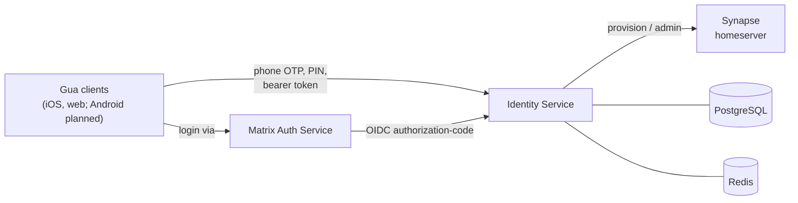

<p align="center">
  
</p>


# Gua Identity Service

The **Gua Identity Service** is a Spring Boot–based microservice that handles **user identity and authentication** for the Gua messaging platform. It owns phone-number sign-up and sign-in, OTP delivery, the account PIN (two-step verification), privileged account operations (deactivate / identity reset), encrypted directory lookup, and a self-contained **OpenID Connect provider** that issues the access tokens used to authenticate calls back into this service and to bridge login into Matrix Authentication Service (MAS) / Synapse.

---

## ✨ Features

- 📱 **Phone sign-up & sign-in** — request OTP → verify OTP → either provision a new Matrix user, resume an existing session, or fall through to a PIN challenge for users with two-step verification enabled.
- 🔐 **OTP management** — Redis-backed codes with TTL, per-phone and per-IP hourly caps, localized SMS templates (en / pt-BR), optional Twilio delivery.
- 🔢 **Account PIN (two-step verification)** — set, OTP-protected change with a 24h cooldown, recovery reset, 5-attempt lockout with a 15-minute lock, and audit logging.
- 🛡️ **Privileged account operations** — fresh phone-OTP reauthentication gates account deactivation and identity-credential reset (modeled on Matrix UIA `m.login.msisdn`).
- 🔑 **OpenID Connect provider** — RS256 authorization-code + PKCE flow, discovery/JWKS endpoints, and seeded clients for MAS (confidential) and the Gua apps (public, PKCE-required).
- 📇 **Directory lookup** — privacy-preserving phone-hash search using a server-side pepper.
- 🚦 **Built-in rate limiting** — per-endpoint Resilience4j limiters so the service is safe to run without an upstream WAF.
- 🗄️ **Persistent identities** — PostgreSQL with Flyway migrations.
- 📚 **OpenAPI/Swagger UI** at `/swagger-ui.html`.

---

## 🛠️ Tech Stack

- **Java 21** (LTS)
- **Spring Boot 3.5.x**, **Gradle (Groovy DSL)**
- **Spring Web** (MVC REST controllers) + **Spring WebFlux** (`WebClient` for the Matrix admin API)
- **Spring Security** — stateless bearer-token auth validated locally against this service's own JWKS
- **Spring Data JPA / Hibernate** (PostgreSQL dialect) + **Flyway** for migrations
- **Spring Data Redis** — OTP codes, PIN-change challenges, reauth tokens, signup tokens, authorization codes
- **Nimbus JOSE + JWT** — RS256 token signing & verification
- **Resilience4j** — per-endpoint rate limiting
- **Twilio SDK** — SMS delivery (disabled by default)
- **springdoc-openapi** — Swagger UI / OpenAPI docs
- **Bean Validation** — request validation

Testing: **Spring Boot Test**, **Testcontainers** (PostgreSQL), **WireMock** (Matrix admin contract tests). Running `./gradlew test` therefore requires a working Docker daemon.

Infra: **PostgreSQL** (identities), **Redis** (ephemeral tokens), **Synapse** + **MAS** (downstream Matrix), all wired via **Docker Compose**.

---

## 🏗️ How it fits together



The identity service is **both** an OIDC provider (MAS delegates phone-OTP login to it) **and** the issuer/validator of the bearer tokens its own client-facing REST API requires. Tokens are primarily verified locally against the published JWKS (RS256 signature, issuer, audience, and expiry). As a fallback, a token that is not one of this service's own JWTs is verified against Synapse's `/whoami` endpoint, which lets a native client reuse its Matrix SDK session token to call a subset of endpoints.

---
## 🚧 Local development stack

Spin up Redis, Postgres, and a disposable Synapse homeserver with a single command:

```bash
# run and export environment variables into the current shell
source scripts/start-dev-test-stack.sh
```


Running the script normally (`bash scripts/start-dev-test-stack.sh`) will still launch the containers; it also writes the computed environment variables to `.env.identity-service` so you can load them manually with `source .env.identity-service` or copy them into IntelliJ.

What the script does:

1. Starts all dependencies using `docker-compose.test.yml` (PostgreSQL, Redis, a disposable Synapse homeserver, and a MAS container).
2. Waits for Synapse to become healthy.
3. Creates (or reuses) an admin Matrix user and captures its access token.
4. Generates a directory pepper (stored at `docker/.identity-pepper`) for consistent hashing.
5. Exports all required environment variables for the identity service.

Once the script has been sourced you can run the application with `./gradlew bootRun` or from IntelliJ without additional environment setup. To tear everything down:

```bash
docker compose -f docker-compose.test.yml down
```

> ⚠️ **Always source the environment before `bootRun`.** Variables such as `IDENTITY_MATRIX_ADMIN_API_BASE_URL` are interpolated into `WebClient` base URLs; if they are unset the literal `${...}` placeholder reaches `WebClient` and every Matrix-admin call fails with `IllegalArgumentException: Not enough variable values available`. Use `source .env.identity-service` (or source the start script) in the same shell that runs Gradle.

### Local secret files (gitignored — not in the repo)

The following files contain development secrets and are intentionally **gitignored**. The dev stack creates or expects them locally; never commit them:

| File | Purpose |
| --- | --- |
| `.env.identity-service` | Computed env vars written by the start script (Matrix admin token, base URLs, pepper, OIDC keys). |
| `docker/.identity-pepper` | Server-side pepper used to hash phone numbers for directory lookup. |
| `docker/.oidc-jwt-secret` | Local OIDC signing material for the dev stack. |
| `docker/mas/mas.conf.yaml` | MAS configuration including its signing/encryption secrets and upstream-OIDC client credentials. |

If you don't set `OIDC_RSA_PRIVATE_KEY` / `OIDC_RSA_PUBLIC_KEY`, the service generates an **ephemeral** RSA signing key at startup (and logs a warning) — fine for local dev, but tokens won't survive a restart.

---

## 🧪 Tests

```bash
./gradlew test
```

Integration and contract tests use **Testcontainers** (PostgreSQL) and **WireMock** (Matrix admin API), so a running **Docker** daemon is required.

---

## 📡 API reference

Interactive docs: **`/swagger-ui.html`** (OpenAPI JSON at `/api-docs`). Endpoints marked **Public** require no bearer token; **Bearer** endpoints require an `Authorization: Bearer <access-token>` header issued by this service's `/oauth2/token`.

### Onboarding & sessions

| Method & path | Auth | Purpose |
| --- | --- | --- |
| `POST /otp/send` | Public | Generate and dispatch an OTP to a phone number (rate-limited, localized SMS). |
| `POST /otp/verify` | Public | Verify an OTP. Returns one of: an existing-user Matrix session, a `signupToken` (new user), or a `pinChallengeToken` (returning user with two-step verification). |
| `POST /otp/change-number` | Bearer | Re-bind a verified phone number to an existing account (OTP + PIN). |
| `GET /signup/check-username` | Public | Real-time username availability check (format/reserved rules + Matrix lookup). Does not mutate state. |
| `POST /signup/complete` | Public¹ | Exchange a `signupToken` for a provisioned Matrix user with chosen username/display name. |
| `POST /signin/verify-pin` | Public¹ | Exchange a `pinChallengeToken` + PIN for a Matrix session (second leg of 2SV sign-in). |

¹ No bearer token, but gated by the single-use token issued from `/otp/verify`.

### Account PIN (two-step verification)

| Method & path | Auth | Purpose |
| --- | --- | --- |
| `GET /security/pin/status` | Bearer | Whether the user has a PIN set (drives the "set up two-step verification" nudge). |
| `POST /security/pin` | Bearer | Set the **initial** PIN. Rejects payloads containing `currentPin` — changes must use the flow below. |
| `POST /security/pin/change/start` | Bearer | Verify current PIN, enforce the 24h change cooldown, and send an OTP. Returns a challenge id (`425` if cooldown active). |
| `POST /security/pin/change/complete` | Bearer | Redeem the challenge + OTP to apply the new PIN. |
| `POST /security/pin/reset` | Public | Begin PIN recovery by sending an OTP to the verified phone. |
| `POST /security/pin/reset/complete` | Public | Verify the reset OTP and set a new PIN. |

PIN policy is configurable under `identity.security`: `pin-change-cooldown` (default **24h**), `pin-reset-cooldown` (default **7 days**), `max-pin-attempts` (default **5**), `pin-lock-duration` (default **15m**), `pin-change-challenge-ttl` (default **5m**).

### Privileged account operations

Each privileged operation requires a fresh **reauth token** proving phone possession, in addition to the bearer token.

| Method & path | Auth | Purpose |
| --- | --- | --- |
| `POST /account/reauth/start` | Bearer | Send a fresh OTP to the user's linked phone. |
| `POST /account/reauth/verify` | Bearer | Exchange the OTP for a single-use, short-lived reauth token. |
| `POST /account/deactivate` | Bearer + reauth | Deactivate the user's Matrix account (optionally erasing data). |
| `POST /account/reset-identity-credentials` | Bearer + reauth | Rotate the homeserver password and return one-time UIA credentials for `client.resetIdentity`. |

### Directory

| Method & path | Auth | Purpose |
| --- | --- | --- |
| `POST /directory/lookup` | Bearer | Resolve contacts by salted phone hash. |

---

## 🔐 OpenID Connect provider

The service is a self-contained OIDC provider. It issues the access tokens that protect its own REST API and lets [Matrix Authentication Service (MAS)](https://github.com/element-hq/matrix-authentication-service/) delegate user login to phone-based OTP flows.

### Endpoints

| Endpoint | Purpose |
| --- | --- |
| `GET /.well-known/openid-configuration` | Discovery metadata (issuer, authorize/token/userinfo/JWKS URLs, supported response/grant types, `S256` PKCE, `RS256`). |
| `GET /.well-known/jwks.json` | Publishes the **RSA public** signing key so relying parties can verify RS256 tokens. |
| `GET /oauth2/authorize` | Authorization-code flow. Accepts `client_id`, `redirect_uri`, `response_type=code`, `scope`, `phone_number`, `otp_code`, optional `display_name`/`state`/PKCE `code_challenge`; issues a code after validating the OTP. |
| `POST /oauth2/token` | Exchanges an authorization code (and PKCE `code_verifier`) for a signed access token + ID token. |
| `GET /userinfo` | Returns the authenticated subject (`sub`), `phone_number`, and optional `name`. |

### Signing & configuration

Tokens are signed with **RS256**. Provide the keypair via `OIDC_RSA_PRIVATE_KEY` / `OIDC_RSA_PUBLIC_KEY` (key id from `OIDC_JWK_KEY_ID`, default `oidc-signing-key`). If the keys are unset, an **ephemeral** key is generated at startup (dev only). The issuer is taken from `IDENTITY_BASE_URL`, so point it at the publicly reachable base path (e.g. `https://identity.example.com`). Token TTLs: authorization code `PT5M`, access token `PT15M`, ID token `PT15M` (all overridable).

Seeded clients (`oidc.clients` in `application.yml`):

| Client | Type | PKCE | Scopes |
| --- | --- | --- | --- |
| `mas` | Confidential (`client_secret`) | optional | `openid`, `profile`, `phone` |
| `gua-ios` | Public | **required** (`S256`) | `openid`, `profile`, `phone` |

Additional first-party app clients (web today, Android in future) are registered as further public, PKCE-required entries under `oidc.clients`.

### API authentication

Client-facing REST endpoints require an access token in the `Authorization: Bearer <token>` header. `OidcAccessTokenValidator` first tries to verify the token locally against the published JWKS — checking the RS256 signature, the issuer, that the audience matches a registered client, and that the token has not expired or been revoked. If the token is not one of this service's own JWTs, it falls back to Synapse's `/whoami` endpoint so a native client can reuse its Matrix SDK session token (these tokens are granted no OIDC scopes). Access tokens carry a `jti` and can be invalidated ahead of expiry via a per-user revoke-before cutoff in Redis, which `/account/deactivate` and `/account/reset-identity-credentials` set. Authorization codes and other short-lived tokens are stored in Redis to keep the service horizontally scalable.

---

## 🛡️ Rate limiting

Every public endpoint is protected by a **Resilience4j**-based rate limiter, so the service can run safely without an upstream proxy or WAF. Defaults live in `application.yml` under `identity.rate-limits` and are individually overridable via `IDENTITY_RATE_LIMIT_<NAME>_{LIMIT,REFRESH,TIMEOUT}` environment variables. A `default-config` applies to any endpoint without a specific rule.

| Endpoint | Default limit | Window |
| --- | --- | --- |
| `POST /otp/send` | 5 | 1 min |
| `POST /otp/verify` | 10 | 1 min |
| `POST /otp/change-number` | 3 | 1 hour |
| `POST /signup/complete` | 10 | 1 min |
| `POST /signin/verify-pin` | 10 | 1 min |
| `POST /security/pin` | 20 | 5 min |
| `POST /security/pin/change/start` | 5 | 1 hour |
| `POST /security/pin/change/complete` | 5 | 1 hour |
| `POST /security/pin/reset` | 3 | 1 hour |
| `POST /security/pin/reset/complete` | 3 | 1 hour |
| `POST /directory/lookup` | 30 | 5 min |
| _all others_ | 120 (`default-config`) | 1 min |

Set `IDENTITY_RATE_LIMITS_ENABLED=false` to disable the limiter (e.g., for load testing). Otherwise clients receive HTTP `429` with a JSON body (`{"message":"Rate limit exceeded"}`) and a `Retry-After` header.

---
## 🚀 Deployment

### Build the container image

```bash
docker build -t gua/identity-service:latest .
```

### Compose file

An example `docker-compose.identity.yml` is included. Provide environment values (either via a `.env` file or directly in your orchestration system) for:

- `SPRING_DATASOURCE_*` – JDBC details for Postgres
- `SPRING_DATA_REDIS_*` – Redis host/port
- `IDENTITY_BASE_URL` – publicly reachable base URL; becomes the OIDC `issuer`
- `IDENTITY_MATRIX_*` – Synapse admin/client base URLs, homeserver domain, and admin token (used for provisioning; token validation is handled locally)
- `IDENTITY_DIRECTORY_PEPPER` – server-side secret used to hash phone digests
- `OIDC_RSA_PRIVATE_KEY` / `OIDC_RSA_PUBLIC_KEY` – RSA keypair used to sign and verify RS256 OIDC tokens (an ephemeral key is generated if omitted — not suitable for production)
- `OIDC_CLIENT_MAS_SECRET` – confidential client secret for the MAS OIDC client
- `IDENTITY_SMS_TWILIO_*` – Twilio credentials if SMS delivery is enabled (`IDENTITY_SMS_TWILIO_ENABLED=true`)

Then run:

```bash
docker compose -f docker-compose.identity.yml up -d --build
```

The container exposes port `8080` by default and relies on the surrounding services (Postgres/Redis/Synapse) defined in the compose file. Adjust or remove the bundled Postgres/Redis services if you point at managed instances instead.

---
