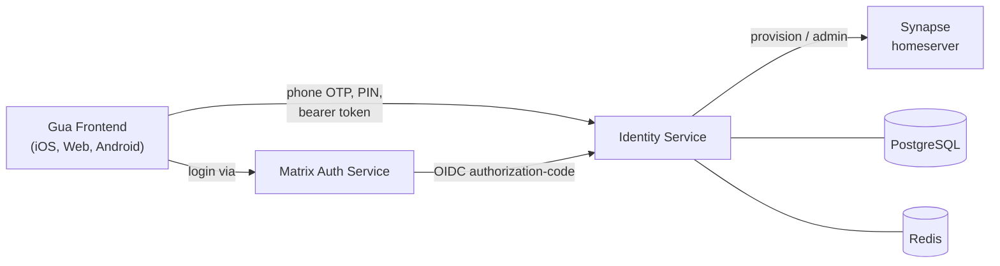

<p align="center">
  
</p>


# Gua Identity Service

The **Gua Identity Service** is a Spring Boot–based microservice that handles **user identity and authentication** for the Gua messaging platform. It owns phone-number sign-up and sign-in, OTP delivery, the account PIN (two-step verification), privileged account operations (deactivate / identity reset), encrypted directory lookup, and a self-contained **OpenID Connect provider** that issues the access tokens used to authenticate calls back into this service and to bridge login into Matrix Authentication Service (MAS) / Synapse.

---

## ✨ Features

- 📱 **Phone sign-up & sign-in** — request OTP → verify OTP → either provision a new Matrix user, resume an existing session, or fall through to a PIN challenge for users with two-step verification enabled.
- 🔐 **OTP management** — Redis-backed codes with TTL, per-phone and per-IP hourly caps, localized SMS templates (en / pt-BR), optional Twilio delivery.
- 🔢 **Account PIN (two-step verification)** — set, OTP-protected change with a 24h cooldown, recovery reset, 5-attempt lockout with a 15-minute lock, and audit logging. A NIST-aligned strength policy rejects non-6-digit, all-repeated, sequential, and common PINs.
- 🛡️ **Privileged account operations** — fresh phone-OTP reauthentication gates account deactivation and identity-credential reset (modeled on Matrix UIA `m.login.msisdn`).
- 🔑 **OpenID Connect provider** — RS256 authorization-code + PKCE flow with an **interactive browser login** (phone → OTP → PIN/profile) that MAS redirects into, discovery/JWKS endpoints, and seeded clients for MAS (confidential) and the Gua apps (public, PKCE-required).
- 🪪 **Passkeys (WebAuthn)** — after phone verification, the user can optionally **register a passkey** and later **sign in with it** instead of an SMS code. Built on Yubico `webauthn-server-core`; credentials are persisted (`passkey_credentials`) and the login flow gains a `PASSKEY_SETUP` step.
- 🌐 **Federation directory publishing** — at account provisioning, publishes `phone → this homeserver` to the **gua-resolver** shared directory (`POST /directory/entries`), signed with the homeserver's Ed25519 membership credential. Best-effort: a resolver outage never blocks sign-up/sign-in.
- 📇 **Directory lookup** — privacy-preserving phone-hash search using a server-side pepper. The raw phone number is never stored; only an irreversible HMAC digest plus a display-only masked form (e.g. `••••4567`).
- 📊 **Prometheus metrics** — Micrometer at `/actuator/prometheus` (HTTP/JVM/DB-pool) plus domain counters (`gua_identity_signup_total`, `gua_identity_login_total`, `gua_identity_otp_verify_total`, `gua_identity_sms_send_total{provider,result}`).
- 🚦 **Built-in rate limiting** — per-endpoint Resilience4j limiters so the service is safe to run without an upstream WAF.
- 🗄️ **Persistent identities** — PostgreSQL with Flyway migrations.
- 📚 **OpenAPI/Swagger UI** at `/swagger-ui.html`.

---

## 🛠️ Tech Stack

- **Java 21** (LTS)
- **Spring Boot 3.5.x**, **Gradle (Groovy DSL)**
- **Spring Web** (MVC REST controllers) + **Spring WebFlux** (`WebClient` for the Matrix admin API)
- **Spring Security** — stateless bearer-token auth validated locally against this service's own JWKS
- **Spring Data JPA / Hibernate** (PostgreSQL dialect) + **Flyway** for migrations
- **Spring Data Redis** — OTP codes, PIN-change challenges, reauth tokens, signup tokens, authorization codes
- **Nimbus JOSE + JWT** — RS256 token signing & verification
- **Resilience4j** — per-endpoint rate limiting
- **Twilio SDK** — SMS delivery (disabled by default)
- **springdoc-openapi** — Swagger UI / OpenAPI docs
- **Bean Validation** — request validation

Testing: **Spring Boot Test**, **Testcontainers** (PostgreSQL), **WireMock** (Matrix admin contract tests). Running `./gradlew test` therefore requires a working Docker daemon.

Infra: **PostgreSQL** (identities), **Redis** (ephemeral tokens), **Synapse** + **MAS** (downstream Matrix), all wired via **Docker Compose**.

---

## 🏗️ How it fits together



The identity service is **both** an OIDC provider (MAS delegates phone-OTP login to it) **and** the issuer/validator of the bearer tokens its own client-facing REST API requires. Tokens are primarily verified locally against the published JWKS (RS256 signature, issuer, audience, and expiry). As a fallback, a token that is not one of this service's own JWTs is verified against Synapse's `/whoami` endpoint, which lets a native client reuse its Matrix SDK session token to call a subset of endpoints.

For login, MAS redirects the browser to `GET /oauth2/authorize`; the identity service parks the request in a short-lived, Redis-backed login session and hands off to the **`gua-idp-web`** single-page UI, which walks the user through phone → OTP → PIN (returning) or profile (new user) via the `/login/*` API before an authorization code is issued back to MAS.

---

## 🧭 Routing & global usernames (federation at scale)

The identity service is the **routing authority** for a **Gua-controlled federation** — a set of homeservers Gua operates (à la [Tchap](https://github.com/tchapgouv), the French government's closed Matrix federation). It is *not* the open Matrix network: global-username uniqueness is a guarantee only within Gua's own homeservers.

- **Homeserver registry** (`identity.routing.homeservers`) lists the homeservers accounts can live on (`id`, `domain`, admin URL, region, weight, enabled). When unset, a single homeserver is synthesised from the legacy `identity.matrix.*` properties, so single-homeserver deployments need no config change.
- **Routing layer** (`HomeserverRouter`) decides which homeserver a **new** account lives on, by rule (`single` / `region` / `weighted`). Placement is decided **once at signup** and recorded in the directory. Relocating an account between homeservers is a protocol-level limitation of Matrix (immutable MXIDs) and is intentionally out of scope.
- **Global usernames** are unique across the federation (case-insensitive), enforced by the directory (`directory_entries.username` + unique index). The username is a stable **alias** recorded alongside the account's `homeserver_id`, so the federation can resolve *where an identity lives*. `GET /directory/resolve?username=` returns the MXID + homeserver for a username.
- The UI treats the full Matrix ID `@id:server` as an implementation detail — users see only their username; the directory maps it to the authoritative MXID + homeserver.

> Roadmap: the **opaque-MXID** model (fully decoupling the human handle from the MXID, the strongest hedge for any future account portability) is staged as a follow-up because it changes the MAS `preferred_username` → Synapse provisioning chain. Today the chosen handle is both the MXID localpart and the recorded global username.

---

## 🔀 MAS fork — `Gua-ra/gua-auth-service`

The identity stack uses **[`Gua-ra/gua-auth-service`](https://github.com/Gua-ra/gua-auth-service)**, a minimal fork of [`element-hq/matrix-authentication-service`](https://github.com/element-hq/matrix-authentication-service) (MAS).

### Why a fork?

The upstream consent screen ("Continue to {client}?") exposes the homeserver name (`dev.local` / `gua.app`) to users, conflicts with Gua's centralised model where the backend chooses the homeserver, and adds an unnecessary extra step when users only interact with first-party clients they implicitly trust.

The fork adds a single `[gua]` config section that lists client IDs whose consent screen is **skipped**; the OPA policy is still enforced. All Gua-specific code lives in files that **have no upstream equivalent** (`crates/config/src/sections/gua.rs`, `crates/handlers/src/gua/mod.rs`, `gua/README.md`), minimising merge conflicts on upstream updates.

### Docker image

```
ghcr.io/gua-ra/gua-auth-service:v1.18.0-gua.1
```

Tag convention: `v<upstream-mas-version>-gua.<patch>` (mirrors [Tchap's approach](https://github.com/tchapgouv/matrix-authentication-service)).

### Enabling skip-consent in `mas.conf.yaml`

```yaml
gua:
  skip_consent_client_ids:
    - 01JXTEST000000000000BCDE01   # gua-ios client ID
```

### Upgrading the fork

See `gua/README.md` in the fork repository for the upgrade runbook.

---


Spin up Redis, Postgres, and a disposable Synapse homeserver with a single command:

```bash
# run and export environment variables into the current shell
source scripts/start-dev-test-stack.sh
```


Running the script normally (`bash scripts/start-dev-test-stack.sh`) will still launch the containers; it also writes the computed environment variables to `.env.identity-service` so you can load them manually with `source .env.identity-service` or copy them into IntelliJ.

What the script does:

1. Starts all dependencies using `docker-compose.test.yml` (PostgreSQL, Redis, a disposable Synapse homeserver, and a **MAS container** running the `Gua-ra/gua-auth-service` fork image).
2. Waits for Synapse to become healthy.
3. Creates (or reuses) an admin Matrix user and captures its access token.
4. Generates a directory pepper (stored at `docker/.identity-pepper`) for consistent hashing.
5. Exports all required environment variables for the identity service.

Once the script has been sourced you can run the application with `./gradlew bootRun` or from IntelliJ without additional environment setup. To tear everything down:

```bash
docker compose -f docker-compose.test.yml down
```

> ⚠️ **Always source the environment before `bootRun`.** Variables such as `IDENTITY_MATRIX_ADMIN_API_BASE_URL` are interpolated into `WebClient` base URLs; if they are unset the literal `${...}` placeholder reaches `WebClient` and every Matrix-admin call fails with `IllegalArgumentException: Not enough variable values available`. Use `source .env.identity-service` (or source the start script) in the same shell that runs Gradle.

### Local secret files (gitignored — not in the repo)

The following files contain development secrets and are intentionally **gitignored**. The dev stack creates or expects them locally; never commit them:

| File | Purpose |
| --- | --- |
| `.env.identity-service` | Computed env vars written by the start script (Matrix admin token, base URLs, pepper, OIDC keys). |
| `docker/.identity-pepper` | Server-side pepper used to hash phone numbers for directory lookup. |
| `docker/.oidc-jwt-secret` | Local OIDC signing material for the dev stack. |
| `docker/mas/mas.conf.yaml` | MAS configuration including its signing/encryption secrets and upstream-OIDC client credentials. |

If you don't set `OIDC_RSA_PRIVATE_KEY` / `OIDC_RSA_PUBLIC_KEY`, the service generates an **ephemeral** RSA signing key at startup (and logs a warning) — fine for local dev, but tokens won't survive a restart.

---

## 🧪 Tests

```bash
./gradlew test
```

Integration and contract tests use **Testcontainers** (PostgreSQL) and **WireMock** (Matrix admin API), so a running **Docker** daemon is required.

---

## 📡 API reference

Interactive docs: **`/swagger-ui.html`** (OpenAPI JSON at `/api-docs`). Endpoints marked **Public** require no bearer token; **Bearer** endpoints require an `Authorization: Bearer <access-token>` header issued by this service's `/oauth2/token`.

### Onboarding & sessions

| Method & path | Auth | Purpose |
| --- | --- | --- |
| `POST /otp/send` | Public | Generate and dispatch an OTP to a phone number (rate-limited, localized SMS). |
| `POST /otp/verify` | Public | Verify an OTP. Returns one of: an existing-user Matrix session, a `signupToken` (new user), or a `pinChallengeToken` (returning user with two-step verification). |
| `GET /signup/check-username` | Public | Real-time username availability check (format/reserved rules + Matrix lookup). Does not mutate state. |
| `POST /signup/complete` | Public¹ | Exchange a `signupToken` for a provisioned Matrix user with chosen username/display name. |
| `POST /signin/verify-pin` | Public¹ | Exchange a `pinChallengeToken` + PIN for a Matrix session (second leg of 2SV sign-in). |

¹ No bearer token, but gated by the single-use token issued from `/otp/verify`.

### Account PIN (two-step verification)

| Method & path | Auth | Purpose |
| --- | --- | --- |
| `GET /security/pin/status` | Bearer | Whether the user has a PIN set (drives the "set up two-step verification" nudge). |
| `POST /security/pin` | Bearer | Set the **initial** PIN. Rejects payloads containing `currentPin` — changes must use the flow below. |
| `POST /security/pin/change/start` | Bearer | Verify current PIN, enforce the 24h change cooldown, and send an OTP. Returns a challenge id (`425` if cooldown active). |
| `POST /security/pin/change/complete` | Bearer | Redeem the challenge + OTP to apply the new PIN. |
| `POST /security/pin/reset` | Public | Begin PIN recovery by sending an OTP to the verified phone. |
| `POST /security/pin/reset/complete` | Public | Verify the reset OTP and set a new PIN. |

PIN policy is configurable under `identity.security`: `pin-change-cooldown` (default **24h**), `pin-reset-cooldown` (default **7 days**), `max-pin-attempts` (default **5**), `pin-lock-duration` (default **15m**), `pin-change-challenge-ttl` (default **5m**).

**PIN strength** is enforced by `PinPolicy` across every set/update/change/reset path: a PIN must be exactly six digits and must not be all-repeated (`000000`), strictly sequential (`123456` / `654321`), or one of a curated list of common PINs. Strength failures surface a distinct `weak_pin` error code (vs `invalid_pin` for a wrong PIN at login). The same rules are mirrored client-side (gua-idp-web, gua-ios) for instant feedback, but the server remains authoritative.

**Username policy** (`UsernamePolicy`, shared by `/signup/check-username`, `/signup/complete`, and the interactive `/login/profile` step): 3–30 chars of lowercase letters, digits, dot, underscore or dash; not reserved; and — matching MAS's registration policy — not all-numeric (so a bare phone number can't become a handle).

### Privileged account operations

Each privileged operation requires a fresh **reauth token** proving phone possession, in addition to the bearer token.

| Method & path | Auth | Purpose |
| --- | --- | --- |
| `POST /account/reauth/start` | Bearer | Send a fresh OTP to the user's linked phone. |
| `POST /account/reauth/verify` | Bearer | Exchange the OTP for a single-use, short-lived reauth token. |
| `POST /account/deactivate` | Bearer + reauth | Deactivate the user's Matrix account (optionally erasing data). |
| `POST /account/reset-identity-credentials` | Bearer + reauth | Rotate the homeserver password and return one-time UIA credentials for `client.resetIdentity`. |
| `POST /account/phone/change/start` | Bearer + reauth + 2SV | Start a phone-number change: spends a `PHONE_CHANGE`-scoped reauth token **plus a second factor** (account PIN and/or passkey assertion), sends an OTP to the new number, and alerts the old number out of band. Returns a challenge id. |
| `POST /account/phone/change/complete` | Bearer | Redeem the challenge + new-number OTP to atomically re-bind the account's phone mapping; all outstanding sessions are revoked. |

**Phone changes require two-step verification.** Because the reauth OTP goes to the *current* number — which a SIM-swap attacker may control — `/account/phone/change/start` additionally demands a non-phone factor: the account PIN (always, when one is set) and/or a passkey assertion. Accounts with **neither** a PIN nor a passkey are hard-blocked with `403 step_up_required` and must set up two-step verification (a PIN via `/security/pin`, or a passkey) before they can change their number. There is no token-only fallback.

### Directory

| Method & path | Auth | Purpose |
| --- | --- | --- |
| `POST /directory/lookup` | Bearer | Contact discovery: match address-book phone numbers (E.164) to Gua accounts. |
| `GET /directory/resolve?username=` | Bearer | Resolve a global username to its Matrix user id + homeserver (federation routing lookup). |

#### Contact discovery privacy model

`POST /directory/lookup` takes `{"phones": ["+5511999998888", …]}` and returns the subset that
are on Gua (`phone`, `userId`, `username`, `displayName`). The privacy contract:

- **Nothing new at rest.** Submitted numbers are digested **in memory** with the same server-side
  peppered HMAC-SHA256 used by the directory; raw numbers are never persisted and never logged.
  The directory itself continues to store only `phone_digest` + a display-only mask.
- **No client-side hashing, on purpose.** The phone keyspace is small enough that any digest a
  client could compute (with a necessarily public key) is reversible by dictionary — while shipping
  the secret pepper to clients would let anyone holding a DB dump reverse the at-rest digests.
  Honest defense is TLS + server-side pepper, not hashing theater.
- **Enumeration defenses.** Bearer auth required, per-request cap (`identity.directory.max-lookup-batch`,
  default 1000, error `lookup_batch_too_large`), endpoint rate limit (below), and a per-account
  `discoverable` opt-out (V6): accounts with `discoverable = false` never appear in results.
- Invalid/duplicate address-book entries are skipped silently — one bad contact must not fail a sync.

---

## 🔐 OpenID Connect provider

The service is a self-contained OIDC provider. It issues the access tokens that protect its own REST API and lets [Matrix Authentication Service (MAS)](https://github.com/element-hq/matrix-authentication-service/) delegate user login to phone-based OTP flows.

### Endpoints

| Endpoint | Purpose |
| --- | --- |
| `GET /.well-known/openid-configuration` | Discovery metadata (issuer, authorize/token/userinfo/JWKS URLs, supported response/grant types, `S256` PKCE, `RS256`). |
| `GET /.well-known/jwks.json` | Publishes the **RSA public** signing key so relying parties can verify RS256 tokens. |
| `GET /oauth2/authorize` | Authorization-code entry point. Validates `client_id`, `redirect_uri`, `response_type=code`, `scope`, and optional `state`/`nonce`/PKCE `code_challenge`, then starts a login session and **redirects to the interactive login UI**. (A legacy non-interactive mode still accepts `phone_number`+`otp_code` directly and issues a code after validating the OTP.) |
| `POST /oauth2/token` | Exchanges an authorization code (and PKCE `code_verifier`) for a signed access token + ID token. |
| `GET /userinfo` | Returns the authenticated subject (`sub`), `phone_number`, `phone_number_masked` (display-only, e.g. `••••4567`), and optional `name` / `preferred_username`. |

### Interactive login flow

For browser-based login (the path used by MAS and the Gua apps), the identity service renders no HTML itself — it exposes a JSON API consumed by the **`gua-idp-web`** single-page app, served same-origin so the login-session cookie stays first-party.

1. MAS redirects the browser to `GET /oauth2/authorize`. The validated OIDC request (client, redirect URI, scopes, `state`, `nonce`, PKCE challenge) is stored in a Redis-backed login session and referenced by an opaque, HttpOnly, `SameSite=Lax` cookie. The browser is redirected to `idp.login.ui-url` (default `/signin`, served by `gua-idp-web`; kept distinct from the `/login/*` API).
2. The UI drives the `/login/*` API, echoing a per-session CSRF token (issued by `GET /login/context`) in the `X-CSRF-Token` header on every state-changing call.

| Method & path | Purpose |
| --- | --- |
| `GET /login/context` | Current step, masked phone, and CSRF token. |
| `POST /login/phone` | Submit the phone number; dispatches an OTP. |
| `POST /login/otp` | Verify the OTP; routes to the PIN step (returning two-step user), the profile step (new user), or completes login. |
| `POST /login/pin` | Verify the account PIN (returning two-step user). |
| `POST /login/profile` | Choose username + display name (new user). |
| `POST /login/passkey/register/options` · `…/register/verify` | Register a passkey for the account (WebAuthn create). |
| `POST /login/passkey/setup-skip` | Decline passkey setup and complete login. |
| `POST /login/passkey/auth/options` · `…/auth/verify` | Sign in with an existing passkey (WebAuthn get). |

Once phone (and any PIN) verification completes, the flow may enter the `PASSKEY_SETUP` step, offering passkey registration before finishing; the user can skip it. A returning user may instead authenticate with a passkey via the `…/auth/*` endpoints.

On success an authorization code is issued, the login session is consumed (and its cookie cleared), and the response carries `redirectUrl` for the UI to navigate back to the client, which exchanges the code at `/oauth2/token`. For new users the chosen handle is emitted as the `preferred_username` claim so MAS uses it as the Matrix localpart on first provisioning; the OIDC `sub` is an opaque, stable identifier.

Login-flow configuration (`idp.login.*`): `ui-url` (`IDP_LOGIN_UI_URL`, default `/signin`), `session-ttl` (`IDP_LOGIN_SESSION_TTL`, default `PT10M`), `cookie-name` (`IDP_LOGIN_COOKIE_NAME`, default `gua_login`), and `cookie-secure` (`IDP_LOGIN_COOKIE_SECURE`, default `true`; set `false` only for plain-HTTP local development).

### Signing & configuration

Tokens are signed with **RS256**. Provide the keypair via `OIDC_RSA_PRIVATE_KEY` / `OIDC_RSA_PUBLIC_KEY` (key id from `OIDC_JWK_KEY_ID`, default `oidc-signing-key`). If the keys are unset, an **ephemeral** key is generated at startup (dev only). The issuer is taken from `IDENTITY_BASE_URL`, so point it at the publicly reachable base path (e.g. `https://identity.example.com`). Token TTLs: authorization code `PT5M`, access token `PT15M`, ID token `PT15M` (all overridable).

Seeded clients (`oidc.clients` in `application.yml`):

| Client | Type | PKCE | Scopes |
| --- | --- | --- | --- |
| `mas` | Confidential (`client_secret`) | optional | `openid`, `profile`, `phone` |
| `gua-ios` | Public | **required** (`S256`) | `openid`, `profile`, `phone` |

Additional first-party app clients (web today, Android in future) are registered as further public, PKCE-required entries under `oidc.clients`.

### API authentication

Client-facing REST endpoints require an access token in the `Authorization: Bearer <token>` header. `OidcAccessTokenValidator` first tries to verify the token locally against the published JWKS — checking the RS256 signature, the issuer, that the audience matches a registered client, and that the token has not expired or been revoked. If the token is not one of this service's own JWTs, it falls back to Synapse's `/whoami` endpoint so a native client can reuse its Matrix SDK session token (these tokens are granted no OIDC scopes). Access tokens carry a `jti` and can be invalidated ahead of expiry via a per-user revoke-before cutoff in Redis, which `/account/deactivate` and `/account/reset-identity-credentials` set. Authorization codes and other short-lived tokens are stored in Redis to keep the service horizontally scalable.

---

## 🛡️ Rate limiting

Every public endpoint is protected by a **Resilience4j**-based rate limiter, so the service can run safely without an upstream proxy or WAF. Defaults live in `application.yml` under `identity.rate-limits` and are individually overridable via `IDENTITY_RATE_LIMIT_<NAME>_{LIMIT,REFRESH,TIMEOUT}` environment variables. A `default-config` applies to any endpoint without a specific rule.

| Endpoint | Default limit | Window |
| --- | --- | --- |
| `POST /otp/send` | 5 | 1 min |
| `POST /otp/verify` | 10 | 1 min |
| `POST /account/phone/change/start` | 3 | 1 hour |
| `POST /account/phone/change/complete` | 10 | 1 hour |
| `POST /signup/complete` | 10 | 1 min |
| `POST /signin/verify-pin` | 10 | 1 min |
| `POST /security/pin` | 20 | 5 min |
| `POST /security/pin/change/start` | 5 | 1 hour |
| `POST /security/pin/change/complete` | 5 | 1 hour |
| `POST /security/pin/reset` | 3 | 1 hour |
| `POST /security/pin/reset/complete` | 3 | 1 hour |
| `POST /directory/lookup` | 30 | 5 min |
| _all others_ | 120 (`default-config`) | 1 min |

Set `IDENTITY_RATE_LIMITS_ENABLED=false` to disable the limiter (e.g., for load testing). Otherwise clients receive HTTP `429` with a JSON body (`{"message":"Rate limit exceeded"}`) and a `Retry-After` header.

---
## 🌐 Federation directory (gua-resolver)

This homeserver publishes its accounts into the **gua-resolver** shared phone→homeserver directory, so the
global federation front door can route an existing phone to us. At provisioning (and re-affirmed on sign-in)
the service `POST`s `phone → homeserverId` to the resolver's `/directory/entries`, **signed with this
homeserver's Ed25519 membership credential** (the key the resolver admitted for it) so the resolver only
accepts entries for accounts we host. It is **best-effort** — a resolver outage never blocks sign-up/sign-in,
and the local [directory](#-directory) stays authoritative for our own users.

Configuration (`identity.resolver.*`, all blank = disabled, single-homeserver dev works without it):

| Property | Env | Notes |
| --- | --- | --- |
| `base-url` | `IDENTITY_RESOLVER_BASEURL` | resolver base URL (e.g. the in-cluster service) |
| `homeserver-id` | `IDENTITY_RESOLVER_HOMESERVERID` | this homeserver's id in the resolver roster |
| `signing-private-key` | `IDENTITY_RESOLVER_SIGNINGPRIVATEKEY` | Ed25519 membership credential, base64 PKCS#8 — inject from a Secret |

The `IDENTITY_DIRECTORY_PEPPER` **must match** the resolver's directory pepper so phone hashes line up.

## 📊 Observability

Micrometer exposes Prometheus metrics at **`/actuator/prometheus`** (enable via
`MANAGEMENT_ENDPOINTS_EXPOSURE=health,info,prometheus` — the default; the endpoint is permitted in
`SecurityConfig` for in-cluster scraping and tagged `application=identity-service`). Alongside the free
HTTP/JVM/DB-pool metrics, these domain counters drive the Gua usage/reliability dashboards + alerts:

| Metric | Meaning |
| --- | --- |
| `gua_identity_signup_total{result}` | completed new-account registrations |
| `gua_identity_login_total{result}` | successful sign-ins of existing accounts |
| `gua_identity_otp_verify_total{result=valid\|invalid}` | OTP correctness (delivery / abuse signal) |
| `gua_identity_sms_send_total{provider,result=sent\|failed}` | SMS usage + delivery failures (`provider` = the active `SmsSender`) |

> Keep `/actuator` off the public edge (block it at the ingress/reverse-proxy) — Prometheus scrapes it on the
> internal Service.

## 🚀 Deployment

### Build the container image

```bash
docker build -t gua/identity-service:latest .
```

### Compose file

An example `docker-compose.identity.yml` is included. Provide environment values (either via a `.env` file or directly in your orchestration system) for:

- `SPRING_DATASOURCE_*` – JDBC details for Postgres
- `SPRING_DATA_REDIS_*` – Redis host/port
- `IDENTITY_BASE_URL` – publicly reachable base URL; becomes the OIDC `issuer`
- `IDENTITY_MATRIX_*` – Synapse admin/client base URLs, homeserver domain, and admin token (used for provisioning; token validation is handled locally)
- `IDENTITY_DIRECTORY_PEPPER` – server-side secret used to hash phone digests
- `OIDC_RSA_PRIVATE_KEY` / `OIDC_RSA_PUBLIC_KEY` – RSA keypair used to sign and verify RS256 OIDC tokens (an ephemeral key is generated if omitted — not suitable for production)
- `OIDC_CLIENT_MAS_SECRET` – confidential client secret for the MAS OIDC client
- **SMS delivery (Twilio).** By default SMS is logged, not sent (`LoggingSmsSender`). Set
  `IDENTITY_SMS_TWILIO_ENABLED=true` to send real OTPs via Twilio:
  - `IDENTITY_SMS_TWILIO_ACCOUNTSID` – Twilio Account SID (`AC…`)
  - `IDENTITY_SMS_TWILIO_AUTHTOKEN` – Twilio Auth Token (secret)
  - `IDENTITY_SMS_TWILIO_FROMNUMBER` – an SMS-capable Twilio number in E.164 (e.g. `+1…`), **or**
  - `IDENTITY_SMS_TWILIO_MESSAGINGSERVICESID` – a Twilio Messaging Service SID (`MG…`), preferred for
    production (number pool, opt-out/compliance); takes precedence over the from-number when both are set.

  (On a Twilio trial account, SMS can only be delivered to verified numbers.)
- `IDENTITY_RESOLVER_*` – `BASEURL`, `HOMESERVERID`, and `SIGNINGPRIVATEKEY` to publish into the gua-resolver shared directory (see [Federation directory](#-federation-directory-gua-resolver)); leave blank to disable
- `MANAGEMENT_ENDPOINTS_EXPOSURE` – actuator endpoints to expose (default `health,info,prometheus`)

Then run:

```bash
docker compose -f docker-compose.identity.yml up -d --build
```

The container exposes port `8080` by default and relies on the surrounding services (Postgres/Redis/Synapse) defined in the compose file. Adjust or remove the bundled Postgres/Redis services if you point at managed instances instead.

---
