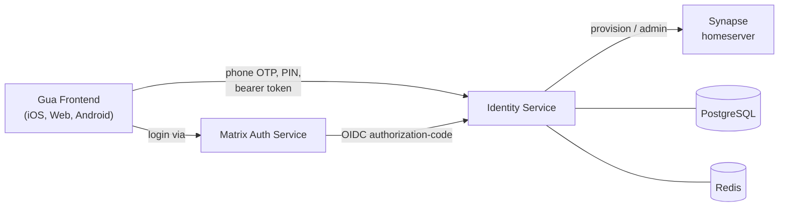

<p align="center">
  
</p>


# Gua Identity Service

> **Status: CURRENT IMPLEMENTATION.** This README describes what the service does on `main` today, for operators and integrators. The service is not the target authentication boundary. In the target design, login authority moves to each homeserver's own auth service, and this service's remaining role is a follow-up decision. That design appears only under the **TARGET ARCHITECTURE** label in [Relationship to the target architecture](#-relationship-to-the-target-architecture) and the documents linked there. Nothing described there is built.

The Gua Identity Service is a Spring Boot microservice. Today it handles identity and authentication for every Gua homeserver. It owns:

- phone sign-up and sign-in, including OTP delivery;
- the account PIN, which is Gua's two-step verification;
- privileged account operations: deactivation, identity reset and phone-number change;
- contact discovery by peppered phone hash.

It also runs a self-contained OpenID Connect provider. That provider issues the access tokens that authenticate calls back into this service. It also bridges login into Matrix Authentication Service (MAS) and Synapse.

---

## ✨ What it does today

- 📱 **Phone sign-up & sign-in**: request OTP → verify OTP → one of three outcomes: provision a new Matrix user, resume an existing session, or fall through to a PIN challenge for users with two-step verification enabled.
- 🔐 **OTP management**: Redis-backed codes with TTL, per-phone and per-IP hourly caps, localized SMS templates (en / pt-BR), optional Twilio delivery.
- 🔢 **Account PIN (two-step verification)**: set, OTP-protected change with a 24h cooldown, recovery reset, 5-attempt lockout with a 15-minute lock, and audit logging. A NIST-aligned strength policy rejects PINs that are not six digits, all-repeated, sequential, or common.
- 🛡️ **Privileged account operations**: account deactivation, identity-credential reset and phone-number change. Each is gated by a fresh phone-OTP reauthentication scoped to that one operation (modeled on Matrix UIA `m.login.msisdn`). A phone change also hard-requires a second factor (PIN or passkey), verifies the **new** number by OTP, and enforces a per-account cooldown.
- 🔑 **OpenID Connect provider**: RS256 authorization-code + PKCE flow with an interactive browser login (phone → OTP → PIN or profile) that MAS redirects into. Includes discovery and JWKS endpoints, plus seeded clients for MAS (confidential) and the Gua apps (public, PKCE-required).
- 🪪 **Passkeys (WebAuthn)**: after phone verification, the user can register a passkey, either during onboarding or later from settings via `/security/passkey/enroll/start`. They can then sign in with it instead of an SMS code. Built on Yubico `webauthn-server-core`. Credentials are persisted in `passkey_credentials`, and the login flow gains a `PASSKEY_SETUP` step.
- 📇 **Directory lookup**: contact discovery by server-side peppered HMAC of the phone number. The directory stores the digest plus a display-only masked form (e.g. `••••4567`), never the raw number. The shared pepper is the current mechanism and is scheduled for replacement.
- 📊 **Prometheus metrics**: Micrometer at `/actuator/prometheus` (HTTP/JVM/DB-pool) plus domain counters (`gua_identity_signup_total`, `gua_identity_login_total`, `gua_identity_otp_verify_total`, `gua_identity_sms_send_total{provider,result}`).
- 🚦 **Built-in rate limiting**: per-endpoint Resilience4j limiters, so the service is safe to run without an upstream WAF.
- 🗄️ **Persistent identities**: PostgreSQL with Flyway migrations.
- 📚 **OpenAPI/Swagger UI** at `/swagger-ui.html`.

---

## 🏗️ How it fits together


```mermaid
flowchart LR
    Clients["Gua Frontend<br/>(iOS, Web, Android)"] -->|phone OTP, PIN,<br/>bearer token| IDS["Identity Service"]
    IDS -->|provision / admin| Synapse["Synapse<br/>homeserver"]
    MAS["Matrix Auth Service"] -->|OIDC authorization-code| IDS
    Clients -->|login via| MAS
    IDS --- PG[("PostgreSQL")]
    IDS --- Redis[("Redis")]
```

Today the identity service plays two roles at once. It is the OIDC provider that MAS delegates phone-OTP login to. It also issues and validates the bearer tokens that its own client-facing REST API requires. Together, those two roles make it the single OIDC provider and the sole credential store for every homeserver. That is the current implementation, not the target; see [Relationship to the target architecture](#-relationship-to-the-target-architecture).

Bearer tokens are primarily verified locally against the published JWKS: RS256 signature, issuer, audience and expiry. A token that is not one of this service's own JWTs is checked against Synapse's `/whoami` endpoint instead. That fallback lets a native client reuse its Matrix SDK session token for a subset of endpoints.

Login works like this. MAS redirects the browser to `GET /oauth2/authorize`. The identity service parks the request in a short-lived, Redis-backed login session and hands off to the `gua-idp-web` single-page UI. That UI walks the user through phone, then OTP, then PIN (returning user) or profile (new user), using the `/login/*` API. Only then is an authorization code issued back to MAS.

---

## 🔭 Relationship to the target architecture

> **TARGET ARCHITECTURE.** Nothing in this section is built. It records where this service sits relative to the frozen design, so that every other section can be read as current state.

Start with the plain-language guide, [Gua identity and federation](https://github.com/Gua-ra/gua-resolver/blob/main/docs/architecture/gua-identity-and-federation.md). The normative record is [ADM-001](https://github.com/Gua-ra/gua-resolver/blob/main/docs/decisions/ADM-001-identifier-binding-placement-trust.md). This README does not repeat its reasoning.

- **Login authority moves to the homeserver.** Today this service is the single OIDC provider and the sole credential store for every homeserver. In the target, each homeserver's own auth service decides login. No artifact issued by the federation is a session grant. What remains of this service afterwards is a follow-up decision, tracked as Phase 7 of the [gua-resolver migration plan](https://github.com/Gua-ra/gua-resolver/blob/main/docs/migrations/gua-resolver-migration-plan.md).
- **Placement and identifier binding become federation concerns.** Placement is which homeserver holds an account. Identifier binding is how an identifier, such as a phone number, is tied to that account. In the target, both are verifiable against signed policy, roster state and verifier attestations. This service's local router and directory table are not that model.
- **The legacy non-interactive branch of `GET /oauth2/authorize` is removed** (ADM-001 L1a). `phone_number`, `otp_code` and `display_name` are no longer accepted, and an authorization code is only ever issued by the interactive login flow.
- **The resolver directory write client is removed.** Sign-up, sign-in and phone change no longer publish anything to the resolver; see [Federation directory](#-federation-directory-gua-resolver).
- **The shared directory pepper is the current mechanism.** It is scheduled for replacement.
- **Existing accounts are the migration input.** Each one is recorded in `directory_entries.homeserver_id`, and its OIDC `sub` is the full Matrix user id. Their migration is tracked in the migration plan.

---

## 🧰 Running it locally

One command starts Redis, Postgres, a disposable Synapse homeserver and a MAS container, then exports the environment variables the service needs:

```bash
# run and export environment variables into the current shell
source scripts/start-dev-test-stack.sh
```

Running the script normally (`bash scripts/start-dev-test-stack.sh`) still launches the containers. It also writes the computed environment variables to `.env.identity-service`. Load them with `source .env.identity-service`, or copy them into IntelliJ.

The script:

1. Starts all dependencies from `docker-compose.test.yml`: PostgreSQL, Redis, a disposable Synapse homeserver, and a MAS container running the `Gua-ra/gua-auth-service` fork image.
2. Waits for Synapse to become healthy.
3. Creates (or reuses) an admin Matrix user and captures its access token.
4. Generates a directory pepper at `docker/.identity-pepper` so hashing stays consistent.
5. Exports every environment variable the identity service needs.

Once the script has been sourced, run the application with `./gradlew bootRun` or from IntelliJ. No further environment setup is needed. To tear everything down:

```bash
docker compose -f docker-compose.test.yml down
```

> ⚠️ **Always source the environment before `bootRun`.** Variables such as `IDENTITY_MATRIX_ADMIN_API_BASE_URL` are interpolated into `WebClient` base URLs. If they are unset, the literal `${...}` placeholder reaches `WebClient`, and every Matrix-admin call fails with `IllegalArgumentException: Not enough variable values available`. Source `.env.identity-service` (or the start script) in the same shell that runs Gradle.

### Local secret files (gitignored, not in the repo)

These files hold development secrets and are intentionally gitignored. The dev stack creates or expects them locally. Never commit them:

| File | Purpose |
| --- | --- |
| `.env.identity-service` | Computed env vars written by the start script (Matrix admin token, base URLs, pepper, OIDC keys). |
| `docker/.identity-pepper` | Server-side pepper used to hash phone numbers for directory lookup. |
| `docker/.oidc-jwt-secret` | Local OIDC signing material for the dev stack. |
| `docker/mas/mas.conf.yaml` | MAS configuration including its signing/encryption secrets and upstream-OIDC client credentials. |

If `OIDC_RSA_PRIVATE_KEY` / `OIDC_RSA_PUBLIC_KEY` are not set, the service generates an ephemeral RSA signing key at startup and logs a warning. That is fine for local development, but tokens will not survive a restart.

---

## 🧪 Tests

```bash
./gradlew test
```

Integration and contract tests use **Testcontainers** (PostgreSQL) and **WireMock** (Matrix admin API), so a running **Docker** daemon is required.

---

## 🛠️ Tech Stack

- **Java 21** (LTS)
- **Spring Boot 3.5.x**, **Gradle (Groovy DSL)**
- **Spring Web** (MVC REST controllers) + **Spring WebFlux** (`WebClient` for the Matrix admin API)
- **Spring Security**: stateless bearer-token auth validated locally against this service's own JWKS
- **Spring Data JPA / Hibernate** (PostgreSQL dialect) + **Flyway** for migrations
- **Spring Data Redis**: OTP codes, PIN-change and phone-change challenges, reauth tokens, signup tokens, authorization codes
- **Nimbus JOSE + JWT**: RS256 token signing & verification
- **Resilience4j**: per-endpoint rate limiting
- **Twilio SDK**: SMS delivery (disabled by default)
- **springdoc-openapi**: Swagger UI / OpenAPI docs
- **Bean Validation**: request validation

Testing: **Spring Boot Test**, **Testcontainers** (PostgreSQL), **WireMock** (Matrix admin contract tests). Running `./gradlew test` therefore requires a working Docker daemon.

Infra: **PostgreSQL** (identities), **Redis** (ephemeral tokens), **Synapse** + **MAS** (downstream Matrix), all wired via **Docker Compose**.

---

## 🧭 Routing & global usernames

> **CURRENT IMPLEMENTATION.** This section describes the per-deployment routing the service performs today. It is not the placement or identifier-binding model of the target architecture.

Gua runs a closed set of homeservers, in the style of [Tchap](https://github.com/tchapgouv), the French government's closed Matrix federation. It does not join the open Matrix network. Today this service picks which of its configured homeservers a new account is created on, and records that choice in its own directory. Routing before login is a separate step: the iOS and Android clients call the resolver's `POST /resolve`, and this service takes no part in that call.

- **Homeserver registry** (`identity.routing.homeservers`) lists the homeservers this deployment can create accounts on. Each entry has `id`, `domain`, admin URL, region, weight and enabled. When the registry is unset, a single homeserver is synthesised from the legacy `identity.matrix.*` properties, so single-homeserver deployments need no config change. The registry is local configuration, not the federation roster.
- **Routing layer** (`HomeserverRouter`) picks a homeserver for each new account by rule (`single`, `region` or `weighted`) and records it in `directory_entries.homeserver_id`. The choice is local: nothing outside this service can re-derive it. Moving an existing account between homeservers is not supported here. Matrix has no native migration that preserves identity and key continuity. Placement migration for existing rows is tracked in the gua-resolver migration plan.
- **Global usernames** are unique within this deployment's directory, case-insensitively. `directory_entries.username` plus a unique index enforce this. The username is an alias recorded alongside the account's `homeserver_id`. `GET /directory/resolve?username=` returns the MXID and homeserver for a username. A homeserver that runs without this service is not covered by that index, so this is a per-deployment guarantee, not a federation one.
- The UI treats the full Matrix ID `@id:server` as an implementation detail. Users see only their username. The directory maps it to the MXID and homeserver recorded at signup.

> Roadmap: an opaque-MXID model, which decouples the human handle from the MXID, is staged as a follow-up. It changes the chain from MAS `preferred_username` to Synapse provisioning. Today the chosen handle is both the MXID localpart and the recorded global username, and the OIDC `sub` is the full Matrix user id. Do not read this as account portability between homeservers.

---

## 🔀 MAS fork: `Gua-ra/gua-auth-service`

The identity stack uses [`Gua-ra/gua-auth-service`](https://github.com/Gua-ra/gua-auth-service), a fork of [`element-hq/matrix-authentication-service`](https://github.com/element-hq/matrix-authentication-service) (MAS). In the current topology, MAS treats this service as its upstream OIDC issuer. That direction is the current implementation only. In the target architecture, the homeserver's own auth service decides login; see [Relationship to the target architecture](#-relationship-to-the-target-architecture).

### Why a fork?

The upstream consent screen ("Continue to {client}?") exposes the homeserver name to users and adds an extra step for first-party clients. Gua-specific handlers live under `crates/handlers/src/gua/` in the fork, which keeps upstream updates cheap to merge. The fork's `main` currently carries no consent-skip configuration, so every login goes through MAS's consent page. Check the fork repository before relying on any `[gua]` config section.

### Docker image

Tag convention: `v<upstream-mas-version>-gua.<patch>` (mirrors [Tchap's approach](https://github.com/tchapgouv/matrix-authentication-service)). The tag the local dev stack runs is pinned in `docker-compose.test.yml`; the fork repository is the source of truth for what each tag contains.

### Upgrading the fork

Follow the fork repository's own documentation for the upgrade runbook.

---

## 📡 API reference

Interactive docs: **`/swagger-ui.html`** (OpenAPI JSON at `/api-docs`). Endpoints marked **Public** require no bearer token; **Bearer** endpoints require an `Authorization: Bearer <access-token>` header issued by this service's `/oauth2/token`.

### Onboarding & sessions

| Method & path | Auth | Purpose |
| --- | --- | --- |
| `POST /otp/send` | Public | Generate and dispatch an OTP to a phone number (rate-limited, localized SMS). |
| `POST /otp/verify` | Public | Verify an OTP. Returns one of: an existing-user Matrix session, a `signupToken` (new user), or a `pinChallengeToken` (returning user with two-step verification). |
| `GET /signup/check-username` | Public | Real-time username availability check (format/reserved rules + Matrix lookup). Does not mutate state. |
| `POST /signup/complete` | Public¹ | Exchange a `signupToken` for a provisioned Matrix user with chosen username/display name. |
| `POST /signin/verify-pin` | Public¹ | Exchange a `pinChallengeToken` + PIN for a Matrix session (second leg of 2SV sign-in). |
| `POST /login/passkey/auth/options` | Session² | Start **passkey sign-in** for a returning user: WebAuthn assertion options, offered at the start of the login flow before OTP verification. |
| `POST /login/passkey/auth/verify` | Session² | Verify the passkey assertion and complete sign-in without an SMS code. Only ever resolves to an existing account, never creates one. |

¹ No bearer token, but gated by the single-use token issued from `/otp/verify`.

² Part of the interactive OIDC login session: requires the login-session cookie plus the CSRF token from `GET /login/context` (see [Interactive login flow](#interactive-login-flow)).

### Account PIN (two-step verification)

| Method & path | Auth | Purpose |
| --- | --- | --- |
| `GET /security/pin/status` | Bearer | Whether the user has a PIN set (drives the "set up two-step verification" nudge). |
| `POST /security/pin` | Bearer | Set the **initial** PIN. Rejects payloads containing `currentPin`: changes must use the flow below. |
| `POST /security/pin/change/start` | Bearer | Verify current PIN, enforce the 24h change cooldown, and send an OTP. Returns a challenge id (`425` if cooldown active). |
| `POST /security/pin/change/complete` | Bearer | Redeem the challenge + OTP to apply the new PIN. |
| `POST /security/pin/reset` | Public | Begin PIN recovery by sending an OTP to the verified phone. |
| `POST /security/pin/reset/complete` | Public | Verify the reset OTP and set a new PIN. |

PIN policy is configurable under `identity.security`: `pin-change-cooldown` (default **24h**), `pin-reset-cooldown` (default **7 days**), `max-pin-attempts` (default **5**), `pin-lock-duration` (default **15m**), `pin-change-challenge-ttl` (default **5m**).

**PIN strength** is enforced by `PinPolicy` across every set/update/change/reset path: a PIN must be exactly six digits and must not be all-repeated (`000000`), strictly sequential (`123456` / `654321`), or one of a curated list of common PINs. Strength failures surface a distinct `weak_pin` error code (vs `invalid_pin` for a wrong PIN at login). The same rules are mirrored client-side (gua-idp-web, gua-ios) for instant feedback, but the server remains authoritative.

**Username policy** (`UsernamePolicy`, shared by `/signup/check-username`, `/signup/complete`, and the interactive `/login/profile` step): 3 to 30 chars of lowercase letters, digits, dot, underscore or dash; not reserved; and, matching MAS's registration policy, not all-numeric (so a bare phone number can't become a handle).

### Passkeys

Passkey **registration** is normally offered during onboarding (see [Interactive login flow](#interactive-login-flow)); an already-signed-in user can also add one later from settings:

| Method & path | Auth | Purpose |
| --- | --- | --- |
| `POST /security/passkey/enroll/start` | Bearer | Start in-app passkey enrollment: creates a login session pinned to the authenticated user and returns a one-time `enrollUrl`. |
| `GET /login/passkey/enroll/{token}` | Public (one-time token) | Redeems the `enrollUrl` in a web view: sets the first-party login cookie and redirects into the sign-in UI at the passkey setup step (`410 enroll_link_expired` once used or expired). |

The pinned session can only reach the passkey-setup step. It can never degrade into an open login or signup. Passkey **sign-in** happens inside the interactive login flow via `POST /login/passkey/auth/options` / `…/verify` (see the quick reference above).

### Privileged account operations

Each privileged operation requires a fresh **reauth token** proving phone possession, in addition to the bearer token. Reauth tokens are **operation-scoped**: `/account/reauth/verify` takes an `operation` field (`DEACTIVATE` | `IDENTITY_RESET` | `PHONE_CHANGE`; defaults to `DEACTIVATE` for backwards compatibility) and the issued token can only be spent on the matching endpoint: a token minted to authorize a deactivation is not valid for an identity reset or a phone change, and vice versa.

| Method & path | Auth | Purpose |
| --- | --- | --- |
| `POST /account/reauth/start` | Bearer | Send a fresh OTP to the user's linked phone. |
| `POST /account/reauth/verify` | Bearer | Exchange the OTP for a single-use reauth token (5-minute TTL) scoped to the requested `operation`. |
| `POST /account/deactivate` | Bearer + reauth (`DEACTIVATE`) | Deactivate the user's Matrix account (optionally erasing data). |
| `POST /account/reset-identity-credentials` | Bearer + reauth (`IDENTITY_RESET`) | Rotate the homeserver password and return one-time UIA credentials for `client.resetIdentity`. |
| `POST /account/phone/change/start` | Bearer + reauth (`PHONE_CHANGE`) + 2SV | Start a phone-number change: spends the reauth token **plus a second factor** (account PIN and/or passkey assertion), sends an OTP to the new number, and alerts the old number out of band. Returns a challenge id (`425` while the per-account change cooldown is active). |
| `POST /account/phone/change/complete` | Bearer | Redeem the challenge + new-number OTP to atomically re-bind the account's phone mapping; all outstanding sessions are revoked. |

**Phone changes require two-step verification.** Because the reauth OTP goes to the *current* number, which a SIM-swap attacker may control, `/account/phone/change/start` additionally demands a non-phone factor: the account PIN (always, when one is set) and/or a passkey assertion. Accounts with **neither** a PIN nor a passkey are hard-blocked with `403 step_up_required` and must set up two-step verification (a PIN via `/security/pin`, or a passkey) before they can change their number. There is no token-only fallback.

**Phone-change cooldown & challenge limits** (configurable under `identity.security`): successful changes are separated by `phone-change-cooldown` (default **24h**). While it is active, `/account/phone/change/start` returns `425` with a `phone_change_cooldown` error code and a `Retry-After` header. Each challenge lives for `phone-change-challenge-ttl` (default **10m**) and allows `max-phone-change-otp-attempts` wrong OTPs (default **5**); at the cap both the challenge and its OTP are destroyed and the flow must restart from `/start`.

### Directory

| Method & path | Auth | Purpose |
| --- | --- | --- |
| `POST /directory/lookup` | Bearer | Contact discovery: match address-book phone numbers (E.164) to Gua accounts. |
| `GET /directory/resolve?username=` | Bearer | Resolve a global username to its Matrix user id + homeserver, from this deployment's directory. |

#### Contact discovery privacy model

`POST /directory/lookup` takes `{"phones": ["+5511999998888", …]}` and returns the subset that
are on Gua (`phone`, `userId`, `username`, `displayName`). The privacy contract:

- **Nothing new at rest.** Submitted numbers are digested **in memory** with the same server-side
  peppered HMAC-SHA256 used by the directory; raw numbers are never persisted and never logged.
  The directory itself continues to store only `phone_digest` + a display-only mask.
- **No client-side hashing, on purpose.** The phone keyspace is small enough that any digest a
  client could compute (with a necessarily public key) is reversible by dictionary, while shipping
  the secret pepper to clients would let anyone holding a DB dump reverse the at-rest digests.
  Honest defense is TLS + server-side pepper, not hashing theater.
- **Enumeration defenses.** Bearer auth required, per-request cap (`identity.directory.max-lookup-batch`,
  default 1000, error `lookup_batch_too_large`), endpoint rate limit (below), and a per-account
  `discoverable` opt-out (V6): accounts with `discoverable = false` never appear in results.
- Invalid/duplicate address-book entries are skipped silently: one bad contact must not fail a sync.

---

## 🔐 OpenID Connect provider

The service is a self-contained OIDC provider. It issues the access tokens that protect its own REST API and lets [Matrix Authentication Service (MAS)](https://github.com/element-hq/matrix-authentication-service/) delegate user login to its phone OTP flows.

### Endpoints

| Endpoint | Purpose |
| --- | --- |
| `GET /.well-known/openid-configuration` | Discovery metadata (issuer, authorize/token/userinfo/JWKS URLs, supported response/grant types, `S256` PKCE, `RS256`). |
| `GET /.well-known/jwks.json` | Publishes the **RSA public** signing key so relying parties can verify RS256 tokens. |
| `GET /oauth2/authorize` | Authorization-code entry point. Validates `client_id`, `redirect_uri`, `response_type=code`, `scope`, and optional `state`/`nonce`/PKCE `code_challenge`, then starts a login session and **redirects to the interactive login UI**. The optional `login_hint` is either an E.164 phone to pre-fill the phone step or the reserved value `passkey`, which records a passkey sign-in intent on the session and is never treated as a phone number. (The legacy non-interactive branch that accepted `phone_number`+`otp_code` directly is removed, per ADM-001 L1a. `phone_number`, `otp_code` and `display_name` are no longer accepted and are ignored if sent.) |
| `POST /oauth2/token` | Exchanges an authorization code (and PKCE `code_verifier`) for a signed access token + ID token. |
| `GET /userinfo` | Returns the authenticated subject (`sub`), `phone_number`, `phone_number_masked` (display-only, e.g. `••••4567`), and optional `name` / `preferred_username`. |

### Interactive login flow

For browser-based login (the path used by MAS and the Gua apps), the identity service renders no HTML itself: it exposes a JSON API consumed by the **`gua-idp-web`** single-page app, served same-origin so the login-session cookie stays first-party.

1. MAS redirects the browser to `GET /oauth2/authorize`. The validated OIDC request (client, redirect URI, scopes, `state`, `nonce`, PKCE challenge) is stored in a Redis-backed login session and referenced by an opaque, HttpOnly, `SameSite=Lax` cookie. The browser is redirected to `idp.login.ui-url` (default `/signin`, served by `gua-idp-web`; kept distinct from the `/login/*` API).
2. The UI drives the `/login/*` API, echoing a per-session CSRF token (issued by `GET /login/context`) in the `X-CSRF-Token` header on every state-changing call.

| Method & path | Purpose |
| --- | --- |
| `GET /login/context` | Current step, masked phone, CSRF token, and `intent` (`PHONE` or `PASSKEY`, from the `login_hint`; a missing field means `PHONE`). |
| `POST /login/phone` | Submit the phone number; dispatches an OTP. |
| `POST /login/otp` | Verify the OTP; routes to the PIN step (returning two-step user), the profile step (new user), or completes login. |
| `POST /login/pin` | Verify the account PIN (returning two-step user). |
| `POST /login/profile` | Choose username + display name (new user). |
| `POST /login/pin-setup` | Offer a new user two-step verification: send a `pin` to enable it, or `skip: true` to continue without one. |
| `POST /login/passkey/register/options` · `…/register/verify` | Register a passkey for the account (WebAuthn create). |
| `POST /login/passkey/setup-skip` | Decline passkey setup and complete login. |
| `POST /login/passkey/auth/options` · `…/auth/verify` | Sign in with an existing passkey (WebAuthn get). |
| `GET /login/passkey/enroll/{token}` | One-time web-view handoff for in-app passkey enrollment started at `POST /security/passkey/enroll/start` (see [Passkeys](#passkeys)). |

New users are walked through profile → `PIN_SETUP` (optional two-step verification) → `PASSKEY_SETUP`; returning users reach `PASSKEY_SETUP` once phone (and any PIN) verification completes, unless the account already has a passkey. Both setup steps can be skipped. A returning user may instead authenticate with a passkey via the `…/auth/*` endpoints.

On success an authorization code is issued, the login session is consumed (and its cookie cleared), and the response carries `redirectUrl` for the UI to navigate back to the client, which exchanges the code at `/oauth2/token`. For new users the chosen handle is emitted as the `preferred_username` claim so MAS uses it as the Matrix localpart on first provisioning. The OIDC `sub` is the account's full Matrix user id on the homeserver chosen at signup (localpart plus homeserver domain). It is stable, but homeserver-scoped rather than opaque, which is why re-keying subjects is an explicit step in the migration plan.

Login-flow configuration (`idp.login.*`): `ui-url` (`IDP_LOGIN_UI_URL`, default `/signin`), `session-ttl` (`IDP_LOGIN_SESSION_TTL`, default `PT10M`), `cookie-name` (`IDP_LOGIN_COOKIE_NAME`, default `gua_login`), and `cookie-secure` (`IDP_LOGIN_COOKIE_SECURE`, default `true`; set `false` only for plain-HTTP local development).

Passkey configuration (`idp.login.passkeys.*`): `rp-id` (`IDP_LOGIN_PASSKEYS_RP_ID`) and `origins` (`IDP_LOGIN_PASSKEYS_ORIGINS`) default to localhost and MUST be set to the registrable auth domain and the exact HTTPS sign-in origin in production, or every WebAuthn ceremony is rejected by the browser.

### Web login gate

An optional invite-only gate for new web accounts, off by default: `idp.login.registration.web-allowlist-enabled` (`IDP_LOGIN_REGISTRATION_WEBALLOWLISTENABLED`). With the flag off, nothing in this section applies.

With it on:

- **OTP send** (`POST /login/phone`, `POST /otp/send`): a web flow gets an OTP only for a known number, meaning one that already has an account or is on `idp.login.registration.web-allowlist` (`IDP_LOGIN_REGISTRATION_WEBALLOWLIST`, E.164 CSV). Anything else gets `403 registration_not_approved` before any SMS is sent.
- **Account creation** (`POST /login/profile`, `POST /signup/complete`): a new web account is created only for an allowlisted number, whichever path minted the OTP.

Returning users are not blocked as long as their directory row resolves: that number counts as known, so an account created in the apps can also sign in on the web. The OTP step has one extra fallback that account creation does not, the homeserver phone binding. On the interactive flow the profile step recovers the account from that binding and heals the directory row, so the user simply signs in. On the REST path, which has no such recovery, a returning number whose directory row no longer resolves clears the OTP step and is then refused as a new web signup instead of minting a second account.

**Web or native.** MAS can append `gua_downstream=web|native` to the upstream authorize request (fork settings `forward_downstream_client` and `downstream_client_web_origin`; `native` means the downstream client's `client_uri` host differs from the web origin). A login session is exempt only when the marker equals `idp.login.registration.native-client-marker` (default `native`) exactly. An absent, empty or unrecognised marker is treated as web, and the REST endpoints, which carry no marker, always are.

**Limits.** The marker travels in a browser redirect, so the user can edit it, and MAS derives it from a `client_uri` that a dynamically registered client sets for itself. Treat the native exemption as a convenience for the beta apps, not a security boundary; SMS rate limits remain the defence against credit burn. An unforgeable signal needs a MAS-side change, such as a signed or PAR-carried downstream claim.

### Signing & configuration

Tokens are signed with **RS256**. Provide the keypair via `OIDC_RSA_PRIVATE_KEY` / `OIDC_RSA_PUBLIC_KEY` (key id from `OIDC_JWK_KEY_ID`, default `oidc-signing-key`). If the keys are unset, an **ephemeral** key is generated at startup (dev only). The issuer is taken from `IDENTITY_BASE_URL`, so point it at the publicly reachable base path (e.g. `https://identity.example.com`). Token TTLs: authorization code `PT5M`, access token `PT15M`, ID token `PT15M` (all overridable).

Seeded clients (`oidc.clients` in `application.yml`):

| Client | Type | PKCE | Scopes |
| --- | --- | --- | --- |
| `mas` | Confidential (`client_secret`) | optional | `openid`, `profile`, `phone` |
| `gua-ios` | Public | **required** (`S256`) | `openid`, `profile`, `phone` |

Additional first-party app clients (web today, Android in future) are registered as further public, PKCE-required entries under `oidc.clients`.

### API authentication

Client-facing REST endpoints require an access token in the `Authorization: Bearer <token>` header. `OidcAccessTokenValidator` first tries to verify the token locally against the published JWKS, checking the RS256 signature, the issuer, that the audience matches a registered client, and that the token has not expired or been revoked. If the token is not one of this service's own JWTs, it falls back to Synapse's `/whoami` endpoint so a native client can reuse its Matrix SDK session token (these tokens are granted no OIDC scopes). Access tokens carry a `jti` and can be invalidated ahead of expiry via a per-user revoke-before cutoff in Redis, which `/account/deactivate`, `/account/reset-identity-credentials`, and `/account/phone/change/complete` set. Authorization codes and other short-lived tokens are stored in Redis to keep the service horizontally scalable.

---

## 🛡️ Rate limiting

Every public endpoint is protected by a **Resilience4j**-based rate limiter, so the service can run safely without an upstream proxy or WAF. Defaults live in `application.yml` under `identity.rate-limits` and are individually overridable via `IDENTITY_RATE_LIMIT_<NAME>_{LIMIT,REFRESH,TIMEOUT}` environment variables. A `default-config` applies to any endpoint without a specific rule.

| Endpoint | Default limit | Window |
| --- | --- | --- |
| `POST /otp/send` | 5 | 1 min |
| `POST /otp/verify` | 10 | 1 min |
| `POST /account/phone/change/start` | 3 | 1 hour |
| `POST /account/phone/change/complete` | 10 | 1 hour |
| `POST /signup/complete` | 10 | 1 min |
| `POST /signin/verify-pin` | 10 | 1 min |
| `POST /login/otp` | 10 | 1 min |
| `POST /login/pin` | 10 | 1 min |
| `POST /login/passkey/auth/options` | 20 | 1 min |
| `POST /login/passkey/auth/verify` | 20 | 1 min |
| `POST /security/pin` | 20 | 5 min |
| `POST /security/pin/change/start` | 5 | 1 hour |
| `POST /security/pin/change/complete` | 5 | 1 hour |
| `POST /security/pin/reset` | 3 | 1 hour |
| `POST /security/pin/reset/complete` | 3 | 1 hour |
| `POST /directory/lookup` | 30 | 5 min |
| _all others_ | 120 (`default-config`) | 1 min |

**Guess budgets.** The per-address rules above bound how fast one client can try a code; they do not bound how many guesses a code can absorb, because guesses can be spread over addresses for the whole TTL. Every OTP therefore carries its own budget: each guess is counted per phone in Redis (`otp:attempts:<E.164>`, an atomic increment expiring with the code) before it is compared, so at most `identity.otp.max-verify-attempts` guesses (default **5**, `IDENTITY_OTP_MAX_VERIFY_ATTEMPTS`) are ever compared against one code, whether they arrive one by one, spread over addresses or in parallel. The last allowed guess deletes the code when it is wrong, a guess counted past the cap is refused without being compared, and the spent counter is left to expire so a late guess cannot reopen the budget; only a fresh send, which resets the counter, can continue. Codes are compared in constant time. This covers every path that redeems a phone OTP (`/otp/verify`, `/login/otp`, PIN change, PIN reset, account re-authentication); the new-number OTP of a phone change keeps its own per-challenge cap (`identity.security.max-phone-change-otp-attempts`). The interactive login steps `/login/otp`, `/login/pin`, `/login/passkey/auth/options` and `/login/passkey/auth/verify` are listed individually because the `default-config` window was far too loose for a credential check; those calls carry no bearer token, so their limiter is keyed by client address.

Set `IDENTITY_RATE_LIMITS_ENABLED=false` to disable the limiter (e.g., for load testing). Otherwise clients receive HTTP `429` with a JSON body (`{"message":"Rate limit exceeded"}`) and a `Retry-After` header.

---

## 🌐 Federation directory (gua-resolver)

> **REMOVED.** This service no longer writes to the gua-resolver directory. The client that did (`POST /directory/entries`, signed with this homeserver's roster key) was the member-authorized directory mutation that [ADM-001](https://github.com/Gua-ra/gua-resolver/blob/main/docs/decisions/ADM-001-identifier-binding-placement-trust.md) L1b rejects: the resolver accepted any active member's key for any row, so a member could bind any phone number to itself. The client, its properties and its call sites are deleted, and `ResolverDirectoryPublishRemovedTest` fails the build if the write path comes back.

### What this means

- Sign-up, sign-in (`/otp/verify`, `/signin/verify-pin`) and phone change complete without contacting the resolver. For this deployment's own users they read and write only this service's own [directory](#directory), as they always did.
- The resolver's read path is unaffected. Clients still route before login through the resolver's `POST /resolve`, in which this service takes no part.
- Rows this service published earlier are left in place in the resolver directory until placement records replace them. Nothing here removes or rewrites them, including old numbers from past phone changes, which were never unpublished because the resolver had no delete. That migration is tracked in the [gua-resolver migration plan](https://github.com/Gua-ra/gua-resolver/blob/main/docs/migrations/gua-resolver-migration-plan.md).
- The `identity.resolver.*` properties no longer exist. `IDENTITY_RESOLVER_BASEURL`, `IDENTITY_RESOLVER_HOMESERVERID` and `IDENTITY_RESOLVER_SIGNINGPRIVATEKEY` are ignored if a manifest still sets them: nothing binds those names and unknown environment variables do not fail startup (`IdentityServicePropertiesResolverEnvTest`). Remove them, and the signing-key Secret, from the deployment when convenient.

### Pepper

`IDENTITY_DIRECTORY_PEPPER` is this service's own directory pepper. The resolver has a separate `directory.pepper`. The two services hash the phone number differently, so their digests are not interchangeable even when the pepper value is the same. The shared-pepper model is the current mechanism and is scheduled for replacement.

## 📊 Observability

Micrometer exposes Prometheus metrics at **`/actuator/prometheus`** (enable via
`MANAGEMENT_ENDPOINTS_EXPOSURE=health,info,prometheus`, the default; the endpoint is permitted in
`SecurityConfig` for in-cluster scraping and tagged `application=identity-service`). Alongside the free
HTTP/JVM/DB-pool metrics, these domain counters drive the Gua usage/reliability dashboards + alerts:

| Metric | Meaning |
| --- | --- |
| `gua_identity_signup_total{result}` | completed new-account registrations |
| `gua_identity_login_total{result}` | successful sign-ins of existing accounts |
| `gua_identity_otp_verify_total{result=valid\|invalid\|exhausted}` | OTP correctness (delivery / abuse signal); `exhausted` counts guesses refused by the attempt cap: the guess that burns a code plus any parallel guess counted past the cap (brute-force signal) |
| `gua_identity_sms_send_total{provider,result=sent\|failed}` | SMS usage + delivery failures (`provider` = the active `SmsSender`) |

> Keep `/actuator` off the public edge (block it at the ingress/reverse-proxy): Prometheus scrapes it on the
> internal Service.

## 🚀 Deployment

### Build the container image

```bash
docker build -t gua/identity-service:latest .
```

### Compose file

An example `docker-compose.identity.yml` is included. Provide environment values (either via a `.env` file or directly in your orchestration system) for:

- `SPRING_DATASOURCE_*`: JDBC details for Postgres
- `SPRING_DATA_REDIS_*`: Redis host/port
- `IDENTITY_BASE_URL`: publicly reachable base URL; becomes the OIDC `issuer`
- `IDENTITY_MATRIX_*`: Synapse admin/client base URLs, homeserver domain, and admin token (used for provisioning; token validation is handled locally)
- `IDENTITY_DIRECTORY_PEPPER`: server-side secret used to hash phone digests. This is the current mechanism and is scheduled for replacement; rotating it orphans every stored digest
- `OIDC_RSA_PRIVATE_KEY` / `OIDC_RSA_PUBLIC_KEY`: RSA keypair used to sign and verify RS256 OIDC tokens (an ephemeral key is generated if omitted, not suitable for production)
- `OIDC_CLIENT_MAS_SECRET`: confidential client secret for the MAS OIDC client
- **SMS delivery (Twilio).** By default SMS is logged, not sent (`LoggingSmsSender`). Set
  `IDENTITY_SMS_TWILIO_ENABLED=true` to send real OTPs via Twilio:
  - `IDENTITY_SMS_TWILIO_ACCOUNTSID`: Twilio Account SID (`AC…`)
  - `IDENTITY_SMS_TWILIO_AUTHTOKEN`: Twilio Auth Token (secret)
  - `IDENTITY_SMS_TWILIO_FROMNUMBER`: an SMS-capable Twilio number in E.164 (e.g. `+1…`), **or**
  - `IDENTITY_SMS_TWILIO_MESSAGINGSERVICESID`: a Twilio Messaging Service SID (`MG…`), preferred for
    production (number pool, opt-out/compliance); takes precedence over the from-number when both are set.

  (On a Twilio trial account, SMS can only be delivered to verified numbers.)
- `MANAGEMENT_ENDPOINTS_EXPOSURE`: actuator endpoints to expose (default `health,info,prometheus`)

Then run:

```bash
docker compose -f docker-compose.identity.yml up -d --build
```

The container exposes port `8080` by default and relies on the surrounding services (Postgres/Redis/Synapse) defined in the compose file. Adjust or remove the bundled Postgres/Redis services if you point at managed instances instead.

---
