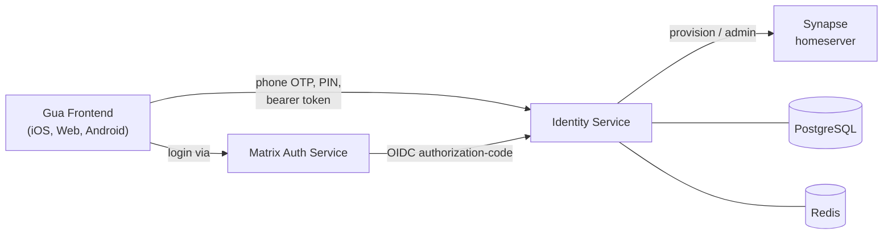

<p align="center">
  
</p>


# Gua Identity Service

> **Status: CURRENT IMPLEMENTATION.** This README describes what the service does on `main` today, for operators and integrators. The service is not the target authentication boundary. In the target design, login authority moves to each homeserver's own auth service, and this service's remaining role is a follow-up decision. That design appears only under the **TARGET ARCHITECTURE** label in [Relationship to the target architecture](#-relationship-to-the-target-architecture) and the documents linked there. Nothing described there is built.

The Gua Identity Service is a Spring Boot microservice. Today it handles identity and authentication for every Gua homeserver. It owns:

- phone sign-up and sign-in, including OTP delivery;
- the account PIN, which is Gua's two-step verification;
- privileged account operations: deactivation, identity reset and phone-number change;
- contact discovery by peppered phone hash.

It also runs a self-contained OpenID Connect provider. That provider issues the access tokens that authenticate calls back into this service. It also bridges login into Matrix Authentication Service (MAS) and Synapse.

---

## ✨ What it does today

- 📱 **Phone sign-up & sign-in**: request OTP → verify OTP → then the factor the account holds: the PIN, or the passkey when it holds only a passkey. A new account must set a PIN or a passkey before it finishes. The SMS code never completes a sign-in on its own.
- 🔐 **OTP management**: Redis-backed codes with TTL, per-phone and per-IP hourly caps, localized SMS templates (en / pt-BR), optional Twilio delivery.
- 🔢 **Account PIN (two-step verification)**: set, OTP-protected change with a 24h cooldown, 5-attempt lockout with a 15-minute lock, and audit logging. A NIST-aligned strength policy rejects PINs that are not six digits, all-repeated, sequential, or common.
- 🛡️ **Privileged account operations**: account deactivation, identity-credential reset and phone-number change. Each is gated by a fresh phone-OTP reauthentication scoped to that one operation (modeled on Matrix UIA `m.login.msisdn`), in which the signed-in user confirms the number on their own account and the server checks it against the account's own directory binding. A phone change also hard-requires a stronger factor on top (a user-verifying passkey assertion, else the account PIN), verifies the **new** number by OTP, and enforces a per-account cooldown.
- 🔑 **OpenID Connect provider**: RS256 authorization-code + PKCE flow with an interactive browser login (phone → OTP → PIN or profile) that MAS redirects into. Includes discovery and JWKS endpoints, plus seeded clients for MAS (confidential) and the Gua apps (public, PKCE-required).
- 🪪 **Passkeys (WebAuthn)**: after phone verification, the user can register a passkey, either during onboarding or later from settings via `/security/passkey/enroll/start`. They can then sign in with it instead of an SMS code, and an account holding only a passkey must present it after the OTP.
- 🧩 **Adding a factor needs a step-up**: a bearer session on its own never adds a passkey or a PIN. Enrollment from settings runs in a web session that first confirms the account with the strongest thing it can produce (see [Adding a factor from settings](#adding-a-factor-from-settings)).
- 🧭 **Delayed account recovery**: a user who proved the number but cannot present any factor the account holds can start a recovery that waits out a dormancy period and a waiting period, is cancelled by any signed-in app or any sign-in with a factor, and on completion sets a new PIN, removes the account's passkeys and signs out every other session. Built on Yubico `webauthn-server-core`. Credentials are persisted in `passkey_credentials`, and the login flow gains a `PASSKEY_SETUP` step.
- 📇 **Directory lookup**: contact discovery by server-side peppered HMAC of the phone number. The directory stores the digest plus a display-only masked form (e.g. `••••4567`), never the raw number. The shared pepper is the current mechanism and is scheduled for replacement.
- 📊 **Prometheus metrics**: Micrometer at `/actuator/prometheus` (HTTP/JVM/DB-pool) plus domain counters (`gua_identity_signup_total`, `gua_identity_login_total`, `gua_identity_otp_verify_total`, `gua_identity_sms_send_total{provider,result}`).
- 🚦 **Built-in rate limiting**: per-endpoint Resilience4j limiters, so the service is safe to run without an upstream WAF.
- 🗄️ **Persistent identities**: PostgreSQL with Flyway migrations.
- 📚 **OpenAPI/Swagger UI** at `/swagger-ui.html`.

---

## 🏗️ How it fits together


```mermaid
flowchart LR
    Clients["Gua Frontend<br/>(iOS, Web, Android)"] -->|phone OTP, PIN,<br/>bearer token| IDS["Identity Service"]
    IDS -->|provision / admin| Synapse["Synapse<br/>homeserver"]
    MAS["Matrix Auth Service"] -->|OIDC authorization-code| IDS
    Clients -->|login via| MAS
    IDS --- PG[("PostgreSQL")]
    IDS --- Redis[("Redis")]
```

Today the identity service plays two roles at once. It is the OIDC provider that MAS delegates phone-OTP login to. It also issues and validates the bearer tokens that its own client-facing REST API requires. Together, those two roles make it the single OIDC provider and the sole credential store for every homeserver. That is the current implementation, not the target; see [Relationship to the target architecture](#-relationship-to-the-target-architecture).

Bearer tokens are primarily verified locally against the published JWKS: RS256 signature, issuer, audience and expiry. A token that is not one of this service's own JWTs is checked against Synapse's `/whoami` endpoint instead. That fallback lets a native client reuse its Matrix SDK session token for a subset of endpoints.

Login works like this. MAS redirects the browser to `GET /oauth2/authorize`. The identity service parks the request in a short-lived, Redis-backed login session and hands off to the `gua-idp-web` single-page UI. That UI walks the user through phone, then OTP, then the factor the account holds (returning user) or profile and a first factor (new user), using the `/login/*` API. Only then is an authorization code issued back to MAS.

---

## 🔭 Relationship to the target architecture

> **TARGET ARCHITECTURE.** Nothing in this section is built. It records where this service sits relative to the frozen design, so that every other section can be read as current state.

Start with the plain-language guide, [Gua identity and federation](https://github.com/Gua-ra/gua-resolver/blob/main/docs/architecture/gua-identity-and-federation.md). The normative record is [ADM-001](https://github.com/Gua-ra/gua-resolver/blob/main/docs/decisions/ADM-001-identifier-binding-placement-trust.md). This README does not repeat its reasoning.

- **Login authority moves to the homeserver.** Today this service is the single OIDC provider and the sole credential store for every homeserver. In the target, each homeserver's own auth service decides login. No artifact issued by the federation is a session grant. What remains of this service afterwards is a follow-up decision, tracked as Phase 7 of the [gua-resolver migration plan](https://github.com/Gua-ra/gua-resolver/blob/main/docs/migrations/gua-resolver-migration-plan.md).
- **Placement and identifier binding become federation concerns.** Placement is which homeserver holds an account. Identifier binding is how an identifier, such as a phone number, is tied to that account. In the target, both are verifiable against signed policy, roster state and verifier attestations. This service's local router and directory table are not that model.
- **The legacy non-interactive branch of `GET /oauth2/authorize` is removed** (ADM-001 L1a). `phone_number`, `otp_code` and `display_name` are no longer accepted, and an authorization code is only ever issued by the interactive login flow.
- **The resolver directory write client is removed.** Sign-up, sign-in and phone change no longer publish anything to the resolver; see [Federation directory](#-federation-directory-gua-resolver).
- **The shared directory pepper is the current mechanism.** It is scheduled for replacement.
- **Existing accounts are the migration input.** Each one is recorded in `directory_entries.homeserver_id`, and its OIDC `sub` is the full Matrix user id. Their migration is tracked in the migration plan.

---

## 🧰 Running it locally

One command starts Redis, Postgres, a disposable Synapse homeserver and a MAS container, then exports the environment variables the service needs:

```bash
# run and export environment variables into the current shell
source scripts/start-dev-test-stack.sh
```

Running the script normally (`bash scripts/start-dev-test-stack.sh`) still launches the containers. It also writes the computed environment variables to `.env.identity-service`. Load them with `source .env.identity-service`, or copy them into IntelliJ.

The script:

1. Starts all dependencies from `docker-compose.test.yml`: PostgreSQL, Redis, a disposable Synapse homeserver, and a MAS container running the `Gua-ra/gua-auth-service` fork image.
2. Waits for Synapse to become healthy.
3. Creates (or reuses) an admin Matrix user and captures its access token.
4. Generates a directory pepper at `docker/.identity-pepper` so hashing stays consistent.
5. Exports every environment variable the identity service needs.

Once the script has been sourced, run the application with `./gradlew bootRun` or from IntelliJ. No further environment setup is needed. To tear everything down:

```bash
docker compose -f docker-compose.test.yml down
```

> ⚠️ **Always source the environment before `bootRun`.** Variables such as `IDENTITY_MATRIX_ADMIN_API_BASE_URL` are interpolated into `WebClient` base URLs. If they are unset, the literal `${...}` placeholder reaches `WebClient`, and every Matrix-admin call fails with `IllegalArgumentException: Not enough variable values available`. Source `.env.identity-service` (or the start script) in the same shell that runs Gradle.

### Local secret files (gitignored, not in the repo)

These files hold development secrets and are intentionally gitignored. The dev stack creates or expects them locally. Never commit them:

| File | Purpose |
| --- | --- |
| `.env.identity-service` | Computed env vars written by the start script (Matrix admin token, base URLs, pepper, OIDC keys). |
| `docker/.identity-pepper` | Server-side pepper used to hash phone numbers for directory lookup. |
| `docker/.oidc-jwt-secret` | Local OIDC signing material for the dev stack. |
| `docker/mas/mas.conf.yaml` | MAS configuration including its signing/encryption secrets and upstream-OIDC client credentials. |

If `OIDC_RSA_PRIVATE_KEY` / `OIDC_RSA_PUBLIC_KEY` are not set, the service generates an ephemeral RSA signing key at startup and logs a warning. That is fine for local development, but tokens will not survive a restart.

---

## 🧪 Tests

```bash
./gradlew test
```

Integration and contract tests use **Testcontainers** (PostgreSQL) and **WireMock** (Matrix admin API), so a running **Docker** daemon is required.

---

## 🛠️ Tech Stack

- **Java 21** (LTS)
- **Spring Boot 3.5.x**, **Gradle (Groovy DSL)**
- **Spring Web** (MVC REST controllers) + **Spring WebFlux** (`WebClient` for the Matrix admin API)
- **Spring Security**: stateless bearer-token auth validated locally against this service's own JWKS
- **Spring Data JPA / Hibernate** (PostgreSQL dialect) + **Flyway** for migrations
- **Spring Data Redis**: OTP codes, PIN-change and phone-change challenges, reauth tokens, signup tokens, authorization codes
- **Nimbus JOSE + JWT**: RS256 token signing & verification
- **Resilience4j**: per-endpoint rate limiting
- **Twilio SDK**: SMS delivery (disabled by default)
- **springdoc-openapi**: Swagger UI / OpenAPI docs
- **Bean Validation**: request validation

Testing: **Spring Boot Test**, **Testcontainers** (PostgreSQL), **WireMock** (Matrix admin contract tests). Running `./gradlew test` therefore requires a working Docker daemon.

Infra: **PostgreSQL** (identities), **Redis** (ephemeral tokens), **Synapse** + **MAS** (downstream Matrix), all wired via **Docker Compose**.

---

## 🧭 Routing & global usernames

> **CURRENT IMPLEMENTATION.** This section describes the per-deployment routing the service performs today. It is not the placement or identifier-binding model of the target architecture.

Gua runs a closed set of homeservers, in the style of [Tchap](https://github.com/tchapgouv), the French government's closed Matrix federation. It does not join the open Matrix network. Today this service picks which of its configured homeservers a new account is created on, and records that choice in its own directory. Routing before login is a separate step: the iOS and Android clients call the resolver's `POST /resolve`, and this service takes no part in that call.

- **Homeserver registry** (`identity.routing.homeservers`) lists the homeservers this deployment can create accounts on. Each entry has `id`, `domain`, admin URL, region, weight and enabled. When the registry is unset, a single homeserver is synthesised from the legacy `identity.matrix.*` properties, so single-homeserver deployments need no config change. The registry is local configuration, not the federation roster.
- **Routing layer** (`HomeserverRouter`) picks a homeserver for each new account by rule (`single`, `region` or `weighted`) and records it in `directory_entries.homeserver_id`. The choice is local: nothing outside this service can re-derive it. Moving an existing account between homeservers is not supported here. Matrix has no native migration that preserves identity and key continuity. Placement migration for existing rows is tracked in the gua-resolver migration plan.
- **Global usernames** are unique within this deployment's directory, case-insensitively. `directory_entries.username` plus a unique index enforce this. The username is an alias recorded alongside the account's `homeserver_id`. `GET /directory/resolve?username=` returns the MXID and homeserver for a username. A homeserver that runs without this service is not covered by that index, so this is a per-deployment guarantee, not a federation one.
- The UI treats the full Matrix ID `@id:server` as an implementation detail. Users see only their username. The directory maps it to the MXID and homeserver recorded at signup.

> Roadmap: an opaque-MXID model, which decouples the human handle from the MXID, is staged as a follow-up. It changes the chain from MAS `preferred_username` to Synapse provisioning. Today the chosen handle is both the MXID localpart and the recorded global username, and the OIDC `sub` is the full Matrix user id. Do not read this as account portability between homeservers.

---

## 🔀 MAS fork: `Gua-ra/gua-auth-service`

The identity stack uses [`Gua-ra/gua-auth-service`](https://github.com/Gua-ra/gua-auth-service), a fork of [`element-hq/matrix-authentication-service`](https://github.com/element-hq/matrix-authentication-service) (MAS). In the current topology, MAS treats this service as its upstream OIDC issuer. That direction is the current implementation only. In the target architecture, the homeserver's own auth service decides login; see [Relationship to the target architecture](#-relationship-to-the-target-architecture).

### Why a fork?

The upstream consent screen ("Continue to {client}?") exposes the homeserver name to users and adds an extra step for first-party clients. Gua-specific handlers live under `crates/handlers/src/gua/` in the fork, which keeps upstream updates cheap to merge. The fork's `main` currently carries no consent-skip configuration, so every login goes through MAS's consent page. Check the fork repository before relying on any `[gua]` config section.

### Docker image

Tag convention: `v<upstream-mas-version>-gua.<patch>` (mirrors [Tchap's approach](https://github.com/tchapgouv/matrix-authentication-service)). The tag the local dev stack runs is pinned in `docker-compose.test.yml`; the fork repository is the source of truth for what each tag contains.

### Upgrading the fork

Follow the fork repository's own documentation for the upgrade runbook.

---

## 📡 API reference

Interactive docs: **`/swagger-ui.html`** (OpenAPI JSON at `/api-docs`). Endpoints marked **Public** require no bearer token; **Bearer** endpoints require an `Authorization: Bearer <access-token>` header issued by this service's `/oauth2/token`.

### Onboarding & sessions

| Method & path | Auth | Purpose |
| --- | --- | --- |
| `POST /otp/send` | Public | Generate and dispatch an OTP to a phone number (rate-limited, localized SMS). |
| `POST /otp/verify` | Public | Verify an OTP. Returns a `signupToken` (new user) or a `pinChallengeToken` (returning user holding a PIN; the PIN may also be sent inline). An account holding only a passkey is `403 passkey_required` and one holding no factor is `403 factor_setup_required`: this path cannot run a passkey ceremony or set a first factor, so those accounts sign in through the interactive flow. |
| `POST /account/genesis` | Public³ | Register an on-device `AccountGenesis`, receive its `accountId` and a single-use attach handle. Off unless `identity.genesis.enabled`. See [Account genesis](#account-genesis-accountid). |
| `GET /signup/check-username` | Public | Real-time username availability check (format/reserved rules + Matrix lookup). Does not mutate state. |
| `POST /signup/complete` | Public¹ | Exchange a `signupToken` and a PIN for a provisioned Matrix user with chosen username/display name. A missing or blank PIN is `400 pin_required`, and a malformed or weak one `invalid_pin`/`weak_pin`, both checked before the token is consumed. |
| `POST /signin/verify-pin` | Public¹ | Exchange a `pinChallengeToken` + PIN for a Matrix session (second leg of 2SV sign-in). |
| `POST /login/passkey/auth/options` | Session² | Start **passkey sign-in** for a returning user: WebAuthn assertion options, offered at the phone and OTP steps and at the PIN step. |
| `POST /login/passkey/auth/verify` | Session² | Verify the passkey assertion and complete sign-in without an SMS code. Only ever resolves to an existing account, never creates one. |

¹ No bearer token, but gated by the single-use token issued from `/otp/verify`.

² Part of the interactive OIDC login session: requires the login-session cookie plus the CSRF token from `GET /login/context` (see [Interactive login flow](#interactive-login-flow)).

³ No bearer token, and none is possible: registration happens before any OIDC flow exists to authenticate against. The request is self-authenticating instead, carrying a possession proof under the key committed inside the genesis itself.

### Account genesis (`accountId`)

Every account gets a permanent `accountId`, derived from an immutable object that commits the account's initial authority key. This implements Phase 3 of the [gua-resolver migration plan](https://github.com/Gua-ra/gua-resolver/blob/main/docs/migrations/gua-resolver-migration-plan.md), as decided in [ADM-008](https://github.com/Gua-ra/gua-resolver/blob/main/docs/decisions/ADM-008-account-genesis-and-placement-records.md).

**Nothing reads the accountId.** Not routing, not login, not a token claim, not a userinfo field, not a directory column. It is derived, stored and audited, and that is all. The reason is specific: MAS derives the Matrix localpart from an arbitrary template over the imported claims, and an accountId is lowercase letters and digits, so it would pass MAS's localpart rules. A claim carrying one would be a single config line away from re-keying accounts. `AccountIdNotReadGuardTest` fails the build if an accountId reaches any file on the routing, login or claim path.

**The objects.** `AccountGenesis` (suite `0x01`, 87 bytes) commits an Ed25519 authority key, the algorithm identifiers, and an initial recovery authority key and framework. It holds no identifier and no homeserver. `BootstrapGenesis` (suite `0x00`, 22 bytes) commits nothing but random entropy, and marks an account that predates account authority. Both are fixed-layout byte strings, and

```
accountId = "ga1" || base32(0x01 || rootClass || SHA-256(canonical bytes))
```

where `rootClass` is `0x01` for a genesis-rooted account and `0x00` for a bootstrap one, so an auditor can tell them apart from the id alone. The digest covers the bytes **as received**, never a re-encoding. An accountId has exactly one spelling: 34 bytes are 272 bits while 55 base32 characters carry 275, so the final character always holds three unused bits and is one of `a`, `i`, `q`, `y`. Decoders match `^ga1[a-z2-7]{54}[aiqy]$`, then decode, re-encode and compare.

Golden vectors live in [`docs/specs/genesis-vectors.v1.json`](docs/specs/genesis-vectors.v1.json): canonical bytes, hashes, accountIds, reproducible signatures under the RFC 8032 published test keys, and every case a conforming decoder must refuse together with the rule that refuses it. The iOS, Android and resolver ports verify against that file, and `GenesisVectorsTest` recomputes every byte of it.

**Registration and attach.** The client registers its genesis at `POST /account/genesis` and gets back a single-use attach handle, stored only as a hash and valid for `identity.genesis.pending-ttl`. It then sends `login_hint = "gua:phone=<E.164>;genesis=<handle>"`, which MAS forwards verbatim.

A handle on its own attaches nothing. Anyone can compose an authorize URL, so the hint is attacker-controlled in both directions, and the dangerous shape is an attacker's own genesis in a URL that prefills the victim's number. The attach therefore needs a second proof: when a session carrying a handle reaches the profile step, the server issues 32 CSPRNG bytes held against that login session, and the client signs the fixed-length preimage (27 domain bytes, then the challenge, then the 34 raw accountId bytes) with the committed authority key. identity-service verifies it against the key inside the stored genesis and derives the accountId itself, reading none from the request. Verification happens inside the account-creation transaction, so a handle that fails to attach fails the whole signup rather than silently falling back to a bootstrap id. A signup presenting no handle at all takes the bootstrap branch, which is not a failure.

**Flags** (all off by default, so a deployment that sets none behaves exactly as it did before this feature existed):

| Property | Env | Default | Effect |
| --- | --- | --- | --- |
| `identity.genesis.enabled` | `IDENTITY_GENESIS_ENABLED` | `false` | Master switch. Off: the endpoint answers `503`, the `gua:` hint grammar is not parsed, and no account gets a genesis row. |
| `identity.genesis.production-issuance` | `IDENTITY_GENESIS_PRODUCTION_ISSUANCE` | `false` | Allows issuing ids under recovery framework `0x01`. Off outside dev: that framework commits no delay bounds, and its recovery key shares the device store with the key it would veto, so production issuance waits on ADM-002. Dev turns it on and treats the ids as disposable. |
| `identity.genesis.pending-ttl` | `IDENTITY_GENESIS_PENDING_TTL` | `PT30M` | How long a registered genesis stays attachable. |
| `identity.genesis.require-for-native` | `IDENTITY_GENESIS_REQUIRE_FOR_NATIVE` | `false` | Refuses a native signup that presents no handle instead of giving it a bootstrap id. Flip only once the clients ship genesis. |
| `identity.genesis.bootstrap-backfill.enabled` | `IDENTITY_GENESIS_BOOTSTRAP_BACKFILL_ENABLED` | `false` | Mints a bootstrap accountId at startup for every existing account that has none. Idempotent and resumable, so it is safe to leave on. |

**Metrics.** `gua_identity_account_genesis{origin}` splits accounts into `GENESIS` and `BOOTSTRAP`; `gua_identity_accounts_without_genesis` must reach zero and stay there. Both are gauges, so neither name carries the `_total` suffix the Prometheus registry appends to counters, and both counts fall as the backfill runs. Both are read from the database at most once a minute and cached in between, and neither is registered while every flag is off, so a deployment that has not turned the feature on never runs the account scan behind them. An account recovered through the homeserver phone-binding fallback is given its id on the spot, so the second gauge can reach zero without waiting for a restart.

**Rollback.** Turn the flags off: the endpoint returns `503`, attach is skipped and nothing writes a genesis row. The table stays, because an accountId is permanent and nothing reads it. Drop `account_genesis` (and its `flyway_schema_history` row) only on abandoning the feature.

### Account authority, adoption and the device lifecycle

An account's authority is an append-only chain of signed records, and the chain **is** the authority: there is no ambient "the account's key" outside it. This implements [ADM-009](https://github.com/Gua-ra/gua-resolver/blob/main/docs/decisions/ADM-009-account-authority-adoption-and-device-lifecycle.md), which decides how an account that already exists, and whose id commits no key, gains authority at all, and decides the whole device lifecycle alongside it because a design that roots an account on one device and says nothing about the second device has only moved the failure.

**Everything here ships disabled.** With `identity.authority.enabled` off, every `/account/authority` endpoint answers `503 authority_disabled`, no row is written to any authority table, and no existing login, recovery, factor or genesis path behaves differently. `AuthorityFlagsOffTest` checks that the refusal happens before the account is resolved, before a challenge is minted and before any repository is touched.

**Adoption does not change the accountId.** An accountId is permanent, and its class byte is inside the hashed prefix, so adoption leaves `account_genesis` exactly as it is. The class byte records **how the id was derived**, never whether the account holds authority today: after adoption a class `0x00` account holds authority its id does not commit, and a verifier that needs to know reads the chain. The cost is accepted and real, and it is why new accounts still need a genesis: an adopted account's authority is not self-certifying from its id, and until the reserved log leaf exists it is an assertion by that account's homeserver.

**One envelope, four records.** Fixed layout, big-endian, no delimiters: magic (4, and the signature domain), version, suite, the 34 raw accountId bytes, `prevHash` (32), `seq` (8), then a body fixed per type. `GUAA` AdoptRoot (177 bytes), `GUAD` DeviceGrant (161), `GUAX` DeviceRevoke (145), `GUAR` AuthorityRecovery (209). The decoder refuses an unknown magic, version, suite, framework, reason, authorization or flag, a wrong length, a `seq` below 1, an all-zero key, a key that fails Ed25519 point decoding, a recovery key equal to a device key in the same record, and a label with a non-zero byte after its first zero, each with a stable rule token in the shape `AccountGenesisCodec` established. The all-zero rule is separate from point decoding because the all-zero encoding decodes to a valid low-order point.

`authorizingKey` names the key whose signature authorizes a record, **inside the bytes that are hashed**, so a future log leaf commits who authorized each transition and not only that someone did. `AuthorityRecovery.authorization` is `0x01` for the committed recovery authority key or `0x02` for the account-recovery path; under `0x02`, and only then, `authorizingKey` is all zero, and the decoder enforces that pairing in both directions.

**One preimage rule, for every type.** A record is verified against `magic || the 32 bytes of the server challenge minted for that transition || the canonical bytes`. The magic is the signature domain, so no record can be replayed as another type; the accountId is inside the canonical bytes, so none can be replayed into another account; and the challenge is inside every signature, so no record is precomputable on other hardware, transferable to another party, or resubmittable after it was opposed. Challenges are minted against the account **and** the acting stepped-up session, are single use, and are burned on refusal as well as on acceptance. Only their SHA-256 is stored.

**One head, one order, no races.** Exactly one `account_authority_head` row per account, read `FOR UPDATE` by every writer, and acceptance is a compare-and-set on `prevHash` and `seq`. Two devices acting at once produce one winner and one refusal carrying the current head. A record inside its opposition window has already taken its `seq`, so an immediate transition cannot starve a delayed one; a cancelled record keeps that slot, so the hash chain has no gap and no branch. Competing transitions resolve by ADM-002 D2's rank, not by a freeze: rank 2 is a recovery signed by the committed recovery authority key, rank 1 any record signed by an active device, rank 0 a recovery authorized through account recovery. A higher rank cancels a pending lower one, an equal rank is refused, and each cancelled initiation doubles the backoff of the key set that opened it.

**The device set.** A per-device key, never one key copied to every device: copying makes revocation meaningless, since the revoked device still holds the key the account is defined by. A grant takes effect on acceptance, because it only adds, and its holder is **quarantined** for one window: it may not sign a grant, a revocation or an approval, and it does not count toward the active device a revocation must leave behind. Revoking another device waits out the window; revoking itself is immediate, because a device removing its own authority reduces what an attacker holding it could do. Neither may leave the account with no unquarantined active device.

**The browser holds no authority, ever.** A browser login grants account access and never enters the device set, and this is a rule rather than a default: there is no flag that lets a web session sign an authority record. Authority-sensitive actions reachable from the web create a pending approval carrying the account, the action digest and a challenge; the browser shows a four-character code from an alphabet with no look-alikes, and an active authority device shows the same code and the action in the reader's own words and signs it. A malicious page reaches the approval and not the signature.

**SMS possession authorizes nothing here**, in any combination, at any step, including adoption. The phone's only role is as one notification channel among several. Three source rules hold that, and `AccountAuthorityGuardTest` fails the build on each: no authority file references the OTP services, `AuthFactor.PHONE_OTP` appears in no accepted set, and no transition is accepted on a factor inside the fresh-factor hold or while the account's last completed recovery is inside it. The third rule is the one that carries the weight: account recovery deletes every passkey, sets a caller-chosen PIN and revokes the account's sessions in one transaction, so without it a SIM-swap attacker presents that PIN days later as the possession proof for rooting the account. `identity_users.recovery_completed_at` exists for that rule, because `pin_reset_requested_at` is cleared on completion and `pin_set_at` cannot tell a recovery from an ordinary PIN change.

**Endpoints** (all bearer, all `503` while the flag is off; the four transitions additionally require a native session):

| Endpoint | What it does |
| --- | --- |
| `POST /account/authority/challenge` | Accepts the step-up this purpose is scoped to and mints the challenge the record will sign. The step-up and the challenge are minted together, so a step-up can never be older than the challenge it authorizes. |
| `POST /account/authority/adopt` | Records a pending `AdoptRoot` at `seq 1`. Refused on a non-empty chain, on a class `0x01` account, and without the confirmation that the recovery key was stored. |
| `POST /account/authority/oppose` | Objects to the pending transition. Free the first time, a step-up on any factor at any age after that. |
| `POST /account/authority/device/grant` | Activates another device key, effective at once, grantee quarantined. |
| `POST /account/authority/device/revoke` | Removes a device key: pending for another device, immediate for itself. |
| `POST /account/authority/recover` | Replaces the device set and the recovery key in one record. |
| `GET /account/authority` | The chain, the device set, any pending step. **The one endpoint that returns an accountId**, and only ever to its own account holder, because the client signs over its 34 raw bytes. |
| `POST /account/authority/approval`, `GET /account/authority/approval`, `POST /account/authority/approval/{id}/sign` | The browser-approval trio above. |

Two prerequisites ship with it, because the feature is incoherent without them. `POST /security/passkey/credentials/{credentialId}/remove` removes **one** credential behind the usual step-up: until now the only way was to remove them all, so an owner locking a thief out of a stolen device had to wipe every credential and register a new one, which put their own remaining factor inside the fresh-factor hold. And `GET /account/authority` is how the account holder reads their own accountId, which no endpoint returned before.

**Flags** (all off or empty by default):

| Property | Env | Default | Effect |
| --- | --- | --- | --- |
| `identity.authority.enabled` | `IDENTITY_AUTHORITY_ENABLED` | `false` | Master switch. Off: every endpoint answers `503` and no row exists. |
| `identity.authority.production-adoption` | `IDENTITY_AUTHORITY_PRODUCTION_ADOPTION` | `false` | Allows adoption at all. Off outside dev: under framework `0x01` the recovery key shares the device store with the key it would veto, so this waits on ADM-002 Q6. |
| `identity.authority.opposition-window` | `IDENTITY_AUTHORITY_OPPOSITION_WINDOW` | `PT72H` | The opposition window, and the quarantine a granted device serves. |
| `identity.authority.recovery-window` | `IDENTITY_AUTHORITY_RECOVERY_WINDOW` | `P7D` | ADM-002 D1's delay for framework `0x01`, deliberately not the adoption window. |
| `identity.authority.challenge-ttl` | `IDENTITY_AUTHORITY_CHALLENGE_TTL` | `PT15M` | How long a challenge, and therefore its step-up, stays spendable. |
| `identity.authority.approval-ttl` | `IDENTITY_AUTHORITY_APPROVAL_TTL` | `PT10M` | How long a browser-started approval stays signable. |
| `identity.authority.max-live-approvals` | `IDENTITY_AUTHORITY_MAX_LIVE_APPROVALS` | `3` | How many approvals one account may hold at once. |
| `identity.authority.allow-short-windows-for-testing` | `IDENTITY_AUTHORITY_ALLOW_SHORT_WINDOWS_FOR_TESTING` | `false` | Lifts the 24-hour floor on both windows. Dev only. |
| `identity.authority.native-client-ids` | `IDENTITY_AUTHORITY_NATIVE_CLIENT_IDS` | empty | Client ids whose tokens count as a native session, read from the token's verified audience. Empty means no client may root an account. |

**Startup refuses `enabled=true`** while no out-of-band notification channel is wired, which is ADM-009 gate 2. Every window here is theatre without a channel that survives both a SIM swap and the session revocation a recovery performs: the shipped `AuthorityNotifier` writes a log line and answers `isOutOfBand() == false`, and a log line is not a channel. Startup also refuses a window under 24 hours without the testing switch, and a challenge TTL over 15 minutes.

**Rollback.** Turn `identity.authority.*` off: every endpoint answers `503` and nothing writes. The tables may then be dropped, but they do not need to be, because nothing else reads them. Keep `identity_users.recovery_completed_at` either way: it is a fact about the account rather than feature state, and dropping it would silently reopen the hold above.

### Which factor applies where

A passkey is the preferred strong factor and the account PIN is the fallback for everyone who cannot use one. `AuthFactorPolicy` is where the answers live, so the interactive login flow, the legacy REST sign-in, the status endpoint and the phone-change step-up cannot each decide them differently. Two of them it decides, and two it states, which is not the same thing:

| Question | Answer | Where it is used | Decided there? |
| --- | --- | --- | --- |
| Preferred factor | `PASSKEY` → `PIN` → `PHONE_OTP`, whichever the account has registered first | `GET /security/pin/status`, and the interactive login state once its subject is resolved | Yes |
| What finishes a sign-in after the OTP | A held PIN: the PIN step (a passkey assertion is accepted there too). A held passkey and no PIN: the passkey is required. Neither: a first factor must be set up. The phone OTP is never the completing factor | interactive login, legacy `/otp/verify` | Yes |
| Step-up for a phone change | `PASSKEY` then `PIN`, hard block when neither is produced | published to clients by `GET /security/pin/status` as `phoneChangeStepUpFactors`; enforced separately by `POST /account/phone/change/start` | Published, not enforced |
| Step-up for adding a factor | A held passkey: the assertion, and the PIN is not also asked for. A held PIN and no passkey: the PIN. Neither: the account's own number and an OTP sent to it | the `ENROLL_STEP_UP` step of an enrollment session ([Adding a factor from settings](#adding-a-factor-from-settings)) | Read off `loginPolicy`, enforced there |
| Recovery | Restores the `PIN` after the phone OTP and a waiting period, and removes stored passkeys | written down in the policy; run by `AccountRecoveryService` | Stated, not called |

The step-up row is deliberate and worth reading before editing it: the rule stays in the enforcing branches because a configuration value able to switch the PIN branch or the final refusal off would turn one edit into a lockout or a bypass. The cost is that the published list and the enforced one can drift, held together only by tests.

**Held, registered, usable.** Three different things, and each question reads exactly one:

- **Held** (`passkeyHeld`, `pinRegistered`): a credential row exists. This is what sign-in routing, the legacy REST checks and recovery read, and it ignores whether the deployment currently has passkeys switched on. Switching passkeys off must not turn a passkey-only account into one an SMS code finishes, because its next step would be setting a PIN of the SMS holder's choosing.
- **Registered** (`passkeyRegistered`): held and assertable on this deployment. This is what the published `passkeyRegistered` fields report, so a client is never offered a ceremony the server cannot run.
- **Usable on this device**: only the client knows it and anyone holding a session can claim it. There is no field anywhere for a client to say "my passkey is unavailable, ask me for something else"; that would not describe a device, it would request the weaker factor.

**Why a held passkey can be required.** Requiring a passkey used to be refused as permanent lockout, since a credential left on a lost phone could not be removed or replaced. It is no longer lockout, because the account has a way back that does not need the credential: the [delayed account recovery](#delayed-account-recovery). The PIN stays the fallback underneath a held passkey: an account holding both is asked for the PIN and may present the passkey instead.

**Where the inventory is published, and where it must not be.** `passkeyRegistered` and `preferredFactor` appear in two places: `GET /security/pin/status`, which is bearer-gated and answers only for the subject in the token; and the interactive login state, but only from a step the flow cannot reach without an OTP or an assertion having resolved the subject (`PIN_REQUIRED`, `PASSKEY_REQUIRED`, `PIN_SETUP`, `PASSKEY_SETUP`, `ENROLL_STEP_UP`), and only when the session actually carries that subject. Both fields are absent from the JSON before then.

`pinRegistered` is narrower again. `GET /security/pin/status` has always answered it, as `hasPin`, to whoever holds the token. On the login state it appears at `ENROLL_STEP_UP` and nowhere else, because that session was minted from the caller's own bearer token and repeats an answer that caller can already read from the status endpoint. It is there because the step-up has to decide whether to offer the PIN beside the passkey, and `preferredFactor` alone cannot say: it answers `PASSKEY` for a passkey-only account and for a passkey-and-PIN one alike, so the web offered the PIN switch to both and the passkey-only holder typed a PIN only to be refused with `pin_not_set`. It stays off the sign-in steps because a session there has proved a phone number and nothing more.

The phone and OTP steps are excluded, and that exclusion is the point. At those steps the session holds a number somebody typed and nothing they have proved, so answering *does this account hold a passkey* there would answer it for any number at all: an enumeration oracle over who holds what. The phases that may report are an allow list rather than a pair of exclusions, so a step added later publishes nothing until somebody decides it should, and a guard test fails if `PHONE` or `OTP_SENT` ever joins it.

### Account PIN (two-step verification)

| Method & path | Auth | Purpose |
| --- | --- | --- |
| `GET /security/pin/status` | Bearer | Whether the user has a PIN set (drives the "set up two-step verification" nudge), plus `changePhoneCooldownRemainingSeconds` (how long the fresh-2FA hold below still has to run), the account's factor report: `passkeyRegistered`, `preferredFactor` and `phoneChangeStepUpFactors` (see [Which factor applies where](#which-factor-applies-where)), and the recovery banner fields `accountRecoveryPending`, `accountRecoveryCompletableAtEpochSeconds` and `accountRecoveryExpiresAtEpochSeconds` (null when no recovery is live), plus `accountRecoveryDormancySeconds` and `accountRecoveryWaitSeconds`, the two configured waits, which are reported whether or not one is live (see [Delayed account recovery](#delayed-account-recovery)). |
| `POST /security/pin` | Bearer | **Retired.** Always `403 step_up_required`, naming the flow below. A bearer session on its own must not add a durable factor. |
| `POST /security/pin/enroll/start` | Bearer | Add a PIN from settings: creates an enrollment session pinned to the authenticated user and returns a one-time `enrollUrl`. `409 pin_already_set` when the account has one. See [Adding a factor from settings](#adding-a-factor-from-settings). |
| `POST /security/pin/change/start` | Bearer | Enforce the 24h change cooldown, authorize with a passkey step-up assertion (`passkeyStepUpId` + `passkeyCredential`, preferred) or the current PIN, and send an OTP. A freshly registered passkey is held (`400 twofa_cooldown_active`) and the PIN path stays available. Returns a challenge id (`425` if cooldown active). |
| `POST /security/pin/change/complete` | Bearer | Redeem the challenge + OTP to apply the new PIN. |
| `POST /security/pin/reset` · `…/reset/complete` | Public | **Retired.** Always `410 endpoint_retired`. A lost PIN is recovered inside sign-in now, see [Delayed account recovery](#delayed-account-recovery). |

PIN policy is configurable under `identity.security`: `pin-change-cooldown` (default **24h**), `pin-reset-cooldown` (default **7 days**; the fresh-2FA hold below, and the fallback for both recovery durations), `max-pin-attempts` (default **5**), `pin-lock-duration` (default **15m**), `pin-change-challenge-ttl` (default **5m**).

**The PIN-change code is namespaced to its flow.** `POST /otp/send` is public and unauthenticated, and it writes the per-phone key `otp:code:<E.164>`. A flow that verified against that key would accept a code anyone could ask for, for any reason, and could have a code planted under it before the flow began. The PIN-change code therefore lives under `otp:code:pin-change:<challengeId>`, which the public send cannot reach, so it can only be satisfied by the code that flow itself sent. It keeps the same per-code guess budget, the same per-phone and per-IP send limits and the same TTL as the public path.

**A freshly minted second factor cannot move the phone number yet.** A login session can create or recover a PIN, and the phone-change step-up then accepts that PIN, so the login side is itself a route to re-pointing the number: an attacker who reaches a session only has to set a PIN of their own. `POST /account/phone/change/start` therefore refuses a PIN whose `pin_set_at` is inside the fresh-2FA hold, with `400 twofa_cooldown_active` and the remaining seconds in `retryAfterSeconds` (mirrored in `Retry-After`); `GET /security/pin/status` reports the same number up front so a client can show the wait instead of walking the whole flow into a refusal. The window is `identity.security.pin-reset-cooldown` (default **7 days**), which applies the same way to a PIN obtained through account recovery: a knowledge factor which has only just come into existence is not yet trusted for a takeover-shaped action. Nothing is refused permanently and no factor is taken away; the hold expires on its own. It is an **additional** refusal: the per-account change cooldown (`phone-change-cooldown`, `425`) is unchanged and still runs.

**The same hold applies to a freshly registered passkey, on the same window.** A passkey settles the phone-change step-up on its own, with the PIN never asked for, and `POST /security/passkey/enroll/start` asks a session holder for nothing but the bearer token. Holding only the PIN would therefore price the same takeover at seven days or at nothing depending on which factor the attacker reached for, and the cheap one is the passkey. So a step-up assertion whose credential was registered inside the window is refused with the same `400 twofa_cooldown_active` and `retryAfterSeconds`, weighed on `passkey_credentials.created_at` and only after the credential is known to belong to the caller. An established credential still settles the step-up at once, the PIN branch is untouched and still reachable by retrying with the PIN, and the refusal expires on its own.

One asymmetry is deliberate and visible on the wire: `changePhoneCooldownRemainingSeconds` on `GET /security/pin/status` reports the PIN hold only. A client should read it when it is about to offer the PIN, not as "can I change my number now": an account whose passkey is past its hold is told to wait for a flow that passkey would settle at once, and the field is also silent about the separate 24h `phone-change-cooldown`.

**PIN strength** is enforced by `PinPolicy` across every set/update/change/recovery path: a PIN must be exactly six digits and must not be all-repeated (`000000`), strictly sequential (`123456` / `654321`), or one of a curated list of common PINs. Strength failures surface a distinct `weak_pin` error code (vs `invalid_pin` for a wrong PIN at login). The same rules are mirrored client-side (gua-idp-web, gua-ios) for instant feedback, but the server remains authoritative.

**Username policy** (`UsernamePolicy`, shared by `/signup/check-username`, `/signup/complete`, and the interactive `/login/profile` step): 3 to 30 chars of lowercase letters, digits, dot, underscore or dash; not reserved; and, matching MAS's registration policy, not all-numeric (so a bare phone number can't become a handle).

### Delayed account recovery

The way back for someone who proved the phone number by OTP but cannot present the PIN or passkey the account holds (lost phone, forgotten PIN, credential manager wiped). An SMS code proves possession of a number, which a SIM swap also gives; what separates the account holder from whoever holds the SIM is that the holder still has a signed-in device or a factor. So recovery is slow on purpose, and gives the holder time to use either.

| Method & path | Auth | Purpose |
| --- | --- | --- |
| `POST /login/recovery/start` | Session² | Open a recovery episode. Available only at `PIN_REQUIRED` or `PASSKEY_REQUIRED` after a verified OTP, never in a re-authentication or an in-app enrollment session (`409 recovery_unavailable`). Returns the login state with `recovery.status` `PENDING`; a live episode is returned unchanged. `400 recovery_cooldown_active` with `retryAfterSeconds` and `Retry-After` when the account was used inside the dormancy period. Sends no SMS. |
| `POST /login/recovery/complete` | Session² | `{ "newPin" }`. Completes a `READY` episode and the login. Re-checked under the account row lock: `409 recovery_not_ready` with the fresh `recovery` object when it is still waiting, was cancelled or expired. A malformed or weak PIN is `400 invalid_pin`/`weak_pin` and counts nothing. |
| `POST /security/recovery/cancel` | Bearer | The account holder's cancel, from the banner every signed-in app shows while a recovery is live. `204` whether or not one was live. |

**The rules.** Both durations fall back to `pin-reset-cooldown` (7 days) when unset.

- **Request** only when the account has had no completed sign-in for `account-recovery-dormancy` (`IDENTITY_SECURITY_ACCOUNT_RECOVERY_DORMANCY`).
- **Finish** only after `account-recovery-wait` (`IDENTITY_SECURITY_ACCOUNT_RECOVERY_WAIT`) has passed since the request.
- The episode is stamped on `identity_users.pin_reset_requested_at` and is **live** while `now < stamp + wait + max(wait, dormancy)`. That one predicate drives every status, every writer and the status endpoint. A dead stamp is treated as absent, so an abandoned request can never satisfy the wait of the next one.
- Status, decided in this order: `PENDING` (live, still waiting), `READY` (live, wait over), `TOO_SOON` (not live, signed in inside the dormancy period), `AVAILABLE`. The login state's `recovery` object carries `availableAtEpochSeconds` for `TOO_SOON` (rounded up to the **start of the next UTC day**, so the clients can say "try again after Sep 14" and nothing about the time of the last sign-in is readable from it; to the next whole minute when `IDENTITY_SECURITY_ACCOUNT_RECOVERY_ALLOW_SHORT_FOR_TESTING=true`, where a day would dwarf the durations under test and leave dev QA with nothing to watch. Every client renders this value as a **date** with no clock time whichever rounding produced it, so on a short-duration deployment a two-minute wait still reads as a date; that is the cost of the exception and not a defect, and the exact remaining wait is in the `retryAfterSeconds` of `recovery_cooldown_active`, which counts down to that same published time) and `completableAtEpochSeconds` plus `expiresAtEpochSeconds` for `PENDING`/`READY`. It also carries `dormancySeconds` and `waitSeconds`, the two configured waits, at every status: they are configuration rather than episode state, and the screen that explains the two waits has to state the ones this deployment enforces. It is an explicit `null` whenever recovery is not available to the session, which is how the UI knows to hide the link.
- Startup refuses either duration below **24h** unless `IDENTITY_SECURITY_ACCOUNT_RECOVERY_ALLOW_SHORT_FOR_TESTING=true`, which only a dev deployment may set.
- The same two waits are on `GET /security/pin/status`, under `accountRecoveryDormancySeconds` and `accountRecoveryWaitSeconds`. The two spellings are deliberate, not a drift: the login state publishes a nested `recovery` object, so the short names sit inside it and cannot collide with anything; `pin/status` has never had one and its recovery fields have always been flat and prefixed (`accountRecoveryPending`, `accountRecoveryCompletableAtEpochSeconds`, `accountRecoveryExpiresAtEpochSeconds`), so naming these two `dormancySeconds` and `waitSeconds` there would put two bare nouns at the top level of a response that is mostly about the PIN, and nesting them would reshape a response both apps already decode. Same values, same getters, one shape per response.

**What ends an episode.** A completed sign-in with the PIN or a passkey; a successful PIN check anywhere; the owner's cancel, which also counts as account activity so whoever started the recovery cannot start another one the next minute; and completion itself.

**What completion does**, in one transaction under the row lock: sets the new PIN (stamping `pin_set_at`, so the fresh-2FA hold keeps it off a phone change), ends the episode, clears any PIN lock, and removes every stored passkey, because the premise is that they cannot be used and a lost or stolen device must not sign back in with passkey-first sign-in, which asks for no OTP. The user can enroll a new passkey afterwards. After commit it cuts off this service's own access tokens and completes the login, and the ID token of that login carries `gua_end_other_sessions: true`. Signing out the other sessions is done by the authentication service when it sees that claim: identity-service's token cutoff does not reach the MAS and Matrix tokens the apps hold, and identity-service has no MAS admin credential.

**The sign-out survives a login that cannot be finished.** The recovery commits before its login is issued, so a failure after the commit (a Redis error issuing the code, a browser that never follows the redirect) would otherwise lose it: the episode is over, and the next sign-in with the new PIN is an ordinary one. The recovery transaction therefore also records the sign-out as owed (`recovery:end-other-sessions:<user>` in Redis, written just before the commit so a Redis failure rolls the recovery back, and kept for `account-recovery-wait`). While it is owed, the claim is re-issued on every completed sign-in of the account, whatever factor it used, not only on the recovery's own. It is settled when the token endpoint issues an ID token carrying the claim, and sign-ins after that are ordinary again. Only a completed recovery records it; after one, the only person who can complete a sign-in is whoever set the new PIN. The completion also stamps `last_login_at` in its own transaction, so the account never looks dormant enough for another recovery because the sign-in record after the commit did not run.

**Known limit of the owed sign-out.** Settling records the hand-over, not the sign-out. The authentication service (MAS) exchanges the code for the ID token first and acts on the claim only when it finishes the upstream link page for that login. If it never finishes that page (the browser does not follow the redirect to it, or the page fails), the claim is spent without signing anything out, and no later sign-in re-issues it because the mark is already settled. Closing this would need MAS to confirm the sign-out back to identity-service.

**Every writer takes the row lock.** Start, complete, cancel, the sign-in record, the PIN check, the PIN change and the phone-change stamp all read `identity_users` under `SELECT ... FOR UPDATE`, so a cancel and a completion can never both win and no writer can put back a PIN hash or recovery stamp another one just committed. A row that does not exist yet is inserted and flushed at once, so two sessions creating it meet on the unique `user_id`; in first-factor enrollment the loser gets `409 factor_required`. `AccountRecoveryConcurrencyTest` races them against real Postgres.

**Rollout.** Migration `V12` clears every `pin_reset_requested_at` left by the retired PIN reset endpoints. Those stamps were opened before any code was checked and while no app could show the banner, so read under these rules some would already be `READY`. A user who still needs to recover starts again at sign-in and gets the full wait.

**Known gap, recorded and not fixed here.** A phone-number change calls the same token cutoff, which likewise does not sign out the apps' MAS and Matrix sessions.

### Passkeys

Passkey **registration** is normally offered during onboarding (see [Interactive login flow](#interactive-login-flow)); an already-signed-in user can also add one later from settings:

| Method & path | Auth | Purpose |
| --- | --- | --- |
| `POST /security/passkey/enroll/start` | Bearer | Start in-app passkey enrollment: creates a login session pinned to the authenticated user and returns a one-time `enrollUrl`. The session starts at the step-up, see [Adding a factor from settings](#adding-a-factor-from-settings). `409 passkey_already_registered` when the account has one. |
| `GET /login/enroll/{token}` · `GET /login/passkey/enroll/{token}` | Public (one-time token) | Redeems the `enrollUrl` in a web view: sets the first-party login cookie and redirects into the sign-in UI, which finds the session at `ENROLL_STEP_UP` (`410 enroll_link_expired` once used or expired). The `/passkey/` spelling is what older links carry and is the same handoff. |
| `POST /security/passkey/stepup/options` | Bearer | Start a **user-verifying** assertion that may be spent as the step-up factor on a privileged operation. Returns a `stepUpId` and the WebAuthn `publicKey` options. |

The pinned session can only reach the enrollment steps. It can never degrade into an open login or signup, and it stores nothing before the step-up below. Passkey **sign-in** happens inside the interactive login flow via `POST /login/passkey/auth/options` / `…/verify` (see the quick reference above).

**Sign-in and step-up are different bars.** A sign-in assertion proves possession of an unlocked device; the account PIN it would stand in for on a privileged operation proves knowledge, counts its failures and locks out. So the step-up ceremony asks for `userVerification: required` and the assertion is refused (`403 passkey_user_verification_required`) unless the authenticator data says the user was actually verified, which is read off the presented assertion rather than trusted from what the stored request asked for. Step-up challenges live in their own Redis namespace (`passkey:stepup:<stepUpId>`) and are pinned to the authenticated account, so a sign-in challenge cannot be spent as a step-up and a step-up challenge cannot complete a login. Every assertion challenge, step-up and sign-in alike, is burned when it is presented rather than when it is accepted: a challenge that outlived a refusal could be presented again for the rest of its 5 minute TTL, which would turn a single-use window into a retry window and make a failed attempt free. Sign-in and registration deliberately stay at `userVerification: preferred`: raising them would refuse an authenticator that cannot verify a user and quietly move those accounts onto another factor, for no gain, since sign-in is not where an assertion replaces a knowledge factor. Signature-counter validation stays off for the same shape of reason: a passkey held in a synced credential manager legitimately never increments, so validating the counter would lock those accounts out of their own credential, and the counter is not what the step-up bar rests on.

### Adding a factor from settings

A bearer session on its own never adds a durable factor. A session is the thing an attacker gets hold of, and a passkey or a PIN created from one is a second way into the account that outlives the session, so both enrollment entry points hand back a one-time URL for a web session that has proved nothing yet.

| Method & path | Auth | Purpose |
| --- | --- | --- |
| `POST /security/passkey/enroll/start` · `POST /security/pin/enroll/start` | Bearer | Create the enrollment session and return its `enrollUrl`. `409` when the account already holds that factor, or `409 step_up_unavailable` when no proof the account could give is one this deployment can run. |
| `POST /login/enroll/stepup/passkey/options` · `…/passkey/verify` | Session cookie + CSRF | The preferred proof: a **user-verifying** assertion pinned to the session's account. |
| `POST /login/enroll/stepup/pin` | Session cookie + CSRF | `{ "pin" }`. The proof for an account that holds a PIN and no passkey. Counted and locked out like the sign-in PIN step. `409 pin_not_set` when the account has none. |
| `POST /login/enroll/stepup/otp/send` · `…/otp/verify` | Session cookie + CSRF | `{ "phoneNumber" }` then `{ "phoneNumber", "code" }`. Only for an account that holds **no** factor: `409 step_up_factor_available` otherwise. The number is checked against the account's own directory binding exactly as [reauthentication](#privileged-account-operations) does, so the refusal for someone else's number says nothing about whose it is. |

The session starts at a new phase `ENROLL_STEP_UP` and publishes the same factor fields as the sign-in factor steps (`passkeyRegistered`, `preferredFactor`, `passkeysEnabled`) plus `enrollment: true`, so the UI offers the right proof instead of guessing. It additionally publishes `pinRegistered`, which no other step does. `recovery` is always `null` there: recovery is the way back for someone who cannot get in, and this session belongs to someone who is already signed in.

**Strongest first, and only one of them.** An account that produces a passkey is never also asked for its PIN, for the same reason the phone-change step-up does not ask: demanding the knowledge factor as well from someone who just proved the stronger one would make the stronger one worth less than the weaker one.

**An account with nothing to prove itself with is told so at the door.** The three proofs cover every account but one: an account holding a passkey and no PIN, on a deployment where passkeys are switched off, can run no assertion, has no PIN to give, and is not offered the SMS proof either, which is confined to accounts that hold nothing at all. Opening a session for it would publish `passkeyRegistered: false` and `preferredFactor: PHONE_OTP`, point the web at the phone step, and then refuse that step with `step_up_factor_available`. So both entry points refuse it up front with `409 step_up_unavailable` instead of handing out a session whose own published state points at the one path the server will not take. That account's way back is the [delayed account recovery](#delayed-account-recovery).

**Why SMS is allowed here at all, and only here.** An account holding no factor has nothing stronger to prove itself with, and it is the account that most needs to acquire one. The proof is a fresh reauthentication of the current account and an OTP to its current number, which establishes a **login** factor and nothing else: no account-authority transition is reachable from an enrollment session, and neither is recovery. An account that *does* hold a factor is refused this path, because letting a code sent to the number stand in for a held factor is exactly the SIM-swap downgrade the factor gate exists to refuse. Someone who cannot produce what their account holds has the [delayed account recovery](#delayed-account-recovery), which waits.

**Nothing is stored before the step-up.** Only the accepted proof moves the session to `PASSKEY_SETUP` or `PIN_SETUP`, and those steps refuse an enrollment session that has not been through it (`403 step_up_required`). The proof is recorded in its own session field, separate from the one that lets a session finish a sign-in, so an enrollment session still cannot complete a login even if a future route sent it to completion. An enrollment session issues no authorization code, whatever step it finishes at.

**The fresh-factor hold still applies.** A PIN or passkey created this way starts its hold like any other, so it cannot move the phone number for `pin-reset-cooldown` (see [Account PIN](#account-pin-two-step-verification)).

**The sheet returns to the app that opened it.** On completion the session echoes back an app-scheme redirect, and each build of the apps answers its own: the store build `global.gua`, a QA build `global.gua.dev`, an Android debug build `global.gua.debug`. One value for the whole deployment left the sheet on a QA build handing off to a scheme that build does not answer, so it never dismissed itself, and on a phone that also has the store build installed the completion went to the wrong app.

Both enroll-start endpoints therefore take an **optional** body, `{ "redirectUri": "<app scheme>" }`, and the session's redirect is resolved in three steps:

1. **the redirect the caller named**, when it is on the deployment's allowlist;
2. **the app scheme registered by the OIDC client the bearer token was issued to**, for a token this service minted itself;
3. **the configured default**, `idp.login.enroll.redirect-uri` (`IDP_LOGIN_ENROLL_REDIRECT_URI`).

Step 2 exists and is right, but it cannot reach the case this is for. An app signs in through MAS, so its bearer is a homeserver token validated through `whoami`, and the principal it yields names no OIDC client of ours to read a scheme off. Every app bearer falls to step 3. The build is in fact the only party that knows which build it is, so the value has to be able to come from the caller.

**Which is exactly why it is bounded by an allowlist.** This is a bearer endpoint that hands back a URL on our own origin, and one that honoured whatever redirect it was handed would hand a session's completion wherever the caller asked. `idp.login.enroll.redirect-uris` (`IDP_LOGIN_ENROLL_REDIRECT_URIS`, comma separated) is the list of redirects a caller may name, and it is the operator who writes it: the caller only says which of the deployment's own entries is asking. Unset, the allowlist is exactly the single `redirect-uri` above, so no deployment changes behaviour until its configuration does. The match is exact, because an allowlist that normalized or prefix-matched would be taking back the one judgement it exists to remove from the caller, and what gets stamped on the session is the configured entry rather than the string that arrived.

A named value that is not on the list is `400 invalid_redirect_uri`. It is not echoed back in the message, not written to a log, and no session is created to carry it, so the endpoint cannot be used to reflect a string of the caller's choosing. Clients treat that refusal as the signal to retry once with no `redirectUri`, which lands on step 2 or 3, so an older server or a deployment that has not been told about a build yet costs QA a redirect and never the enrollment itself.

Only an app scheme is taken from a client registration in step 2: what is being chosen is what the web view opening the sheet is listening for, and a client whose redirects are all web origins, the authentication service among them, is not an app that can be handed back to.

### Privileged account operations

Each privileged operation requires a fresh **reauth token** proving phone possession, in addition to the bearer token. Reauth tokens are **operation-scoped**: `/account/reauth/verify` takes an `operation` field (`DEACTIVATE` | `IDENTITY_RESET` | `PHONE_CHANGE`; defaults to `DEACTIVATE` for backwards compatibility) and the issued token can only be spent on the matching endpoint: a token minted to authorize a deactivation is not valid for an identity reset or a phone change, and vice versa.

| Method & path | Auth | Purpose |
| --- | --- | --- |
| `POST /account/reauth/start` | Bearer | `{ "phone" }`: the number the signed-in user says is on their account. `202` and an OTP to that number once it is shown to be the account's. |
| `POST /account/reauth/verify` | Bearer | `{ "phone", "code", "operation" }`. Exchange the OTP for a single-use reauth token (5-minute TTL) scoped to the requested `operation`. |
| `POST /account/deactivate` | Bearer + reauth (`DEACTIVATE`) | Deactivate the user's Matrix account (optionally erasing data). |
| `POST /account/reset-identity-credentials` | Bearer + reauth (`IDENTITY_RESET`) | Rotate the homeserver password and return one-time UIA credentials for `client.resetIdentity`. |
| `POST /account/phone/change/start` | Bearer + reauth (`PHONE_CHANGE`) + 2SV | Start a phone-number change: spends the reauth token **plus a stronger factor** (a user-verifying passkey assertion, else the account PIN), sends an OTP to the new number, and alerts the old number out of band. Returns a challenge id (`425` while the per-account change cooldown is active). |
| `POST /account/phone/change/complete` | Bearer | Redeem the challenge + new-number OTP to atomically re-bind the account's phone mapping; all outstanding sessions are revoked. |

**The caller confirms the number; the server never looks one up.** The signed-in user types the number on their own account. It is normalized by `PhoneNumberNormalizer`, digested with the directory pepper and compared with the digests of that account's own `directory_entries` rows, with the same homeserver phone-binding fallback the OTP step of the interactive login uses, so a rotated or drifted pepper does not strand a legitimate account (the fallback is best effort: the admin API is not reliably available under MAS delegated authentication, and a failure there is a miss, never an accepted number). Only a match sends the code, and the code goes to the number that was just proved to be the account's. Three things follow:

- **Nothing is stored.** Verify re-derives everything from the number submitted again, so there is no pending-phone record and no raw number anywhere.
- **Nothing is revealed.** A number that is not this account's is `403 reauth_phone_mismatch`, in the same words whether it is unknown, belongs to somebody else, or simply is not this one, so the endpoint cannot be used to ask who owns a number. A number that does not parse is `400 invalid_phone_number` from the normalizer, which is a function of the submitted string alone and says nothing about any account.
- **Guessing is bounded.** The account's own number is the secret being guessed by a stolen session, so wrong numbers are counted per user in Redis and further attempts are refused with `429` once `identity.security.max-reauth-phone-attempts-per-hour` (default **5**) is spent. The attempt is reserved by an atomic increment *before* the comparison, so a burst of parallel guesses is bounded by the same budget as a sequence of them, and it is given back when the number turns out to be the account's own, so the budget is spent by mismatches only and retyping your own number never locks you out of it. Both reauth endpoints also carry their own per-user, per-address [rate limit](#-rate-limiting). Successful sends stay inside the ordinary per-phone and per-address OTP limits.

This replaced a lookup of the homeserver's `msisdn` threepid binding, which an account created through the real interactive signup does not have, so phone change, deactivation and identity reset were unreachable for exactly the accounts a user can create (identity-service#44). Writing that binding at signup was the alternative and was rejected: it would put the raw MSISDN of every account on the homeserver, the admin API that serves it is unreliable under MAS delegated authentication, and the directory already holds the authoritative binding.

**Phone changes require two-step verification.** Because the reauth OTP goes to the *current* number, which a SIM-swap attacker may control, `/account/phone/change/start` additionally demands a non-phone factor. **Strongest first**: a user-verifying passkey assertion from `/security/passkey/stepup/options` settles the step-up on its own and the PIN is not asked for, because demanding the knowledge factor as well from someone who just proved the stronger one would make the stronger one worth less than the weaker one. Otherwise the account PIN is the fallback, and it stays the fallback for everyone who cannot produce an assertion on the device in front of them: a credential left on a lost phone must not become an account that can no longer change its number, so the step-up never asks whether a passkey is *registered*, only whether this caller *produced* one. Accounts that can produce **neither** are hard-blocked with `403 step_up_required` and must set up two-step verification (see [Adding a factor from settings](#adding-a-factor-from-settings)) before they can change their number. There is no token-only fallback. Two further refusals sit on top, neither of which replaces anything: a passkey that did not verify the user is not accepted as the factor (`403 passkey_user_verification_required`), and a PIN that was created, changed or reset inside the fresh-2FA hold is not accepted either (`400 twofa_cooldown_active`, see [Account PIN](#account-pin-two-step-verification)). The hold is weighed on the age of whichever credential was presented, the PIN's `pin_set_at` or the passkey's `created_at`; see the passkey note above for why leaving the passkey out of it would price the same takeover at nothing.

**Phone-change cooldown & challenge limits** (configurable under `identity.security`): successful changes are separated by `phone-change-cooldown` (default **24h**). While it is active, `/account/phone/change/start` returns `425` with a `phone_change_cooldown` error code and a `Retry-After` header. Each challenge lives for `phone-change-challenge-ttl` (default **10m**) and allows `max-phone-change-otp-attempts` wrong OTPs (default **5**); at the cap both the challenge and its OTP are destroyed and the flow must restart from `/start`.

### Directory

| Method & path | Auth | Purpose |
| --- | --- | --- |
| `POST /directory/lookup` | Bearer | Contact discovery: match address-book phone numbers (E.164) to Gua accounts. |
| `GET /directory/resolve?username=` | Bearer | Resolve a global username to its Matrix user id + homeserver, from this deployment's directory. |

#### Contact discovery privacy model

`POST /directory/lookup` takes `{"phones": ["+5511999998888", …]}` and returns the subset that
are on Gua (`phone`, `userId`, `username`, `displayName`). The privacy contract:

- **Nothing new at rest.** Submitted numbers are digested **in memory** with the same server-side
  peppered HMAC-SHA256 used by the directory; raw numbers are never persisted and never logged.
  The directory itself continues to store only `phone_digest` + a display-only mask.
- **No client-side hashing, on purpose.** The phone keyspace is small enough that any digest a
  client could compute (with a necessarily public key) is reversible by dictionary, while shipping
  the secret pepper to clients would let anyone holding a DB dump reverse the at-rest digests.
  Honest defense is TLS + server-side pepper, not hashing theater.
- **Enumeration defenses.** Bearer auth required, per-request cap (`identity.directory.max-lookup-batch`,
  default 1000, error `lookup_batch_too_large`), endpoint rate limit (below), and a per-account
  `discoverable` opt-out (V6): accounts with `discoverable = false` never appear in results.
- Invalid/duplicate address-book entries are skipped silently: one bad contact must not fail a sync.

---

## 🔐 OpenID Connect provider

The service is a self-contained OIDC provider. It issues the access tokens that protect its own REST API and lets [Matrix Authentication Service (MAS)](https://github.com/element-hq/matrix-authentication-service/) delegate user login to its phone OTP flows.

### Endpoints

| Endpoint | Purpose |
| --- | --- |
| `GET /.well-known/openid-configuration` | Discovery metadata (issuer, authorize/token/userinfo/JWKS URLs, supported response/grant types, `S256` PKCE, `RS256`). |
| `GET /.well-known/jwks.json` | Publishes the **RSA public** signing key so relying parties can verify RS256 tokens. |
| `GET /oauth2/authorize` | Authorization-code entry point. Validates `client_id`, `redirect_uri`, `response_type=code`, `scope`, and optional `state`/`nonce`/PKCE `code_challenge`, then starts a login session and **redirects to the interactive login UI**. The optional `login_hint` is either an E.164 phone to pre-fill the phone step or the reserved value `passkey`, which records a passkey sign-in intent on the session and is never treated as a phone number. (The legacy non-interactive branch that accepted `phone_number`+`otp_code` directly is removed, per ADM-001 L1a. `phone_number`, `otp_code` and `display_name` are no longer accepted and are ignored if sent.) |
| `POST /oauth2/token` | Exchanges an authorization code (and PKCE `code_verifier`) for a signed access token + ID token. |
| `GET /userinfo` | Returns the authenticated subject (`sub`), `phone_number`, `phone_number_masked` (display-only, e.g. `••••4567`), and optional `name` / `preferred_username`. |

### Interactive login flow

For browser-based login (the path used by MAS and the Gua apps), the identity service renders no HTML itself: it exposes a JSON API consumed by the **`gua-idp-web`** single-page app, served same-origin so the login-session cookie stays first-party.

1. MAS redirects the browser to `GET /oauth2/authorize`. The validated OIDC request (client, redirect URI, scopes, `state`, `nonce`, PKCE challenge) is stored in a Redis-backed login session and referenced by an opaque, HttpOnly, `SameSite=Lax` cookie. The browser is redirected to `idp.login.ui-url` (default `/signin`, served by `gua-idp-web`; kept distinct from the `/login/*` API).
2. The UI drives the `/login/*` API, echoing a per-session CSRF token (issued by `GET /login/context`) in the `X-CSRF-Token` header on every state-changing call.

| Method & path | Purpose |
| --- | --- |
| `GET /login/context` | Current step, masked phone, CSRF token, `intent` (`PHONE` or `PASSKEY`, from the `login_hint`; a missing field means `PHONE`), `enrollment` (an in-app factor enrollment rather than a sign-in), and, once the subject is resolved, `passkeyRegistered`, `preferredFactor` and `passkeysEnabled` (deployment capability), plus `pinRegistered` at `ENROLL_STEP_UP` only. At `PIN_REQUIRED` and `PASSKEY_REQUIRED` after an OTP it also carries `recovery` (see [Delayed account recovery](#delayed-account-recovery)); everywhere else `recovery` is `null`. |
| `POST /login/phone` | Submit the phone number; dispatches an OTP. |
| `POST /login/otp` | Verify the OTP; routes a returning account to `PIN_REQUIRED` (holds a PIN), `PASSKEY_REQUIRED` (holds only a passkey) or the passkey offer (holds nothing), and a new user to the profile step. Never completes the login. |
| `POST /login/pin` | Verify the account PIN at `PIN_REQUIRED`. Refused (`409 unexpected_step`) at `PASSKEY_REQUIRED`. |
| `POST /login/profile` | Choose username + display name (new user). |
| `POST /login/pin-setup` | The factor for an account holding none that is not finishing with a passkey, and the PIN being added in an enrollment session. Mandatory: `skip: true`, a missing PIN and a blank PIN are `400 pin_required`. `409 factor_required` when another session gave a signing-in account a factor in the meantime, `409 pin_already_set` for an enrolling one. |
| `POST /login/passkey/register/options` · `…/register/verify` | Register a passkey for the account (WebAuthn create). |
| `POST /login/passkey/setup-skip` | Leave the passkey offer without registering one (declined, failed, or no authenticator). A session that already signed in with its PIN completes; an account holding no factor goes on to `PIN_SETUP`. |
| `POST /login/passkey/auth/options` · `…/auth/verify` | Sign in with an existing passkey (WebAuthn get). Reachable from `PHONE`, `OTP_SENT`, `PIN_REQUIRED` and `PASSKEY_REQUIRED`. |
| `POST /login/recovery/start` · `…/recovery/complete` | The delayed account recovery, from `PIN_REQUIRED` or `PASSKEY_REQUIRED` after an OTP (see [Delayed account recovery](#delayed-account-recovery)). |
| `POST /login/enroll/stepup/*` | The enrollment step-up, at `ENROLL_STEP_UP` (see [Adding a factor from settings](#adding-a-factor-from-settings)). |
| `GET /login/enroll/{token}` | One-time web-view handoff for in-app factor enrollment started at `POST /security/passkey/enroll/start` or `POST /security/pin/enroll/start` (see [Adding a factor from settings](#adding-a-factor-from-settings)). |

**No code without a factor.** Every completion requires the session to have authenticated with one: a passkey assertion, the PIN, the account's first factor created in this session, or a completed recovery. Completion refuses anything else with `409 factor_required`, which is also what a login session saved before this rule existed gets. "First factor" is decided under the account's row lock at the moment it is written: two sessions for the same factorless account can both reach setup, and the second to finish finds a factor it did not authenticate with and is refused before storing its own.

New users are walked through profile → `PASSKEY_SETUP` → done, and reach `PIN_SETUP` only when the passkey does not happen: the offer is left without a credential (declined, refused by the authenticator, or no authenticator to run it), or the deployment has passkeys switched off, in which case the profile step routes straight there. The PIN is the fallback for whoever cannot use a passkey rather than the first thing a new account is asked for, and `PIN_SETUP` cannot be skipped. An older account that holds no factor is routed the same way after its OTP. Returning users who sign in with their PIN reach `PASSKEY_SETUP` unless the account already has a passkey or the deployment has passkeys switched off, and complete when they decline.

A returning user may instead authenticate with a passkey via the `…/auth/*` endpoints, which are reachable from the phone step, the OTP step, **the PIN step** and `PASSKEY_REQUIRED`. That last one matters: being asked for a PIN is what the flow does to an account that has one, which is exactly the population that would want the stronger factor, and until now the PIN step answered an attempt to use a passkey with a conflict. Admitting it takes nothing away, because the same assertion already completes the same login one step earlier. Two limits hold whatever the step: the profile step is never admitted (an assertion there would reach account creation) and neither is an in-app enrollment session (it carries no OIDC request, so it must keep issuing no authorization code). A session that has already resolved its subject, which is every session at `PIN_REQUIRED` and `PASSKEY_REQUIRED`, additionally requires the assertion to resolve to that same account.

On success an authorization code is issued, the login session is consumed (and its cookie cleared), and the response carries `redirectUrl` for the UI to navigate back to the client, which exchanges the code at `/oauth2/token`. For new users the chosen handle is emitted as the `preferred_username` claim so MAS uses it as the Matrix localpart on first provisioning. Returning users emit the username stored in the directory at signup, never a value derived from the user id; an account with no stored username falls back to the localpart of a well-formed Matrix user id, and the login is refused with `account_identity_inconsistent` when that value fails the username format or is another account's stored username (ADM-001 S6). The OIDC `sub` is the account's full Matrix user id on the homeserver chosen at signup (localpart plus homeserver domain). It is stable, but homeserver-scoped rather than opaque, which is why re-keying subjects is an explicit step in the migration plan.

Login-flow configuration (`idp.login.*`): `ui-url` (`IDP_LOGIN_UI_URL`, default `/signin`), `session-ttl` (`IDP_LOGIN_SESSION_TTL`, default `PT10M`), `cookie-name` (`IDP_LOGIN_COOKIE_NAME`, default `gua_login`), and `cookie-secure` (`IDP_LOGIN_COOKIE_SECURE`, default `true`; set `false` only for plain-HTTP local development).

Passkey configuration (`idp.login.passkeys.*`): `rp-id` (`IDP_LOGIN_PASSKEYS_RP_ID`) and `origins` (`IDP_LOGIN_PASSKEYS_ORIGINS`) default to localhost and MUST be set to the registrable auth domain and the exact HTTPS sign-in origin in production, or every WebAuthn ceremony is rejected by the browser.

### Web login gate

An optional invite-only gate for new web accounts, off by default: `idp.login.registration.web-allowlist-enabled` (`IDP_LOGIN_REGISTRATION_WEBALLOWLISTENABLED`). With the flag off, nothing in this section applies.

With it on:

- **OTP send** (`POST /login/phone`, `POST /otp/send`): a web flow gets an OTP only for a known number, meaning one that already has an account or is on `idp.login.registration.web-allowlist` (`IDP_LOGIN_REGISTRATION_WEBALLOWLIST`, E.164 CSV). Anything else gets `403 registration_not_approved` before any SMS is sent.
- **Account creation** (`POST /login/profile`, `POST /signup/complete`): a new web account is created only for an allowlisted number, whichever path minted the OTP.

Returning users are not blocked as long as their directory row resolves: that number counts as known, so an account created in the apps can also sign in on the web. The OTP step has one extra fallback that account creation does not, the homeserver phone binding. On the interactive flow the profile step recovers the account from that binding and heals the directory row, so the user simply signs in. On the REST path, which has no such recovery, a returning number whose directory row no longer resolves clears the OTP step and is then refused as a new web signup instead of minting a second account.

**Web or native.** MAS can append `gua_downstream=web|native` to the upstream authorize request (fork settings `forward_downstream_client` and `downstream_client_web_origin`; `native` means the downstream client's `client_uri` host differs from the web origin). A login session is exempt only when the marker equals `idp.login.registration.native-client-marker` (default `native`) exactly. An absent, empty or unrecognised marker is treated as web, and the REST endpoints, which carry no marker, always are.

**Limits.** The marker travels in a browser redirect, so the user can edit it, and MAS derives it from a `client_uri` that a dynamically registered client sets for itself. Treat the native exemption as a convenience for the beta apps, not a security boundary; SMS rate limits remain the defence against credit burn. An unforgeable signal needs a MAS-side change, such as a signed or PAR-carried downstream claim.

### Signing & configuration

Tokens are signed with **RS256**. Provide the keypair via `OIDC_RSA_PRIVATE_KEY` / `OIDC_RSA_PUBLIC_KEY` (key id from `OIDC_JWK_KEY_ID`, default `oidc-signing-key`). If the keys are unset, an **ephemeral** key is generated at startup (dev only). The issuer is taken from `IDENTITY_BASE_URL`, so point it at the publicly reachable base path (e.g. `https://identity.example.com`). Token TTLs: authorization code `PT5M`, access token `PT15M`, ID token `PT15M` (all overridable).

Seeded clients (`oidc.clients` in `application.yml`):

| Client | Type | PKCE | Scopes |
| --- | --- | --- | --- |
| `mas` | Confidential (`client_secret`) | optional | `openid`, `profile`, `phone` |
| `gua-ios` | Public | **required** (`S256`) | `openid`, `profile`, `phone` |

Additional first-party app clients (web today, Android in future) are registered as further public, PKCE-required entries under `oidc.clients`.

### API authentication

Client-facing REST endpoints require an access token in the `Authorization: Bearer <token>` header. `OidcAccessTokenValidator` first tries to verify the token locally against the published JWKS, checking the RS256 signature, the issuer, that the audience matches a registered client, and that the token has not expired or been revoked. If the token is not one of this service's own JWTs, it falls back to Synapse's `/whoami` endpoint so a native client can reuse its Matrix SDK session token (these tokens are granted no OIDC scopes). Access tokens carry a `jti` and can be invalidated ahead of expiry via a per-user revoke-before cutoff in Redis, which `/account/deactivate`, `/account/reset-identity-credentials`, `/account/phone/change/complete` and a completed account recovery set. That cutoff covers this service's own tokens only; it does not end the MAS and Matrix sessions the apps hold. Authorization codes and other short-lived tokens are stored in Redis to keep the service horizontally scalable.

---

## 🛡️ Rate limiting

Every public endpoint is protected by a **Resilience4j**-based rate limiter, so the service can run safely without an upstream proxy or WAF. Defaults live in `application.yml` under `identity.rate-limits` and are individually overridable via `IDENTITY_RATE_LIMIT_<NAME>_{LIMIT,REFRESH,TIMEOUT}` environment variables. A `default-config` applies to any endpoint without a specific rule.

| Endpoint | Default limit | Window |
| --- | --- | --- |
| `POST /otp/send` | 5 | 1 min |
| `POST /otp/verify` | 10 | 1 min |
| `POST /account/genesis` | 10 | 1 min |
| `POST /account/reauth/start` | 5 | 1 min |
| `POST /account/reauth/verify` | 10 | 1 min |
| `POST /account/phone/change/start` | 3 | 1 hour |
| `POST /account/phone/change/complete` | 10 | 1 hour |
| `POST /signup/complete` | 10 | 1 min |
| `POST /signin/verify-pin` | 10 | 1 min |
| `POST /login/otp` | 10 | 1 min |
| `POST /login/pin` | 10 | 1 min |
| `POST /login/passkey/auth/options` | 20 | 1 min |
| `POST /login/passkey/auth/verify` | 20 | 1 min |
| `POST /login/enroll/stepup/pin` | 10 | 1 min |
| `POST /login/enroll/stepup/otp/send` | 5 | 1 min |
| `POST /login/enroll/stepup/otp/verify` | 10 | 1 min |
| `POST /login/enroll/stepup/passkey/options` | 20 | 1 min |
| `POST /login/enroll/stepup/passkey/verify` | 20 | 1 min |
| `POST /login/recovery/start` | 30 | 1 hour |
| `POST /login/recovery/complete` | 30 | 1 hour |
| `POST /security/pin` | 20 | 5 min |
| `POST /security/pin/change/start` | 5 | 1 hour |
| `POST /security/pin/change/complete` | 5 | 1 hour |
| `POST /security/recovery/cancel` | 20 | 5 min |
| `POST /security/passkey/stepup/options` | 20 | 5 min |
| `POST /directory/lookup` | 30 | 5 min |
| _all others_ | 120 (`default-config`) | 1 min |

**Guess budgets.** The per-address rules above bound how fast one client can try a code; they do not bound how many guesses a code can absorb, because guesses can be spread over addresses for the whole TTL. Every OTP therefore carries its own budget: each guess is counted per phone in Redis (`otp:attempts:<E.164>`, an atomic increment expiring with the code) before it is compared, so at most `identity.otp.max-verify-attempts` guesses (default **5**, `IDENTITY_OTP_MAX_VERIFY_ATTEMPTS`) are ever compared against one code, whether they arrive one by one, spread over addresses or in parallel. The last allowed guess deletes the code when it is wrong, a guess counted past the cap is refused without being compared, and the spent counter is left to expire so a late guess cannot reopen the budget; only a fresh send, which resets the counter, can continue. Codes are compared in constant time. This covers every path that redeems a phone OTP (`/otp/verify`, `/login/otp`, PIN change, account re-authentication). The flow whose code is namespaced (`otp:code:pin-change:<challengeId>`) counts its guesses under the matching `otp:attempts:` key through the same capped implementation, so namespacing a code never trades the per-phone key for a code with no budget behind it. The new-number OTP of a phone change keeps its own per-challenge cap (`identity.security.max-phone-change-otp-attempts`). The interactive login steps `/login/otp`, `/login/pin`, `/login/passkey/auth/options` and `/login/passkey/auth/verify` are listed individually because the `default-config` window was far too loose for a credential check; those calls carry no bearer token, so their limiter is keyed by client address.

**Shared addresses.** Unauthenticated login calls are keyed by the client address. On Kubernetes, Spring Boot trusts the forwarded-for header set by the ingress (it enables forwarded-header handling when it detects the platform), and the dev audit log records real client addresses, so the key is the client's public address rather than the ingress hop. Many people can still share one public address (carrier-grade NAT is common on mobile networks), so a per-address limit on a login step has to be sized for a crowd, not for one person. That is why `/login/recovery/start` and `/login/recovery/complete` allow 30 per hour rather than a handful. Neither limit is what protects an account: both endpoints need a login session that has already passed an OTP, starting involves nothing to guess, and completing needs the episode to be `READY`.

Set `IDENTITY_RATE_LIMITS_ENABLED=false` to disable the limiter (e.g., for load testing). Otherwise clients receive HTTP `429` with a JSON body (`{"code":"rate_limited","message":"Rate limit exceeded"}`) and a `Retry-After` header.

---

## 🌐 Federation directory (gua-resolver)

> **REMOVED.** This service no longer writes to the gua-resolver directory. The client that did (`POST /directory/entries`, signed with this homeserver's roster key) was the member-authorized directory mutation that [ADM-001](https://github.com/Gua-ra/gua-resolver/blob/main/docs/decisions/ADM-001-identifier-binding-placement-trust.md) L1b rejects: the resolver accepted any active member's key for any row, so a member could bind any phone number to itself. The client, its properties and its call sites are deleted, and `ResolverDirectoryPublishRemovedTest` fails the build if the write path comes back.

### What this means

- Sign-up, sign-in (`/otp/verify`, `/signin/verify-pin`) and phone change complete without contacting the resolver. For this deployment's own users they read and write only this service's own [directory](#directory), as they always did.
- The resolver's read path is unaffected. Clients still route before login through the resolver's `POST /resolve`, in which this service takes no part.
- Rows this service published earlier are left in place in the resolver directory until placement records replace them. Nothing here removes or rewrites them, including old numbers from past phone changes, which were never unpublished because the resolver had no delete. That migration is tracked in the [gua-resolver migration plan](https://github.com/Gua-ra/gua-resolver/blob/main/docs/migrations/gua-resolver-migration-plan.md).
- The `identity.resolver.*` properties no longer exist. `IDENTITY_RESOLVER_BASEURL`, `IDENTITY_RESOLVER_HOMESERVERID` and `IDENTITY_RESOLVER_SIGNINGPRIVATEKEY` are ignored if a manifest still sets them: nothing binds those names and unknown environment variables do not fail startup (`IdentityServicePropertiesResolverEnvTest`). Remove them, and the signing-key Secret, from the deployment when convenient.

### Pepper

`IDENTITY_DIRECTORY_PEPPER` is this service's own directory pepper. The resolver has a separate `directory.pepper`. The two services hash the phone number differently, so their digests are not interchangeable even when the pepper value is the same. The shared-pepper model is the current mechanism and is scheduled for replacement.

## 📊 Observability

Micrometer exposes Prometheus metrics at **`/actuator/prometheus`** (enable via
`MANAGEMENT_ENDPOINTS_EXPOSURE=health,info,prometheus`, the default; the endpoint is permitted in
`SecurityConfig` for in-cluster scraping and tagged `application=identity-service`). Alongside the free
HTTP/JVM/DB-pool metrics, these domain counters drive the Gua usage/reliability dashboards + alerts:

| Metric | Meaning |
| --- | --- |
| `gua_identity_signup_total{result}` | completed new-account registrations |
| `gua_identity_login_total{result}` | successful sign-ins of existing accounts |
| `gua_identity_otp_verify_total{result=valid\|invalid\|exhausted}` | OTP correctness (delivery / abuse signal); `exhausted` counts guesses refused by the attempt cap: the guess that burns a code plus any parallel guess counted past the cap (brute-force signal) |
| `gua_identity_sms_send_total{provider,result=sent\|failed}` | SMS usage + delivery failures (`provider` = the active `SmsSender`) |

> Keep `/actuator` off the public edge (block it at the ingress/reverse-proxy): Prometheus scrapes it on the
> internal Service.

## 🚀 Deployment

### Build the container image

```bash
docker build -t gua/identity-service:latest .
```

### Compose file

An example `docker-compose.identity.yml` is included. Provide environment values (either via a `.env` file or directly in your orchestration system) for:

- `SPRING_DATASOURCE_*`: JDBC details for Postgres
- `SPRING_DATA_REDIS_*`: Redis host/port
- `IDENTITY_BASE_URL`: publicly reachable base URL; becomes the OIDC `issuer`
- `IDENTITY_MATRIX_*`: Synapse admin/client base URLs, homeserver domain, and admin token (used for provisioning; token validation is handled locally)
- `IDENTITY_DIRECTORY_PEPPER`: server-side secret used to hash phone digests. This is the current mechanism and is scheduled for replacement; rotating it orphans every stored digest
- `OIDC_RSA_PRIVATE_KEY` / `OIDC_RSA_PUBLIC_KEY`: RSA keypair used to sign and verify RS256 OIDC tokens (an ephemeral key is generated if omitted, not suitable for production)
- `OIDC_CLIENT_MAS_SECRET`: confidential client secret for the MAS OIDC client
- **SMS delivery (Twilio).** By default SMS is logged, not sent (`LoggingSmsSender`). Set
  `IDENTITY_SMS_TWILIO_ENABLED=true` to send real OTPs via Twilio:
  - `IDENTITY_SMS_TWILIO_ACCOUNTSID`: Twilio Account SID (`AC…`)
  - `IDENTITY_SMS_TWILIO_AUTHTOKEN`: Twilio Auth Token (secret)
  - `IDENTITY_SMS_TWILIO_FROMNUMBER`: an SMS-capable Twilio number in E.164 (e.g. `+1…`), **or**
  - `IDENTITY_SMS_TWILIO_MESSAGINGSERVICESID`: a Twilio Messaging Service SID (`MG…`), preferred for
    production (number pool, opt-out/compliance); takes precedence over the from-number when both are set.

  (On a Twilio trial account, SMS can only be delivered to verified numbers.)
- `MANAGEMENT_ENDPOINTS_EXPOSURE`: actuator endpoints to expose (default `health,info,prometheus`)

Then run:

```bash
docker compose -f docker-compose.identity.yml up -d --build
```

The container exposes port `8080` by default and relies on the surrounding services (Postgres/Redis/Synapse) defined in the compose file. Adjust or remove the bundled Postgres/Redis services if you point at managed instances instead.

---
