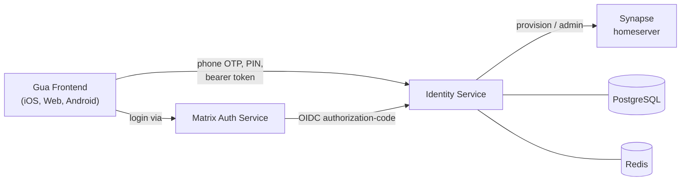

<p align="center">
  
</p>


# Gua Identity Service

> **Status: CURRENT IMPLEMENTATION.** This README describes what the service does on `main` today, as an operator or integrator needs it. It is not the target authentication boundary. Under [ADM-001](https://github.com/Gua-ra/gua-resolver/blob/main/docs/decisions/ADM-001-identifier-binding-placement-trust.md) each homeserver's own auth service becomes authoritative for login (L2), and the remaining role of this service is a follow-up decision. **TARGET ARCHITECTURE** appears only in [Relationship to the target architecture](#-relationship-to-the-target-architecture) and the documents it links; nothing described there is built.

The **Gua Identity Service** is a Spring Boot microservice that, in the current implementation, handles **user identity and authentication** for every Gua homeserver. It owns phone sign-up and sign-in, OTP delivery, the account PIN (two-step verification), privileged account operations (deactivate / identity reset / phone-number change), contact discovery by peppered phone hash, and a self-contained **OpenID Connect provider** that issues the access tokens used to authenticate calls back into this service and to bridge login into Matrix Authentication Service (MAS) / Synapse.

---

## ✨ Features

- 📱 **Phone sign-up & sign-in** — request OTP → verify OTP → either provision a new Matrix user, resume an existing session, or fall through to a PIN challenge for users with two-step verification enabled.
- 🔐 **OTP management** — Redis-backed codes with TTL, per-phone and per-IP hourly caps, localized SMS templates (en / pt-BR), optional Twilio delivery.
- 🔢 **Account PIN (two-step verification)** — set, OTP-protected change with a 24h cooldown, recovery reset, 5-attempt lockout with a 15-minute lock, and audit logging. A NIST-aligned strength policy rejects non-6-digit, all-repeated, sequential, and common PINs.
- 🛡️ **Privileged account operations** — fresh, operation-scoped phone-OTP reauthentication gates account deactivation, identity-credential reset, and phone-number change (modeled on Matrix UIA `m.login.msisdn`). Phone changes additionally hard-require a second factor (PIN or passkey), verify the **new** number by OTP, and enforce a per-account cooldown.
- 🔑 **OpenID Connect provider** — RS256 authorization-code + PKCE flow with an **interactive browser login** (phone → OTP → PIN/profile) that MAS redirects into, discovery/JWKS endpoints, and seeded clients for MAS (confidential) and the Gua apps (public, PKCE-required).
- 🪪 **Passkeys (WebAuthn)** — after phone verification, the user can optionally **register a passkey** (during onboarding, or later from settings via `/security/passkey/enroll/start`) and later **sign in with it** instead of an SMS code. Built on Yubico `webauthn-server-core`; credentials are persisted (`passkey_credentials`) and the login flow gains a `PASSKEY_SETUP` step.
- 🌐 **Federation directory publishing** (scheduled for removal, ADM-001 L1b): at account provisioning, POSTs `phone → this homeserver` to the **gua-resolver** shared directory (`POST /directory/entries`), signed with the homeserver's Ed25519 roster signing key. Best-effort: a resolver outage never blocks sign-up/sign-in. Not the identifier-binding design; see [Federation directory](#-federation-directory-gua-resolver).
- 📇 **Directory lookup**: contact discovery by server-side peppered HMAC of the phone number. The raw number is not stored in the directory; the digest plus a display-only masked form (e.g. `••••4567`) is. The shared pepper is the current mechanism, not the target one (ADM-001 L14, L15).
- 📊 **Prometheus metrics** — Micrometer at `/actuator/prometheus` (HTTP/JVM/DB-pool) plus domain counters (`gua_identity_signup_total`, `gua_identity_login_total`, `gua_identity_otp_verify_total`, `gua_identity_sms_send_total{provider,result}`).
- 🚦 **Built-in rate limiting** — per-endpoint Resilience4j limiters so the service is safe to run without an upstream WAF.
- 🗄️ **Persistent identities** — PostgreSQL with Flyway migrations.
- 📚 **OpenAPI/Swagger UI** at `/swagger-ui.html`.

---

## 🛠️ Tech Stack

- **Java 21** (LTS)
- **Spring Boot 3.5.x**, **Gradle (Groovy DSL)**
- **Spring Web** (MVC REST controllers) + **Spring WebFlux** (`WebClient` for the Matrix admin API)
- **Spring Security** — stateless bearer-token auth validated locally against this service's own JWKS
- **Spring Data JPA / Hibernate** (PostgreSQL dialect) + **Flyway** for migrations
- **Spring Data Redis** — OTP codes, PIN-change and phone-change challenges, reauth tokens, signup tokens, authorization codes
- **Nimbus JOSE + JWT** — RS256 token signing & verification
- **Resilience4j** — per-endpoint rate limiting
- **Twilio SDK** — SMS delivery (disabled by default)
- **springdoc-openapi** — Swagger UI / OpenAPI docs
- **Bean Validation** — request validation

Testing: **Spring Boot Test**, **Testcontainers** (PostgreSQL), **WireMock** (Matrix admin contract tests). Running `./gradlew test` therefore requires a working Docker daemon.

Infra: **PostgreSQL** (identities), **Redis** (ephemeral tokens), **Synapse** + **MAS** (downstream Matrix), all wired via **Docker Compose**.

---

## 🏗️ How it fits together


```mermaid
flowchart LR
    Clients["Gua Frontend<br/>(iOS, Web, Android)"] -->|phone OTP, PIN,<br/>bearer token| IDS["Identity Service"]
    IDS -->|provision / admin| Synapse["Synapse<br/>homeserver"]
    MAS["Matrix Auth Service"] -->|OIDC authorization-code| IDS
    Clients -->|login via| MAS
    IDS --- PG[("PostgreSQL")]
    IDS --- Redis[("Redis")]
```

Today the identity service is **both** an OIDC provider (MAS delegates phone-OTP login to it) **and** the issuer/validator of the bearer tokens its own client-facing REST API requires. That makes it the single OIDC provider and sole credential store for every homeserver. It is the current implementation, not the target: ADM-001 L2 places login authority in each homeserver's own auth service. Tokens are primarily verified locally against the published JWKS (RS256 signature, issuer, audience, and expiry). As a fallback, a token that is not one of this service's own JWTs is verified against Synapse's `/whoami` endpoint, which lets a native client reuse its Matrix SDK session token to call a subset of endpoints.

For login, MAS redirects the browser to `GET /oauth2/authorize`; the identity service parks the request in a short-lived, Redis-backed login session and hands off to the **`gua-idp-web`** single-page UI, which walks the user through phone → OTP → PIN (returning) or profile (new user) via the `/login/*` API before an authorization code is issued back to MAS.

---

## 🔭 Relationship to the target architecture

> **TARGET ARCHITECTURE.** Nothing in this section is built. It records where this service sits relative to the frozen design, so that every other section is read as the current state.

The plain-language guide is [Gua identity and federation](https://github.com/Gua-ra/gua-resolver/blob/main/docs/architecture/gua-identity-and-federation.md); the normative record is [ADM-001](https://github.com/Gua-ra/gua-resolver/blob/main/docs/decisions/ADM-001-identifier-binding-placement-trust.md). Decisions are cited by their ADM-001 label and their reasoning is not repeated here.

- **Authentication moves to the homeserver** (L2). Today this service is the single OIDC provider and the sole credential store for every homeserver. In the target, each homeserver's own auth service decides login, and no federation-issued artifact is a session grant. What remains of this service afterwards is a follow-up decision, tracked as Phase 7 of the [gua-resolver migration plan](https://github.com/Gua-ra/gua-resolver/blob/main/docs/migrations/gua-resolver-migration-plan.md).
- **Placement and identifier binding are federation concerns** (L6, L7, L8), verifiable against signed policy, roster state and verifier attestations. This service's local router and directory table are not that model.
- **Two paths here are scheduled for removal, not yet removed**: the legacy non-interactive branch of `GET /oauth2/authorize` (L1a) and the resolver directory write client (L1b).
- **Existing accounts** recorded in `directory_entries.homeserver_id`, with the OIDC `sub` equal to the Matrix user id, are the migration input tracked as S6.

---

## 🧭 Routing & global usernames

> **CURRENT IMPLEMENTATION.** This section is the per-deployment routing the service performs today. It is not the placement or identifier-binding model of ADM-001 (L2, L6, L7).

Gua runs a closed set of homeservers (à la [Tchap](https://github.com/tchapgouv), the French government's closed Matrix federation), not the open Matrix network. Today this service picks which of its configured homeservers a new account is created on and records that choice in its own directory. Routing before login is the resolver's `POST /resolve`, called by the iOS and Android clients; this service takes no part in that call.

- **Homeserver registry** (`identity.routing.homeservers`) lists the homeservers this deployment can create accounts on (`id`, `domain`, admin URL, region, weight, enabled). When unset, a single homeserver is synthesised from the legacy `identity.matrix.*` properties, so single-homeserver deployments need no config change. This is local configuration, not the federation roster (L10).
- **Routing layer** (`HomeserverRouter`) picks a homeserver for a **new** account by rule (`single` / `region` / `weighted`) and records it in `directory_entries.homeserver_id`. The choice is local and nothing outside this service can re-derive it; L6 defines the target placement transaction. Moving an existing account between homeservers is not supported here. Matrix has no native migration that preserves identity and key continuity (L9), and Gua placement migration for existing rows is tracked as S6.
- **Global usernames** are unique within this deployment's directory (case-insensitive), enforced by `directory_entries.username` + a unique index. The username is an **alias** recorded alongside the account's `homeserver_id`. `GET /directory/resolve?username=` returns the MXID + homeserver for a username. A homeserver that runs without this service is not covered by that index, so this is a per-deployment guarantee, not a federation one.
- The UI treats the full Matrix ID `@id:server` as an implementation detail: users see only their username, and the directory maps it to the MXID + homeserver recorded at signup.

> Roadmap: the **opaque-MXID** model (decoupling the human handle from the MXID) is staged as a follow-up because it changes the MAS `preferred_username` → Synapse provisioning chain. Today the chosen handle is both the MXID localpart and the recorded global username, and the OIDC `sub` is the full Matrix user id. Do not read this as account portability between homeservers (L9).

---

## 🔀 MAS fork: `Gua-ra/gua-auth-service`

The identity stack uses **[`Gua-ra/gua-auth-service`](https://github.com/Gua-ra/gua-auth-service)**, a fork of [`element-hq/matrix-authentication-service`](https://github.com/element-hq/matrix-authentication-service) (MAS). In the current topology MAS treats this service as its upstream OIDC issuer. That direction is the current implementation only: ADM-001 L2 makes the homeserver's own auth service authoritative for login.

### Why a fork?

The upstream consent screen ("Continue to {client}?") exposes the homeserver name to users and adds an extra step for first-party clients. Gua-specific handlers live under `crates/handlers/src/gua/` in the fork, which keeps upstream updates cheap to merge. The fork's `main` currently carries no consent-skip configuration, so every login goes through MAS's consent page; check the fork repository before relying on any `[gua]` config section.

### Docker image

Tag convention: `v<upstream-mas-version>-gua.<patch>` (mirrors [Tchap's approach](https://github.com/tchapgouv/matrix-authentication-service)). The tag the local dev stack runs is pinned in `docker-compose.test.yml`; the fork repository is the source of truth for what each tag contains.

### Upgrading the fork

Follow the fork repository's own documentation for the upgrade runbook.

---


Spin up Redis, Postgres, and a disposable Synapse homeserver with a single command:

```bash
# run and export environment variables into the current shell
source scripts/start-dev-test-stack.sh
```


Running the script normally (`bash scripts/start-dev-test-stack.sh`) will still launch the containers; it also writes the computed environment variables to `.env.identity-service` so you can load them manually with `source .env.identity-service` or copy them into IntelliJ.

What the script does:

1. Starts all dependencies using `docker-compose.test.yml` (PostgreSQL, Redis, a disposable Synapse homeserver, and a **MAS container** running the `Gua-ra/gua-auth-service` fork image).
2. Waits for Synapse to become healthy.
3. Creates (or reuses) an admin Matrix user and captures its access token.
4. Generates a directory pepper (stored at `docker/.identity-pepper`) for consistent hashing.
5. Exports all required environment variables for the identity service.

Once the script has been sourced you can run the application with `./gradlew bootRun` or from IntelliJ without additional environment setup. To tear everything down:

```bash
docker compose -f docker-compose.test.yml down
```

> ⚠️ **Always source the environment before `bootRun`.** Variables such as `IDENTITY_MATRIX_ADMIN_API_BASE_URL` are interpolated into `WebClient` base URLs; if they are unset the literal `${...}` placeholder reaches `WebClient` and every Matrix-admin call fails with `IllegalArgumentException: Not enough variable values available`. Use `source .env.identity-service` (or source the start script) in the same shell that runs Gradle.

### Local secret files (gitignored — not in the repo)

The following files contain development secrets and are intentionally **gitignored**. The dev stack creates or expects them locally; never commit them:

| File | Purpose |
| --- | --- |
| `.env.identity-service` | Computed env vars written by the start script (Matrix admin token, base URLs, pepper, OIDC keys). |
| `docker/.identity-pepper` | Server-side pepper used to hash phone numbers for directory lookup. |
| `docker/.oidc-jwt-secret` | Local OIDC signing material for the dev stack. |
| `docker/mas/mas.conf.yaml` | MAS configuration including its signing/encryption secrets and upstream-OIDC client credentials. |

If you don't set `OIDC_RSA_PRIVATE_KEY` / `OIDC_RSA_PUBLIC_KEY`, the service generates an **ephemeral** RSA signing key at startup (and logs a warning) — fine for local dev, but tokens won't survive a restart.

---

## 🧪 Tests

```bash
./gradlew test
```

Integration and contract tests use **Testcontainers** (PostgreSQL) and **WireMock** (Matrix admin API), so a running **Docker** daemon is required.

---

## 📡 API reference

Interactive docs: **`/swagger-ui.html`** (OpenAPI JSON at `/api-docs`). Endpoints marked **Public** require no bearer token; **Bearer** endpoints require an `Authorization: Bearer <access-token>` header issued by this service's `/oauth2/token`.

### Onboarding & sessions

| Method & path | Auth | Purpose |
| --- | --- | --- |
| `POST /otp/send` | Public | Generate and dispatch an OTP to a phone number (rate-limited, localized SMS). |
| `POST /otp/verify` | Public | Verify an OTP. Returns one of: an existing-user Matrix session, a `signupToken` (new user), or a `pinChallengeToken` (returning user with two-step verification). |
| `GET /signup/check-username` | Public | Real-time username availability check (format/reserved rules + Matrix lookup). Does not mutate state. |
| `POST /signup/complete` | Public¹ | Exchange a `signupToken` for a provisioned Matrix user with chosen username/display name. |
| `POST /signin/verify-pin` | Public¹ | Exchange a `pinChallengeToken` + PIN for a Matrix session (second leg of 2SV sign-in). |
| `POST /login/passkey/auth/options` | Session² | Start **passkey sign-in** for a returning user: WebAuthn assertion options, offered at the start of the login flow before OTP verification. |
| `POST /login/passkey/auth/verify` | Session² | Verify the passkey assertion and complete sign-in without an SMS code. Only ever resolves to an existing account — never creates one. |

¹ No bearer token, but gated by the single-use token issued from `/otp/verify`.

² Part of the interactive OIDC login session: requires the login-session cookie plus the CSRF token from `GET /login/context` (see [Interactive login flow](#interactive-login-flow)).

### Account PIN (two-step verification)

| Method & path | Auth | Purpose |
| --- | --- | --- |
| `GET /security/pin/status` | Bearer | Whether the user has a PIN set (drives the "set up two-step verification" nudge). |
| `POST /security/pin` | Bearer | Set the **initial** PIN. Rejects payloads containing `currentPin` — changes must use the flow below. |
| `POST /security/pin/change/start` | Bearer | Verify current PIN, enforce the 24h change cooldown, and send an OTP. Returns a challenge id (`425` if cooldown active). |
| `POST /security/pin/change/complete` | Bearer | Redeem the challenge + OTP to apply the new PIN. |
| `POST /security/pin/reset` | Public | Begin PIN recovery by sending an OTP to the verified phone. |
| `POST /security/pin/reset/complete` | Public | Verify the reset OTP and set a new PIN. |

PIN policy is configurable under `identity.security`: `pin-change-cooldown` (default **24h**), `pin-reset-cooldown` (default **7 days**), `max-pin-attempts` (default **5**), `pin-lock-duration` (default **15m**), `pin-change-challenge-ttl` (default **5m**).

**PIN strength** is enforced by `PinPolicy` across every set/update/change/reset path: a PIN must be exactly six digits and must not be all-repeated (`000000`), strictly sequential (`123456` / `654321`), or one of a curated list of common PINs. Strength failures surface a distinct `weak_pin` error code (vs `invalid_pin` for a wrong PIN at login). The same rules are mirrored client-side (gua-idp-web, gua-ios) for instant feedback, but the server remains authoritative.

**Username policy** (`UsernamePolicy`, shared by `/signup/check-username`, `/signup/complete`, and the interactive `/login/profile` step): 3–30 chars of lowercase letters, digits, dot, underscore or dash; not reserved; and — matching MAS's registration policy — not all-numeric (so a bare phone number can't become a handle).

### Passkeys

Passkey **registration** is normally offered during onboarding (see [Interactive login flow](#interactive-login-flow)); an already-signed-in user can also add one later from settings:

| Method & path | Auth | Purpose |
| --- | --- | --- |
| `POST /security/passkey/enroll/start` | Bearer | Start in-app passkey enrollment: creates a login session pinned to the authenticated user and returns a one-time `enrollUrl`. |
| `GET /login/passkey/enroll/{token}` | Public (one-time token) | Redeems the `enrollUrl` in a web view: sets the first-party login cookie and redirects into the sign-in UI at the passkey setup step (`410 enroll_link_expired` once used or expired). |

The pinned session can only reach the passkey-setup step — it can never degrade into an open login or signup. Passkey **sign-in** happens inside the interactive login flow via `POST /login/passkey/auth/options` / `…/verify` (see the quick reference above).

### Privileged account operations

Each privileged operation requires a fresh **reauth token** proving phone possession, in addition to the bearer token. Reauth tokens are **operation-scoped**: `/account/reauth/verify` takes an `operation` field (`DEACTIVATE` | `IDENTITY_RESET` | `PHONE_CHANGE`; defaults to `DEACTIVATE` for backwards compatibility) and the issued token can only be spent on the matching endpoint — a token minted to authorize a deactivation is not valid for an identity reset or a phone change, and vice versa.

| Method & path | Auth | Purpose |
| --- | --- | --- |
| `POST /account/reauth/start` | Bearer | Send a fresh OTP to the user's linked phone. |
| `POST /account/reauth/verify` | Bearer | Exchange the OTP for a single-use reauth token (5-minute TTL) scoped to the requested `operation`. |
| `POST /account/deactivate` | Bearer + reauth (`DEACTIVATE`) | Deactivate the user's Matrix account (optionally erasing data). |
| `POST /account/reset-identity-credentials` | Bearer + reauth (`IDENTITY_RESET`) | Rotate the homeserver password and return one-time UIA credentials for `client.resetIdentity`. |
| `POST /account/phone/change/start` | Bearer + reauth (`PHONE_CHANGE`) + 2SV | Start a phone-number change: spends the reauth token **plus a second factor** (account PIN and/or passkey assertion), sends an OTP to the new number, and alerts the old number out of band. Returns a challenge id (`425` while the per-account change cooldown is active). |
| `POST /account/phone/change/complete` | Bearer | Redeem the challenge + new-number OTP to atomically re-bind the account's phone mapping; all outstanding sessions are revoked. |

**Phone changes require two-step verification.** Because the reauth OTP goes to the *current* number — which a SIM-swap attacker may control — `/account/phone/change/start` additionally demands a non-phone factor: the account PIN (always, when one is set) and/or a passkey assertion. Accounts with **neither** a PIN nor a passkey are hard-blocked with `403 step_up_required` and must set up two-step verification (a PIN via `/security/pin`, or a passkey) before they can change their number. There is no token-only fallback.

**Phone-change cooldown & challenge limits** (configurable under `identity.security`): successful changes are separated by `phone-change-cooldown` (default **24h**) — while it is active `/account/phone/change/start` returns `425` with a `phone_change_cooldown` error code and a `Retry-After` header. Each challenge lives for `phone-change-challenge-ttl` (default **10m**) and allows `max-phone-change-otp-attempts` wrong OTPs (default **5**); at the cap both the challenge and its OTP are destroyed and the flow must restart from `/start`.

### Directory

| Method & path | Auth | Purpose |
| --- | --- | --- |
| `POST /directory/lookup` | Bearer | Contact discovery: match address-book phone numbers (E.164) to Gua accounts. |
| `GET /directory/resolve?username=` | Bearer | Resolve a global username to its Matrix user id + homeserver, from this deployment's directory. |

#### Contact discovery privacy model

`POST /directory/lookup` takes `{"phones": ["+5511999998888", …]}` and returns the subset that
are on Gua (`phone`, `userId`, `username`, `displayName`). The privacy contract:

- **Nothing new at rest.** Submitted numbers are digested **in memory** with the same server-side
  peppered HMAC-SHA256 used by the directory; raw numbers are never persisted and never logged.
  The directory itself continues to store only `phone_digest` + a display-only mask.
- **No client-side hashing, on purpose.** The phone keyspace is small enough that any digest a
  client could compute (with a necessarily public key) is reversible by dictionary — while shipping
  the secret pepper to clients would let anyone holding a DB dump reverse the at-rest digests.
  Honest defense is TLS + server-side pepper, not hashing theater.
- **Enumeration defenses.** Bearer auth required, per-request cap (`identity.directory.max-lookup-batch`,
  default 1000, error `lookup_batch_too_large`), endpoint rate limit (below), and a per-account
  `discoverable` opt-out (V6): accounts with `discoverable = false` never appear in results.
- Invalid/duplicate address-book entries are skipped silently — one bad contact must not fail a sync.

---

## 🔐 OpenID Connect provider

The service is a self-contained OIDC provider. It issues the access tokens that protect its own REST API and lets [Matrix Authentication Service (MAS)](https://github.com/element-hq/matrix-authentication-service/) delegate user login to phone-based OTP flows.

### Endpoints

| Endpoint | Purpose |
| --- | --- |
| `GET /.well-known/openid-configuration` | Discovery metadata (issuer, authorize/token/userinfo/JWKS URLs, supported response/grant types, `S256` PKCE, `RS256`). |
| `GET /.well-known/jwks.json` | Publishes the **RSA public** signing key so relying parties can verify RS256 tokens. |
| `GET /oauth2/authorize` | Authorization-code entry point. Validates `client_id`, `redirect_uri`, `response_type=code`, `scope`, and optional `state`/`nonce`/PKCE `code_challenge`, then starts a login session and **redirects to the interactive login UI**. (A legacy non-interactive branch that accepts `phone_number`+`otp_code` directly still exists. It is scheduled for removal under ADM-001 L1a and is not a supported mode; do not build on it.) |
| `POST /oauth2/token` | Exchanges an authorization code (and PKCE `code_verifier`) for a signed access token + ID token. |
| `GET /userinfo` | Returns the authenticated subject (`sub`), `phone_number`, `phone_number_masked` (display-only, e.g. `••••4567`), and optional `name` / `preferred_username`. |

### Interactive login flow

For browser-based login (the path used by MAS and the Gua apps), the identity service renders no HTML itself — it exposes a JSON API consumed by the **`gua-idp-web`** single-page app, served same-origin so the login-session cookie stays first-party.

1. MAS redirects the browser to `GET /oauth2/authorize`. The validated OIDC request (client, redirect URI, scopes, `state`, `nonce`, PKCE challenge) is stored in a Redis-backed login session and referenced by an opaque, HttpOnly, `SameSite=Lax` cookie. The browser is redirected to `idp.login.ui-url` (default `/signin`, served by `gua-idp-web`; kept distinct from the `/login/*` API).
2. The UI drives the `/login/*` API, echoing a per-session CSRF token (issued by `GET /login/context`) in the `X-CSRF-Token` header on every state-changing call.

| Method & path | Purpose |
| --- | --- |
| `GET /login/context` | Current step, masked phone, and CSRF token. |
| `POST /login/phone` | Submit the phone number; dispatches an OTP. |
| `POST /login/otp` | Verify the OTP; routes to the PIN step (returning two-step user), the profile step (new user), or completes login. |
| `POST /login/pin` | Verify the account PIN (returning two-step user). |
| `POST /login/profile` | Choose username + display name (new user). |
| `POST /login/pin-setup` | Offer a new user two-step verification: send a `pin` to enable it, or `skip: true` to continue without one. |
| `POST /login/passkey/register/options` · `…/register/verify` | Register a passkey for the account (WebAuthn create). |
| `POST /login/passkey/setup-skip` | Decline passkey setup and complete login. |
| `POST /login/passkey/auth/options` · `…/auth/verify` | Sign in with an existing passkey (WebAuthn get). |
| `GET /login/passkey/enroll/{token}` | One-time web-view handoff for in-app passkey enrollment started at `POST /security/passkey/enroll/start` (see [Passkeys](#passkeys)). |

New users are walked through profile → `PIN_SETUP` (optional two-step verification) → `PASSKEY_SETUP`; returning users reach `PASSKEY_SETUP` once phone (and any PIN) verification completes, unless the account already has a passkey. Both setup steps can be skipped. A returning user may instead authenticate with a passkey via the `…/auth/*` endpoints.

On success an authorization code is issued, the login session is consumed (and its cookie cleared), and the response carries `redirectUrl` for the UI to navigate back to the client, which exchanges the code at `/oauth2/token`. For new users the chosen handle is emitted as the `preferred_username` claim so MAS uses it as the Matrix localpart on first provisioning. The OIDC `sub` is the account's full Matrix user id on the homeserver chosen at signup (localpart plus homeserver domain): stable, but homeserver-scoped rather than opaque, which is why re-keying subjects is an explicit migration step (ADM-001 S6).

Login-flow configuration (`idp.login.*`): `ui-url` (`IDP_LOGIN_UI_URL`, default `/signin`), `session-ttl` (`IDP_LOGIN_SESSION_TTL`, default `PT10M`), `cookie-name` (`IDP_LOGIN_COOKIE_NAME`, default `gua_login`), and `cookie-secure` (`IDP_LOGIN_COOKIE_SECURE`, default `true`; set `false` only for plain-HTTP local development).

### Signing & configuration

Tokens are signed with **RS256**. Provide the keypair via `OIDC_RSA_PRIVATE_KEY` / `OIDC_RSA_PUBLIC_KEY` (key id from `OIDC_JWK_KEY_ID`, default `oidc-signing-key`). If the keys are unset, an **ephemeral** key is generated at startup (dev only). The issuer is taken from `IDENTITY_BASE_URL`, so point it at the publicly reachable base path (e.g. `https://identity.example.com`). Token TTLs: authorization code `PT5M`, access token `PT15M`, ID token `PT15M` (all overridable).

Seeded clients (`oidc.clients` in `application.yml`):

| Client | Type | PKCE | Scopes |
| --- | --- | --- | --- |
| `mas` | Confidential (`client_secret`) | optional | `openid`, `profile`, `phone` |
| `gua-ios` | Public | **required** (`S256`) | `openid`, `profile`, `phone` |

Additional first-party app clients (web today, Android in future) are registered as further public, PKCE-required entries under `oidc.clients`.

### API authentication

Client-facing REST endpoints require an access token in the `Authorization: Bearer <token>` header. `OidcAccessTokenValidator` first tries to verify the token locally against the published JWKS — checking the RS256 signature, the issuer, that the audience matches a registered client, and that the token has not expired or been revoked. If the token is not one of this service's own JWTs, it falls back to Synapse's `/whoami` endpoint so a native client can reuse its Matrix SDK session token (these tokens are granted no OIDC scopes). Access tokens carry a `jti` and can be invalidated ahead of expiry via a per-user revoke-before cutoff in Redis, which `/account/deactivate`, `/account/reset-identity-credentials`, and `/account/phone/change/complete` set. Authorization codes and other short-lived tokens are stored in Redis to keep the service horizontally scalable.

---

## 🛡️ Rate limiting

Every public endpoint is protected by a **Resilience4j**-based rate limiter, so the service can run safely without an upstream proxy or WAF. Defaults live in `application.yml` under `identity.rate-limits` and are individually overridable via `IDENTITY_RATE_LIMIT_<NAME>_{LIMIT,REFRESH,TIMEOUT}` environment variables. A `default-config` applies to any endpoint without a specific rule.

| Endpoint | Default limit | Window |
| --- | --- | --- |
| `POST /otp/send` | 5 | 1 min |
| `POST /otp/verify` | 10 | 1 min |
| `POST /account/phone/change/start` | 3 | 1 hour |
| `POST /account/phone/change/complete` | 10 | 1 hour |
| `POST /signup/complete` | 10 | 1 min |
| `POST /signin/verify-pin` | 10 | 1 min |
| `POST /security/pin` | 20 | 5 min |
| `POST /security/pin/change/start` | 5 | 1 hour |
| `POST /security/pin/change/complete` | 5 | 1 hour |
| `POST /security/pin/reset` | 3 | 1 hour |
| `POST /security/pin/reset/complete` | 3 | 1 hour |
| `POST /directory/lookup` | 30 | 5 min |
| _all others_ | 120 (`default-config`) | 1 min |

Set `IDENTITY_RATE_LIMITS_ENABLED=false` to disable the limiter (e.g., for load testing). Otherwise clients receive HTTP `429` with a JSON body (`{"message":"Rate limit exceeded"}`) and a `Retry-After` header.

---
## 🌐 Federation directory (gua-resolver)

> **CURRENT IMPLEMENTATION, scheduled for removal.** This is the directory write client that ADM-001 L1b removes; the resolver endpoint it targets is being deleted, not deprecated. It is documented so operators know what the configuration does. Do not add callers to it, and do not read it as the identifier-binding design (that is L7 and L8).

When configured, the service `POST`s `phone → homeserverId` to the resolver's `/directory/entries` at provisioning (and re-affirms it on sign-in), signed with this homeserver's Ed25519 roster signing key. The signature identifies which roster member wrote the row and nothing more. The call is **best-effort**: a resolver outage never blocks sign-up or sign-in, and this service reads its own [directory](#-directory) for its own users. On phone change the service also sends `DELETE /directory/entries`, which the resolver does not implement, so old numbers are not unpublished.

Configuration (`identity.resolver.*`, all blank = disabled, single-homeserver dev works without it):

| Property | Env | Notes |
| --- | --- | --- |
| `base-url` | `IDENTITY_RESOLVER_BASEURL` | resolver base URL (e.g. the in-cluster service) |
| `homeserver-id` | `IDENTITY_RESOLVER_HOMESERVERID` | this homeserver's id in the resolver roster |
| `signing-private-key` | `IDENTITY_RESOLVER_SIGNINGPRIVATEKEY` | Ed25519 roster signing key, base64 PKCS#8, injected from a Secret |

`IDENTITY_DIRECTORY_PEPPER` is this service's own directory pepper. The resolver has a separate `directory.pepper`, and the two services hash the phone differently, so their digests are not interchangeable even with the same pepper value. The shared-pepper model is the current mechanism and is replaced under ADM-001 L14 and L15.

## 📊 Observability

Micrometer exposes Prometheus metrics at **`/actuator/prometheus`** (enable via
`MANAGEMENT_ENDPOINTS_EXPOSURE=health,info,prometheus` — the default; the endpoint is permitted in
`SecurityConfig` for in-cluster scraping and tagged `application=identity-service`). Alongside the free
HTTP/JVM/DB-pool metrics, these domain counters drive the Gua usage/reliability dashboards + alerts:

| Metric | Meaning |
| --- | --- |
| `gua_identity_signup_total{result}` | completed new-account registrations |
| `gua_identity_login_total{result}` | successful sign-ins of existing accounts |
| `gua_identity_otp_verify_total{result=valid\|invalid}` | OTP correctness (delivery / abuse signal) |
| `gua_identity_sms_send_total{provider,result=sent\|failed}` | SMS usage + delivery failures (`provider` = the active `SmsSender`) |

> Keep `/actuator` off the public edge (block it at the ingress/reverse-proxy) — Prometheus scrapes it on the
> internal Service.

## 🚀 Deployment

### Build the container image

```bash
docker build -t gua/identity-service:latest .
```

### Compose file

An example `docker-compose.identity.yml` is included. Provide environment values (either via a `.env` file or directly in your orchestration system) for:

- `SPRING_DATASOURCE_*` – JDBC details for Postgres
- `SPRING_DATA_REDIS_*` – Redis host/port
- `IDENTITY_BASE_URL` – publicly reachable base URL; becomes the OIDC `issuer`
- `IDENTITY_MATRIX_*` – Synapse admin/client base URLs, homeserver domain, and admin token (used for provisioning; token validation is handled locally)
- `IDENTITY_DIRECTORY_PEPPER` – server-side secret used to hash phone digests (current mechanism; rotating it orphans every stored digest, see ADM-001 L15)
- `OIDC_RSA_PRIVATE_KEY` / `OIDC_RSA_PUBLIC_KEY` – RSA keypair used to sign and verify RS256 OIDC tokens (an ephemeral key is generated if omitted — not suitable for production)
- `OIDC_CLIENT_MAS_SECRET` – confidential client secret for the MAS OIDC client
- **SMS delivery (Twilio).** By default SMS is logged, not sent (`LoggingSmsSender`). Set
  `IDENTITY_SMS_TWILIO_ENABLED=true` to send real OTPs via Twilio:
  - `IDENTITY_SMS_TWILIO_ACCOUNTSID` – Twilio Account SID (`AC…`)
  - `IDENTITY_SMS_TWILIO_AUTHTOKEN` – Twilio Auth Token (secret)
  - `IDENTITY_SMS_TWILIO_FROMNUMBER` – an SMS-capable Twilio number in E.164 (e.g. `+1…`), **or**
  - `IDENTITY_SMS_TWILIO_MESSAGINGSERVICESID` – a Twilio Messaging Service SID (`MG…`), preferred for
    production (number pool, opt-out/compliance); takes precedence over the from-number when both are set.

  (On a Twilio trial account, SMS can only be delivered to verified numbers.)
- `IDENTITY_RESOLVER_*` – `BASEURL`, `HOMESERVERID`, and `SIGNINGPRIVATEKEY` for the resolver directory write client, scheduled for removal under ADM-001 L1b (see [Federation directory](#-federation-directory-gua-resolver)); leave blank to disable
- `MANAGEMENT_ENDPOINTS_EXPOSURE` – actuator endpoints to expose (default `health,info,prometheus`)

Then run:

```bash
docker compose -f docker-compose.identity.yml up -d --build
```

The container exposes port `8080` by default and relies on the surrounding services (Postgres/Redis/Synapse) defined in the compose file. Adjust or remove the bundled Postgres/Redis services if you point at managed instances instead.

---
