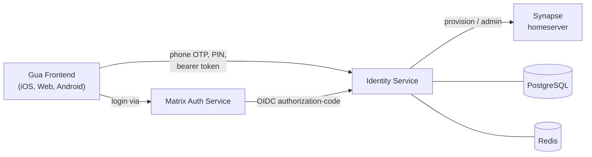

<p align="center">
  
</p>


# Gua Identity Service

> This README describes what the service does on `main` today; the target design lives in the [architecture guide](https://github.com/Gua-ra/gua-resolver/blob/main/docs/architecture/gua-identity-and-federation.md).

The Gua Identity Service is a Spring Boot microservice that handles identity and authentication for every Gua homeserver.

---

## ✨ What it does today

- 📱 **Phone sign-up & sign-in**: OTP, then the factor the account holds (PIN or passkey). The SMS code never completes a sign-in on its own.
- 🔐 **OTP management**: Redis-backed codes with TTL, per-phone and per-IP hourly caps, localized SMS templates (en / pt-BR), optional Twilio delivery.
- 🔢 **Account PIN (two-step verification)**: set, OTP-protected change, lockout, strength policy and audit logging.
- 🛡️ **Privileged account operations**: deactivation, identity-credential reset and phone-number change, each gated by a fresh phone-OTP reauthentication scoped to that operation.
- 🔑 **OpenID Connect provider**: RS256 authorization-code + PKCE flow with an interactive browser login that MAS redirects into.
- 🪪 **Passkeys (WebAuthn)**: registration during onboarding or from settings, and sign-in without an SMS code. Built on Yubico `webauthn-server-core`.
- 🧩 **Factor enrollment from settings**, behind a step-up.
- 🧭 **Delayed account recovery** for a user who proved the number but cannot present a factor.
- 📇 **Directory lookup**: contact discovery by server-side peppered HMAC of the phone number; the raw number is never stored.
- 📊 **Prometheus metrics** at `/actuator/prometheus`.
- 🚦 **Rate limiting**: per-endpoint Resilience4j limiters.
- 🗄️ **Persistent identities**: PostgreSQL with Flyway migrations.
- 📚 **OpenAPI/Swagger UI** at `/swagger-ui.html`.

---

## 🏗️ How it fits together


```mermaid
flowchart LR
    Clients["Gua Frontend<br/>(iOS, Web, Android)"] -->|phone OTP, PIN,<br/>bearer token| IDS["Identity Service"]
    IDS -->|provision / admin| Synapse["Synapse<br/>homeserver"]
    MAS["Matrix Auth Service"] -->|OIDC authorization-code| IDS
    Clients -->|login via| MAS
    IDS --- PG[("PostgreSQL")]
    IDS --- Redis[("Redis")]
```

The service plays two roles: it is the OIDC provider that MAS delegates phone-OTP login to, and it issues and validates the bearer tokens its own REST API requires. Login runs through the [interactive login flow](#interactive-login-flow).

---

## 🔭 Relationship to the target architecture

Nothing in the target design is built here. See the plain-language guide, [Gua identity and federation](https://github.com/Gua-ra/gua-resolver/blob/main/docs/architecture/gua-identity-and-federation.md), and the normative [decision record](https://github.com/Gua-ra/gua-resolver/blob/main/docs/decisions/ADM-001-identifier-binding-placement-trust.md).

---

## 🧰 Running it locally

`scripts/start-dev-test-stack.sh` starts the dependencies and exports the environment variables the service needs:

```bash
source scripts/start-dev-test-stack.sh
```

Running it with `bash` instead writes the variables to `.env.identity-service`. Load them with `source .env.identity-service`, or copy them into IntelliJ.

The script:

1. Starts PostgreSQL, Redis, a disposable Synapse homeserver and a MAS container (the `Gua-ra/gua-auth-service` fork image) from `docker-compose.test.yml`.
2. Waits for Synapse to become healthy.
3. Creates (or reuses) an admin Matrix user and captures its access token.
4. Generates a directory pepper at `docker/.identity-pepper`.
5. Exports every environment variable the identity service needs.

Then run `./gradlew bootRun` or start the application from IntelliJ. To tear everything down:

```bash
docker compose -f docker-compose.test.yml down
```

> ⚠️ Source the environment in the same shell that runs Gradle. Unset, a variable such as `IDENTITY_MATRIX_ADMIN_API_BASE_URL` reaches `WebClient` as a literal `${...}` placeholder, and every Matrix-admin call fails with `IllegalArgumentException: Not enough variable values available`.

### Local secret files (gitignored, not in the repo)

Development secrets the dev stack creates or expects locally. Never commit them:

| File | Purpose |
| --- | --- |
| `.env.identity-service` | Computed env vars written by the start script (Matrix admin token, base URLs, pepper, OIDC keys). |
| `docker/.identity-pepper` | Server-side pepper used to hash phone numbers for directory lookup. |
| `docker/.oidc-jwt-secret` | Local OIDC signing material for the dev stack. |
| `docker/mas/mas.conf.yaml` | MAS configuration including its signing/encryption secrets and upstream-OIDC client credentials. |

---

## 🧪 Tests

```bash
./gradlew test
```

Integration and contract tests use **Testcontainers** (PostgreSQL) and **WireMock** (Matrix admin API), so a running **Docker** daemon is required.

---

## 🛠️ Tech Stack

- **Java 21** (LTS)
- **Spring Boot 3.5.x**, **Gradle (Groovy DSL)**
- **Spring Web** (MVC REST controllers) + **Spring WebFlux** (`WebClient` for the Matrix admin API)
- **Spring Security**: stateless bearer-token auth
- **Spring Data JPA / Hibernate** (PostgreSQL dialect) + **Flyway** for migrations
- **Spring Data Redis**: OTP codes, PIN-change and phone-change challenges, reauth tokens, signup tokens, authorization codes
- **Nimbus JOSE + JWT**: RS256 token signing & verification
- **Resilience4j**: per-endpoint rate limiting
- **Twilio SDK**: SMS delivery (disabled by default)
- **springdoc-openapi**: Swagger UI / OpenAPI docs
- **Bean Validation**: request validation

Infra: **PostgreSQL** (identities), **Redis** (ephemeral tokens), **Synapse** + **MAS** (downstream Matrix), all wired via **Docker Compose**.

---

## 🧭 Routing & global usernames

Gua runs a closed set of homeservers, in the style of [Tchap](https://github.com/tchapgouv), and does not join the open Matrix network. This service picks which of its configured homeservers a new account is created on and records that choice in its own directory. Routing before login is the resolver's `POST /resolve`, which the iOS and Android clients call directly.

- **Homeserver registry** (`identity.routing.homeservers`): the homeservers this deployment can create accounts on, each with `id`, `domain`, admin URL, region, weight and enabled. Unset, a single homeserver is synthesised from the legacy `identity.matrix.*` properties.
- **Routing layer** (`HomeserverRouter`): picks a homeserver for each new account by rule (`single`, `region` or `weighted`) and records it in `directory_entries.homeserver_id`. Moving an account between homeservers is not supported.
- **Global usernames** are unique within this deployment's directory, case-insensitively. Users see only their username; `GET /directory/resolve?username=` returns its MXID and homeserver.

---

## 🔀 MAS fork: `Gua-ra/gua-auth-service`

The identity stack uses [`Gua-ra/gua-auth-service`](https://github.com/Gua-ra/gua-auth-service), a fork of [`element-hq/matrix-authentication-service`](https://github.com/element-hq/matrix-authentication-service) (MAS). MAS treats this service as its upstream OIDC issuer.

The tag the dev stack runs is pinned in `docker-compose.test.yml`; the fork repository documents the rest.

---

## 📡 API reference

Interactive docs: **`/swagger-ui.html`** (OpenAPI JSON at `/api-docs`). Endpoints marked **Public** require no bearer token; **Bearer** endpoints require an `Authorization: Bearer <access-token>` header issued by this service's `/oauth2/token`.

### Onboarding & sessions

| Method & path | Auth | Purpose |
| --- | --- | --- |
| `POST /otp/send` | Public | Generate and dispatch an OTP to a phone number (rate-limited, localized SMS). |
| `POST /otp/verify` | Public | Verify an OTP. Returns a `signupToken` (new user) or a `pinChallengeToken` (returning user holding a PIN; the PIN may also be sent inline). An account holding only a passkey is `403 passkey_required` and one holding no factor is `403 factor_setup_required`; those accounts sign in through the interactive flow. |
| `POST /account/genesis` | Public³ | Register an on-device `AccountGenesis`, receive its `accountId` and a single-use attach handle. Off unless `identity.genesis.enabled`. See [Account genesis](#account-genesis-accountid). |
| `GET /signup/check-username` | Public | Real-time username availability check (format/reserved rules + Matrix lookup). Does not mutate state. |
| `POST /signup/complete` | Public¹ | Exchange a `signupToken` and a PIN for a provisioned Matrix user with chosen username/display name. A missing or blank PIN is `400 pin_required`, and a malformed or weak one `invalid_pin`/`weak_pin`, both checked before the token is consumed. |
| `POST /signin/verify-pin` | Public¹ | Exchange a `pinChallengeToken` + PIN for a Matrix session (second leg of 2SV sign-in). |
| `POST /login/passkey/auth/options` | Session² | Start **passkey sign-in** for a returning user: WebAuthn assertion options. |
| `POST /login/passkey/auth/verify` | Session² | Verify the passkey assertion and complete sign-in without an SMS code. Only ever resolves to an existing account, never creates one. |

¹ No bearer token, but gated by the single-use token issued from `/otp/verify`.

² Part of the interactive OIDC login session: requires the login-session cookie plus the CSRF token from `GET /login/context` (see [Interactive login flow](#interactive-login-flow)).

³ No bearer token: the request carries a possession proof under the key committed inside the genesis.

### Account genesis (`accountId`)

Every account gets a permanent `accountId`, derived from an immutable genesis object that commits the account's initial authority key.

Nothing reads the accountId: it is never a routing input, a claim or a directory column, and `AccountIdNotReadGuardTest` enforces that.

**The objects.** `AccountGenesis` (suite `0x01`, 87 bytes) commits an Ed25519 authority key, the algorithm identifiers, and an initial recovery authority key and framework. It holds no identifier and no homeserver. `BootstrapGenesis` (suite `0x00`, 22 bytes) commits nothing but random entropy, and marks an account that predates account authority. Both are fixed-layout byte strings:

```
accountId = "ga1" || base32(0x01 || rootClass || SHA-256(canonical bytes))
```

`rootClass` is `0x01` for a genesis-rooted account and `0x00` for a bootstrap one; the digest covers the bytes as received, and decoders match `^ga1[a-z2-7]{54}[aiqy]$`.

Golden vectors live in [`docs/specs/genesis-vectors.v1.json`](docs/specs/genesis-vectors.v1.json). The iOS, Android and resolver ports verify against that file, and `GenesisVectorsTest` recomputes it.

**Registration and attach.** The client registers its genesis at `POST /account/genesis` and gets back a single-use attach handle, stored only as a hash and valid for `identity.genesis.pending-ttl`. It then sends `login_hint = "gua:phone=<E.164>;genesis=<handle>"`, which MAS forwards verbatim.

A handle alone attaches nothing: the client must also sign a server-issued challenge with the committed authority key, and a failed attach fails the signup.

**Flags** (all off by default, so a deployment that sets none behaves exactly as it did before this feature existed):

| Property | Env | Default | Effect |
| --- | --- | --- | --- |
| `identity.genesis.enabled` | `IDENTITY_GENESIS_ENABLED` | `false` | Master switch. Off: the endpoint answers `503`, the `gua:` hint grammar is not parsed, and no account gets a genesis row. |
| `identity.genesis.production-issuance` | `IDENTITY_GENESIS_PRODUCTION_ISSUANCE` | `false` | Allows issuing ids under recovery framework `0x01`. Off outside dev: that framework commits no delay bounds, and its recovery key shares the device store with the key it would veto, so production issuance waits on ADM-002. Dev turns it on and treats the ids as disposable. |
| `identity.genesis.pending-ttl` | `IDENTITY_GENESIS_PENDING_TTL` | `PT30M` | How long a registered genesis stays attachable. |
| `identity.genesis.require-for-native` | `IDENTITY_GENESIS_REQUIRE_FOR_NATIVE` | `false` | Refuses a native signup that presents no handle instead of giving it a bootstrap id. Flip only once the clients ship genesis. |
| `identity.genesis.bootstrap-backfill.enabled` | `IDENTITY_GENESIS_BOOTSTRAP_BACKFILL_ENABLED` | `false` | Mints a bootstrap accountId at startup for every existing account that has none. Idempotent and resumable, so it is safe to leave on. |

**Metrics.** `gua_identity_account_genesis{origin}` and `gua_identity_accounts_without_genesis` are gauges registered only while the feature is on; the second must reach zero.

**Rollback.** Turn the flags off. The `account_genesis` table stays.

### Which factor applies where

`AuthFactorPolicy` decides which factor applies.

| Question | Answer | Where it is used | Decided there? |
| --- | --- | --- | --- |
| Preferred factor | `PASSKEY` → `PIN` → `PHONE_OTP`, whichever the account has registered first | `GET /security/pin/status`, and the interactive login state once its subject is resolved | Yes |
| What finishes a sign-in after the OTP | A held PIN: the PIN step (a passkey assertion is accepted there too). A held passkey and no PIN: the passkey is required. Neither: a first factor must be set up. The phone OTP is never the completing factor | interactive login, legacy `/otp/verify` | Yes |
| Step-up for a phone change | `PASSKEY` then `PIN`, hard block when neither is produced | published to clients by `GET /security/pin/status` as `phoneChangeStepUpFactors`; enforced separately by `POST /account/phone/change/start` | Published, not enforced |
| Step-up for adding a factor | A held passkey: the assertion, and the PIN is not also asked for. A held PIN and no passkey: the PIN. Neither: the account's own number and an OTP sent to it | the `ENROLL_STEP_UP` step of an enrollment session ([Adding a factor from settings](#adding-a-factor-from-settings)) | Read off `loginPolicy`, enforced there |
| Recovery | Restores the `PIN` after the phone OTP and a waiting period, and removes stored passkeys | written down in the policy; run by `AccountRecoveryService` | Stated, not called |

Factor fields are published only from steps reached after an OTP or an assertion; `pinRegistered` only at `ENROLL_STEP_UP`.

### Account PIN (two-step verification)

| Method & path | Auth | Purpose |
| --- | --- | --- |
| `GET /security/pin/status` | Bearer | Whether the user has a PIN set, plus `changePhoneCooldownRemainingSeconds`, the factor report (`passkeyRegistered`, `preferredFactor`, `phoneChangeStepUpFactors`; see [Which factor applies where](#which-factor-applies-where)) and the recovery fields `accountRecoveryPending`, `accountRecoveryCompletableAtEpochSeconds` and `accountRecoveryExpiresAtEpochSeconds` (null when no recovery is live), `accountRecoveryDormancySeconds` and `accountRecoveryWaitSeconds` (see [Delayed account recovery](#delayed-account-recovery)). |
| `POST /security/pin` | Bearer | **Retired.** Always `403 step_up_required`, naming the flow below. |
| `POST /security/pin/enroll/start` | Bearer | Add a PIN from settings: creates an enrollment session pinned to the authenticated user and returns a one-time `enrollUrl`. `409 pin_already_set` when the account has one. See [Adding a factor from settings](#adding-a-factor-from-settings). |
| `POST /security/pin/change/start` | Bearer | Enforce the 24h change cooldown, authorize with a passkey step-up assertion (`passkeyStepUpId` + `passkeyCredential`, preferred) or the current PIN, and send an OTP. A freshly registered passkey is held (`400 twofa_cooldown_active`) and the PIN path stays available. Returns a challenge id (`425` if cooldown active). |
| `POST /security/pin/change/complete` | Bearer | Redeem the challenge + OTP to apply the new PIN. |
| `POST /security/pin/reset` · `…/reset/complete` | Public | **Retired.** Always `410 endpoint_retired`. See [Delayed account recovery](#delayed-account-recovery). |

PIN policy is configurable under `identity.security`: `pin-change-cooldown` (default **24h**), `pin-reset-cooldown` (default **7 days**), `max-pin-attempts` (default **5**), `pin-lock-duration` (default **15m**), `pin-change-challenge-ttl` (default **5m**).

- The PIN-change code lives under `otp:code:pin-change:<challengeId>`, which the public `POST /otp/send` cannot write.
- A PIN set inside `pin-reset-cooldown` is refused as the phone-change step-up with `400 twofa_cooldown_active` and `retryAfterSeconds`. A passkey registered inside the same window is refused the same way.
- `changePhoneCooldownRemainingSeconds` reports the PIN hold only.

**PIN strength** (`PinPolicy`): exactly six digits, not all-repeated (`000000`), not strictly sequential (`123456` / `654321`) and not on a list of common PINs. A failure is `weak_pin`; a wrong PIN at login is `invalid_pin`.

**Username policy** (`UsernamePolicy`): 3 to 30 chars of lowercase letters, digits, dot, underscore or dash; not reserved; and not all-numeric, matching MAS's registration policy.

### Delayed account recovery

The way back for someone who proved the phone number by OTP but cannot present the PIN or passkey the account holds.

| Method & path | Auth | Purpose |
| --- | --- | --- |
| `POST /login/recovery/start` | Session² | Open a recovery episode. Available only at `PIN_REQUIRED` or `PASSKEY_REQUIRED` after a verified OTP, never in a re-authentication or an in-app enrollment session (`409 recovery_unavailable`). Returns the login state with `recovery.status` `PENDING`; a live episode is returned unchanged. `400 recovery_cooldown_active` with `retryAfterSeconds` and `Retry-After` when the account was used inside the dormancy period. Sends no SMS. |
| `POST /login/recovery/complete` | Session² | `{ "newPin" }`. Completes a `READY` episode and the login. Re-checked under the account row lock: `409 recovery_not_ready` with the fresh `recovery` object when it is still waiting, was cancelled or expired. A malformed or weak PIN is `400 invalid_pin`/`weak_pin` and counts nothing. |
| `POST /security/recovery/cancel` | Bearer | The account holder's cancel, from the banner every signed-in app shows while a recovery is live. `204` whether or not one was live. |

**The rules.** Both durations fall back to `pin-reset-cooldown` when unset.

- **Request** only when the account has had no completed sign-in for `account-recovery-dormancy` (`IDENTITY_SECURITY_ACCOUNT_RECOVERY_DORMANCY`).
- **Finish** only after `account-recovery-wait` (`IDENTITY_SECURITY_ACCOUNT_RECOVERY_WAIT`) has passed since the request.
- The episode is stamped on `identity_users.pin_reset_requested_at` and is **live** while `now < stamp + wait + max(wait, dormancy)`. A dead stamp is treated as absent.
- Status is `PENDING`, `READY`, `TOO_SOON` or `AVAILABLE`; `availableAtEpochSeconds` is rounded up to the next UTC day, and `recovery` is `null` when recovery is unavailable to the session.
- Startup refuses either duration below **24h** unless `IDENTITY_SECURITY_ACCOUNT_RECOVERY_ALLOW_SHORT_FOR_TESTING=true`, which only a dev deployment may set.

**What ends an episode.** A completed sign-in with the PIN or a passkey; a successful PIN check anywhere; the owner's cancel, which also counts as account activity; and completion itself.

**Completion** sets the new PIN, removes every stored passkey, revokes this service's tokens and completes the login with the ID token claim `gua_end_other_sessions: true`, which stays owed until an ID token carries it. Known limit: MAS does not confirm the sign-out back.

### Passkeys

Passkey **registration** is normally offered during onboarding (see [Interactive login flow](#interactive-login-flow)); an already-signed-in user can also add one later from settings:

| Method & path | Auth | Purpose |
| --- | --- | --- |
| `POST /security/passkey/enroll/start` | Bearer | Start in-app passkey enrollment: creates a login session pinned to the authenticated user and returns a one-time `enrollUrl`. The session starts at the step-up, see [Adding a factor from settings](#adding-a-factor-from-settings). `409 passkey_already_registered` when the account has one. |
| `GET /login/enroll/{token}` · `GET /login/passkey/enroll/{token}` | Public (one-time token) | Redeems the `enrollUrl` in a web view: sets the first-party login cookie and redirects into the sign-in UI, which finds the session at `ENROLL_STEP_UP` (`410 enroll_link_expired` once used or expired). The `/passkey/` spelling is what older links carry and is the same handoff. |
| `POST /security/passkey/stepup/options` | Bearer | Start a **user-verifying** assertion that may be spent as the step-up factor on a privileged operation. Returns a `stepUpId` and the WebAuthn `publicKey` options. |

The pinned session can only reach the enrollment steps and stores nothing before the step-up. Passkey **sign-in** happens inside the interactive login flow via `POST /login/passkey/auth/options` / `…/verify`.

The step-up ceremony requires user verification (`403 passkey_user_verification_required` otherwise) and uses its own challenge namespace, so a sign-in challenge cannot be spent as a step-up.

### Adding a factor from settings

A bearer session on its own never adds a durable factor: both enrollment entry points return a one-time URL for a web session that must pass a step-up first.

| Method & path | Auth | Purpose |
| --- | --- | --- |
| `POST /security/passkey/enroll/start` · `POST /security/pin/enroll/start` | Bearer | Create the enrollment session and return its `enrollUrl`. `409` when the account already holds that factor, or `409 step_up_unavailable` when no proof the account could give is one this deployment can run. |
| `POST /login/enroll/stepup/passkey/options` · `…/passkey/verify` | Session cookie + CSRF | The preferred proof: a **user-verifying** assertion pinned to the session's account. |
| `POST /login/enroll/stepup/pin` | Session cookie + CSRF | `{ "pin" }`. The proof for an account that holds a PIN and no passkey. Counted and locked out like the sign-in PIN step. `409 pin_not_set` when the account has none. |
| `POST /login/enroll/stepup/otp/send` · `…/otp/verify` | Session cookie + CSRF | `{ "phoneNumber" }` then `{ "phoneNumber", "code" }`. Only for an account that holds **no** factor: `409 step_up_factor_available` otherwise. The number is checked against the account's own directory binding, as in [reauthentication](#privileged-account-operations). |

The session starts at `ENROLL_STEP_UP` with `enrollment: true`, and `recovery` is always `null` there.

**Strongest first, and only one of them.** An account that produces a passkey is not also asked for its PIN.

**Nothing is stored before the step-up.** `PASSKEY_SETUP` and `PIN_SETUP` refuse an enrollment session that has not passed it (`403 step_up_required`), and an enrollment session never issues an authorization code.

**The fresh-factor hold still applies** to a PIN or passkey created this way (see [Account PIN](#account-pin-two-step-verification)).

Both enroll-start endpoints take an optional body, `{ "redirectUri": "<app scheme>" }`. It must exactly match an entry in `idp.login.enroll.redirect-uris` (`IDP_LOGIN_ENROLL_REDIRECT_URIS`, comma separated), else `400 invalid_redirect_uri`. When omitted, the app scheme registered by the token's OIDC client applies, else `idp.login.enroll.redirect-uri` (`IDP_LOGIN_ENROLL_REDIRECT_URI`).

### Privileged account operations

Each privileged operation requires a fresh **reauth token** proving phone possession, in addition to the bearer token. Reauth tokens are **operation-scoped**: `/account/reauth/verify` takes an `operation` field (`DEACTIVATE` | `IDENTITY_RESET` | `PHONE_CHANGE`; defaults to `DEACTIVATE` for backwards compatibility) and the issued token can only be spent on the matching endpoint.

| Method & path | Auth | Purpose |
| --- | --- | --- |
| `POST /account/reauth/start` | Bearer | `{ "phone" }`: the number the signed-in user says is on their account. `202` and an OTP to that number once it is shown to be the account's. |
| `POST /account/reauth/verify` | Bearer | `{ "phone", "code", "operation" }`. Exchange the OTP for a single-use reauth token (5-minute TTL) scoped to the requested `operation`. |
| `POST /account/deactivate` | Bearer + reauth (`DEACTIVATE`) | Deactivate the user's Matrix account (optionally erasing data). |
| `POST /account/reset-identity-credentials` | Bearer + reauth (`IDENTITY_RESET`) | Rotate the homeserver password and return one-time UIA credentials for `client.resetIdentity`. |
| `POST /account/phone/change/start` | Bearer + reauth (`PHONE_CHANGE`) + 2SV | Start a phone-number change: spends the reauth token and the step-up factor, sends an OTP to the new number, and alerts the old number out of band. Returns a challenge id (`425` while the per-account change cooldown is active). |
| `POST /account/phone/change/complete` | Bearer | Redeem the challenge + new-number OTP to atomically re-bind the account's phone mapping and revoke this service's tokens. |

The submitted number is compared with the account's own directory digests; a mismatch is always `403 reauth_phone_mismatch`, capped per user by `identity.security.max-reauth-phone-attempts-per-hour` (default **5**, then `429`). A phone change also needs a user-verifying passkey assertion or the account PIN; an account that produces neither gets `403 step_up_required`.

**Phone-change cooldown & challenge limits** (configurable under `identity.security`): successful changes are separated by `phone-change-cooldown` (default **24h**). While it is active, `/account/phone/change/start` returns `425` with a `phone_change_cooldown` error code and a `Retry-After` header. Each challenge lives for `phone-change-challenge-ttl` (default **10m**) and allows `max-phone-change-otp-attempts` wrong OTPs (default **5**); at the cap both the challenge and its OTP are destroyed and the flow must restart from `/start`.

### Directory

| Method & path | Auth | Purpose |
| --- | --- | --- |
| `POST /directory/lookup` | Bearer | Contact discovery: match address-book phone numbers (E.164) to Gua accounts. |
| `GET /directory/resolve?username=` | Bearer | Resolve a global username to its Matrix user id + homeserver, from this deployment's directory. |

#### Contact discovery privacy model

`POST /directory/lookup` takes `{"phones": ["+5511999998888", …]}` and returns the subset that are on Gua (`phone`, `userId`, `username`, `displayName`).

- Submitted numbers are digested in memory with the directory's server-side peppered HMAC-SHA256. Raw numbers are never persisted or logged, and clients do no hashing.
- Enumeration defenses: bearer auth, a per-request cap (`identity.directory.max-lookup-batch`, default 1000, error `lookup_batch_too_large`), the endpoint rate limit, and a per-account `discoverable` opt-out.
- Invalid and duplicate entries are skipped.

---

## 🔐 OpenID Connect provider

### Endpoints

| Endpoint | Purpose |
| --- | --- |
| `GET /.well-known/openid-configuration` | Discovery metadata (issuer, authorize/token/userinfo/JWKS URLs, supported response/grant types, `S256` PKCE, `RS256`). |
| `GET /.well-known/jwks.json` | Publishes the **RSA public** signing key so relying parties can verify RS256 tokens. |
| `GET /oauth2/authorize` | Authorization-code entry point. Validates `client_id`, `redirect_uri`, `response_type=code`, `scope`, and optional `state`/`nonce`/PKCE `code_challenge`, then starts a login session and **redirects to the interactive login UI**. The optional `login_hint` is either an E.164 phone to pre-fill the phone step or the reserved value `passkey`, which records a passkey sign-in intent on the session and is never treated as a phone number. An authorization code is issued only by the interactive flow; `phone_number`, `otp_code` and `display_name` are ignored if sent. |
| `POST /oauth2/token` | Exchanges an authorization code (and PKCE `code_verifier`) for a signed access token + ID token. |
| `GET /userinfo` | Returns the authenticated subject (`sub`), `phone_number`, `phone_number_masked` (display-only, e.g. `••••4567`), and optional `name` / `preferred_username`. |

### Interactive login flow

For browser-based login (the path used by MAS and the Gua apps), the identity service renders no HTML itself: it exposes a JSON API consumed by the **`gua-idp-web`** single-page app, served same-origin so the login-session cookie stays first-party.

1. MAS redirects the browser to `GET /oauth2/authorize`. The validated OIDC request (client, redirect URI, scopes, `state`, `nonce`, PKCE challenge) is stored in a Redis-backed login session and referenced by an opaque, HttpOnly, `SameSite=Lax` cookie. The browser is redirected to `idp.login.ui-url` (default `/signin`, served by `gua-idp-web`; kept distinct from the `/login/*` API).
2. The UI drives the `/login/*` API, echoing a per-session CSRF token (issued by `GET /login/context`) in the `X-CSRF-Token` header on every state-changing call.

| Method & path | Purpose |
| --- | --- |
| `GET /login/context` | Current step, masked phone, CSRF token, `intent` (`PHONE` or `PASSKEY`, from the `login_hint`; a missing field means `PHONE`), `enrollment` (true for an in-app factor enrollment), and, once the subject is resolved, `passkeyRegistered`, `preferredFactor` and `passkeysEnabled` (deployment capability), plus `pinRegistered` at `ENROLL_STEP_UP` only. At `PIN_REQUIRED` and `PASSKEY_REQUIRED` after an OTP it also carries `recovery` (see [Delayed account recovery](#delayed-account-recovery)); everywhere else `recovery` is `null`. |
| `POST /login/phone` | Submit the phone number; dispatches an OTP. |
| `POST /login/otp` | Verify the OTP; routes a returning account to `PIN_REQUIRED` (holds a PIN), `PASSKEY_REQUIRED` (holds only a passkey) or the passkey offer (holds nothing), and a new user to the profile step. Never completes the login. |
| `POST /login/pin` | Verify the account PIN at `PIN_REQUIRED`. Refused (`409 unexpected_step`) at `PASSKEY_REQUIRED`. |
| `POST /login/profile` | Choose username + display name (new user). |
| `POST /login/pin-setup` | The factor for an account holding none that is not finishing with a passkey, and the PIN being added in an enrollment session. Mandatory: `skip: true`, a missing PIN and a blank PIN are `400 pin_required`. `409 factor_required` when another session gave a signing-in account a factor in the meantime, `409 pin_already_set` for an enrolling one. |
| `POST /login/passkey/register/options` · `…/register/verify` | Register a passkey for the account (WebAuthn create). |
| `POST /login/passkey/setup-skip` | Leave the passkey offer without registering one (declined, failed, or no authenticator). A session that already signed in with its PIN completes; an account holding no factor goes on to `PIN_SETUP`. |
| `POST /login/passkey/auth/options` · `…/auth/verify` | Sign in with an existing passkey (WebAuthn get). |
| `POST /login/recovery/start` · `…/recovery/complete` | The delayed account recovery, from `PIN_REQUIRED` or `PASSKEY_REQUIRED` after an OTP (see [Delayed account recovery](#delayed-account-recovery)). |
| `POST /login/enroll/stepup/*` | The enrollment step-up, at `ENROLL_STEP_UP` (see [Adding a factor from settings](#adding-a-factor-from-settings)). |
| `GET /login/enroll/{token}` | One-time web-view handoff for in-app factor enrollment started at `POST /security/passkey/enroll/start` or `POST /security/pin/enroll/start` (see [Adding a factor from settings](#adding-a-factor-from-settings)). |

**No code without a factor.** Completion requires the session to have authenticated with a passkey assertion, the PIN, the account's first factor created in this session, or a completed recovery; anything else is `409 factor_required`.

New users go profile → `PASSKEY_SETUP` → done, and reach `PIN_SETUP`, which cannot be skipped, only when no passkey is registered or passkeys are switched off. A returning user who signs in with the PIN is offered `PASSKEY_SETUP` unless the account already has a passkey.

Passkey sign-in is accepted at the phone, OTP, PIN and `PASSKEY_REQUIRED` steps, never at the profile step or in an enrollment session. Once the session has resolved its subject, the assertion must resolve to that same account.

On success an authorization code is issued, the login session is consumed, and the response carries `redirectUrl` for the UI to navigate back to the client. `preferred_username` is the chosen handle for a new user and the stored directory username for a returning one; `sub` is the full Matrix user id.

Login-flow configuration (`idp.login.*`): `ui-url` (`IDP_LOGIN_UI_URL`, default `/signin`), `session-ttl` (`IDP_LOGIN_SESSION_TTL`, default `PT10M`), `cookie-name` (`IDP_LOGIN_COOKIE_NAME`, default `gua_login`), and `cookie-secure` (`IDP_LOGIN_COOKIE_SECURE`, default `true`; set `false` only for plain-HTTP local development).

Passkey configuration (`idp.login.passkeys.*`): `rp-id` (`IDP_LOGIN_PASSKEYS_RP_ID`) and `origins` (`IDP_LOGIN_PASSKEYS_ORIGINS`) default to localhost and MUST be set to the registrable auth domain and the exact HTTPS sign-in origin in production, or every WebAuthn ceremony is rejected by the browser.

### Web login gate

An optional invite-only gate for new web accounts, off by default: `idp.login.registration.web-allowlist-enabled` (`IDP_LOGIN_REGISTRATION_WEBALLOWLISTENABLED`).

With it on:

- **OTP send** (`POST /login/phone`, `POST /otp/send`): a web flow gets an OTP only for a known number, meaning one that already has an account or is on `idp.login.registration.web-allowlist` (`IDP_LOGIN_REGISTRATION_WEBALLOWLIST`, E.164 CSV). Anything else gets `403 registration_not_approved` before any SMS is sent.
- **Account creation** (`POST /login/profile`, `POST /signup/complete`): a new web account is created only for an allowlisted number, whichever path minted the OTP.

A number that already has an account counts as known, so an account created in the apps can also sign in on the web.

**Web or native.** MAS can append `gua_downstream=web|native` to the upstream authorize request (fork settings `forward_downstream_client` and `downstream_client_web_origin`; `native` means the downstream client's `client_uri` host differs from the web origin). A login session is exempt only when the marker equals `idp.login.registration.native-client-marker` (default `native`) exactly. An absent, empty or unrecognised marker is treated as web, and the REST endpoints, which carry no marker, always are.

**Limits.** The marker is client-asserted and is not a security boundary.

### Signing & configuration

Tokens are signed with **RS256**. Provide the keypair via `OIDC_RSA_PRIVATE_KEY` / `OIDC_RSA_PUBLIC_KEY` (key id from `OIDC_JWK_KEY_ID`, default `oidc-signing-key`). If the keys are unset, an **ephemeral** key is generated at startup (dev only). The issuer is taken from `IDENTITY_BASE_URL`, so point it at the publicly reachable base path (e.g. `https://identity.example.com`). Token TTLs: authorization code `PT5M`, access token `PT15M`, ID token `PT15M` (all overridable).

Seeded clients (`oidc.clients` in `application.yml`):

| Client | Type | PKCE | Scopes |
| --- | --- | --- | --- |
| `mas` | Confidential (`client_secret`) | optional | `openid`, `profile`, `phone` |
| `gua-ios` | Public | **required** (`S256`) | `openid`, `profile`, `phone` |

Further first-party app clients are public, PKCE-required entries under `oidc.clients`.

### API authentication

`OidcAccessTokenValidator` verifies a bearer token locally against the published JWKS: RS256 signature, issuer, an audience matching a registered client, expiry and revocation. A token that is not one of this service's own JWTs is checked against Synapse's `/whoami` instead, so a native client can reuse its Matrix SDK session token; such tokens carry no OIDC scopes. Access tokens carry a `jti` and can be invalidated early by a per-user revoke-before cutoff in Redis, set by `/account/deactivate`, `/account/reset-identity-credentials`, `/account/phone/change/complete` and a completed account recovery. The cutoff covers this service's own tokens only; it does not end the MAS and Matrix sessions the apps hold.

---

## 🛡️ Rate limiting

Every public endpoint is protected by a **Resilience4j**-based rate limiter. Defaults live in `application.yml` under `identity.rate-limits` and are overridable via `IDENTITY_RATE_LIMIT_<NAME>_{LIMIT,REFRESH,TIMEOUT}` environment variables. `default-config` applies to any endpoint without a specific rule.

| Endpoint | Default limit | Window |
| --- | --- | --- |
| `POST /otp/send` | 5 | 1 min |
| `POST /otp/verify` | 10 | 1 min |
| `POST /account/genesis` | 10 | 1 min |
| `POST /account/reauth/start` | 5 | 1 min |
| `POST /account/reauth/verify` | 10 | 1 min |
| `POST /account/phone/change/start` | 3 | 1 hour |
| `POST /account/phone/change/complete` | 10 | 1 hour |
| `POST /signup/complete` | 10 | 1 min |
| `POST /signin/verify-pin` | 10 | 1 min |
| `POST /login/otp` | 10 | 1 min |
| `POST /login/pin` | 10 | 1 min |
| `POST /login/passkey/auth/options` | 20 | 1 min |
| `POST /login/passkey/auth/verify` | 20 | 1 min |
| `POST /login/enroll/stepup/pin` | 10 | 1 min |
| `POST /login/enroll/stepup/otp/send` | 5 | 1 min |
| `POST /login/enroll/stepup/otp/verify` | 10 | 1 min |
| `POST /login/enroll/stepup/passkey/options` | 20 | 1 min |
| `POST /login/enroll/stepup/passkey/verify` | 20 | 1 min |
| `POST /login/recovery/start` | 30 | 1 hour |
| `POST /login/recovery/complete` | 30 | 1 hour |
| `POST /security/pin` | 20 | 5 min |
| `POST /security/pin/change/start` | 5 | 1 hour |
| `POST /security/pin/change/complete` | 5 | 1 hour |
| `POST /security/recovery/cancel` | 20 | 5 min |
| `POST /security/passkey/stepup/options` | 20 | 5 min |
| `POST /directory/lookup` | 30 | 5 min |
| _all others_ | 120 (`default-config`) | 1 min |

**Guess budgets.** Each OTP accepts at most `identity.otp.max-verify-attempts` guesses (default **5**, `IDENTITY_OTP_MAX_VERIFY_ATTEMPTS`), counted in Redis before comparison.

Set `IDENTITY_RATE_LIMITS_ENABLED=false` to disable the limiter (e.g., for load testing). Otherwise clients receive HTTP `429` with a JSON body (`{"code":"rate_limited","message":"Rate limit exceeded"}`) and a `Retry-After` header.

---

## 🌐 Federation directory (gua-resolver)

This service does not write to the gua-resolver directory, and `IDENTITY_RESOLVER_*` variables are ignored if still set.

## 📊 Observability

Micrometer exposes Prometheus metrics at **`/actuator/prometheus`**, tagged `application=identity-service`: HTTP, JVM and DB-pool metrics plus these domain counters:

| Metric | Meaning |
| --- | --- |
| `gua_identity_signup_total{result}` | completed new-account registrations |
| `gua_identity_login_total{result}` | successful sign-ins of existing accounts |
| `gua_identity_otp_verify_total{result=valid\|invalid\|exhausted}` | OTP correctness (delivery / abuse signal); `exhausted` counts guesses refused by the attempt cap: the guess that burns a code plus any parallel guess counted past the cap (brute-force signal) |
| `gua_identity_sms_send_total{provider,result=sent\|failed}` | SMS usage + delivery failures (`provider` = the active `SmsSender`) |

> Keep `/actuator` off the public edge (block it at the ingress/reverse-proxy): Prometheus scrapes it on the
> internal Service.

## 🚀 Deployment

### Build the container image

```bash
docker build -t gua/identity-service:latest .
```

### Compose file

An example `docker-compose.identity.yml` is included. Provide environment values (either via a `.env` file or directly in your orchestration system) for:

- `SPRING_DATASOURCE_*`: JDBC details for Postgres
- `SPRING_DATA_REDIS_*`: Redis host/port
- `IDENTITY_BASE_URL`: publicly reachable base URL; becomes the OIDC `issuer`
- `IDENTITY_MATRIX_*`: Synapse admin/client base URLs, homeserver domain, and admin token (used for provisioning)
- `IDENTITY_DIRECTORY_PEPPER`: server-side secret used to hash phone digests; rotating it orphans every stored digest
- `OIDC_RSA_PRIVATE_KEY` / `OIDC_RSA_PUBLIC_KEY`: RSA keypair used to sign and verify RS256 OIDC tokens (see [Signing & configuration](#signing--configuration))
- `OIDC_CLIENT_MAS_SECRET`: confidential client secret for the MAS OIDC client
- **SMS delivery (Twilio).** By default SMS is logged, not sent (`LoggingSmsSender`). Set
  `IDENTITY_SMS_TWILIO_ENABLED=true` to send real OTPs via Twilio:
  - `IDENTITY_SMS_TWILIO_ACCOUNTSID`: Twilio Account SID (`AC…`)
  - `IDENTITY_SMS_TWILIO_AUTHTOKEN`: Twilio Auth Token (secret)
  - `IDENTITY_SMS_TWILIO_FROMNUMBER`: an SMS-capable Twilio number in E.164 (e.g. `+1…`), **or**
  - `IDENTITY_SMS_TWILIO_MESSAGINGSERVICESID`: a Twilio Messaging Service SID (`MG…`), preferred for
    production (number pool, opt-out/compliance); takes precedence over the from-number when both are set.

  (On a Twilio trial account, SMS can only be delivered to verified numbers.)
- `MANAGEMENT_ENDPOINTS_EXPOSURE`: actuator endpoints to expose (default `health,info,prometheus`)

Then run:

```bash
docker compose -f docker-compose.identity.yml up -d --build
```

The container exposes port `8080` by default and relies on the surrounding services (Postgres/Redis/Synapse) defined in the compose file. Adjust or remove the bundled Postgres/Redis services if you point at managed instances instead.

---
