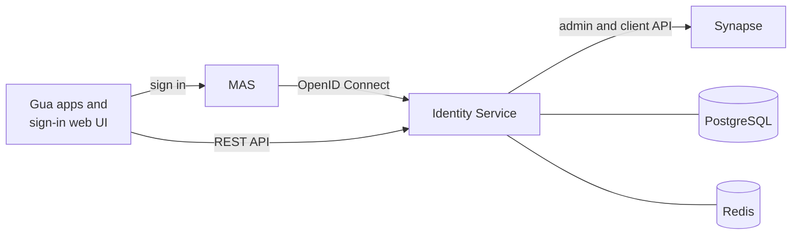

# Gua Identity Service

A Spring Boot service that handles sign-up, sign-in and account security for Gua. It verifies phone numbers by SMS code, holds each account's PIN and passkeys, and acts as the OpenID Connect provider that the Matrix Authentication Service (MAS) delegates login to.

## Responsibilities

- Phone verification: one-time codes sent by SMS, with expiry, attempt caps and send limits.
- Sign-in factors: account PIN and passkeys (WebAuthn). A code alone never completes a sign-in.
- OpenID Connect provider: authorization-code flow with PKCE, RS256 tokens, and the JSON API behind the sign-in web UI.
- Account creation: checks the username, picks a homeserver and creates the Matrix account on it.
- Account operations: PIN change, phone-number change, deactivation, identity reset and delayed account recovery.
- Directory: contact discovery and username lookup. Phone numbers are stored only as peppered HMAC digests.
- Account IDs: registers each account's genesis object and derives its permanent ID.
- Per-endpoint rate limiting, Prometheus metrics and health probes.

## Architecture


```mermaid
flowchart LR
    Apps["Gua apps and<br/>sign-in web UI"] -->|sign in| MAS["MAS"]
    MAS -->|OpenID Connect| IDS["Identity Service"]
    Apps -->|REST API| IDS
    IDS -->|admin and client API| Synapse["Synapse"]
    IDS --- PG[("PostgreSQL")]
    IDS --- Redis[("Redis")]
```

- **MAS** ([`gua-auth-service`](https://github.com/Gua-ra/gua-auth-service), a fork) uses this service as its upstream OpenID Connect provider. The sign-in pages are the `gua-idp-web` single-page app, served on the same origin and driving the `/login/*` API.
- **Synapse**: accounts are created and managed through the admin API. A homeserver access token sent as a bearer token is checked against Synapse.
- **PostgreSQL** holds durable state: directory entries, PIN and passkey credentials, account genesis. Flyway migrations live in `src/main/resources/db/migration`.
- **Redis** holds short-lived state: codes, login sessions, challenges, authorization codes and token revocation cutoffs.

## Local development

Requires JDK 21, Docker, `curl`, `jq` and `openssl`.

```bash
./scripts/start-dev-test-stack.sh   # starts the dependencies, writes .env.identity-service
source .env.identity-service
./gradlew bootRun                   # http://localhost:8080
```

The script starts `docker-compose.test.yml`: PostgreSQL (5432), Redis (6379), Synapse (8008) and MAS (8090). It then creates a Synapse admin user and writes the environment the service needs. Run Gradle in the shell that sourced the file.

Synapse and MAS read local configuration that is not in the repository. Create `docker/synapse/data/homeserver.yaml` and `docker/mas/mas.conf.yaml` before the first run. Both are gitignored, along with the generated `.env.identity-service` and `docker/.identity-pepper`.

SMS is logged instead of sent unless Twilio is enabled. `scripts/otp.sh` prints the active codes from Redis.

```bash
docker compose -f docker-compose.test.yml down   # stop the dependencies
```

`docker-compose.yml` builds and runs the service image with PostgreSQL and Redis. Supply the variables it lists.

## Tests

```bash
./gradlew test
./gradlew test --tests '*AuthFlowIntegrationTest'   # one class
```

A running Docker daemon is required: the integration tests start PostgreSQL and Redis with Testcontainers. The Matrix API is stubbed with WireMock. Spring context tests that need no database container use in-memory H2 through the `test` profile (`src/test/resources/application-test.yml`).

A new migration needs the same change in `src/test/resources/db/schema-mirror.sql`. `SchemaParityTest` compares the two.

## API

The OpenAPI document is generated from the controllers.

- Swagger UI: `/swagger-ui.html`
- OpenAPI JSON: `/api-docs`
- OpenID Connect discovery: `/.well-known/openid-configuration`

## Configuration

`src/main/resources/application.yml` is the source of truth. It lists the properties with their environment variables and defaults. There are no profile-specific files: a deployment is configured through environment variables. The properties bind to `IdentityServiceProperties`, `OidcProperties` and `LoginFlowProperties`.

| Group | Holds |
| --- | --- |
| `spring.datasource`, `spring.data.redis` | PostgreSQL and Redis connections. |
| `identity.matrix`, `identity.routing` | Synapse URLs, server name and admin token. The homeserver list when there is more than one. |
| `identity.directory` | The pepper used to digest phone numbers. |
| `oidc` | Issuer, signing key and registered clients. |
| `idp.login` | Sign-in UI URL, session cookie and passkey relying party. |
| `identity.otp`, `identity.sms.twilio` | Code policy and SMS delivery. |
| `identity.security`, `identity.rate-limits` | PIN, phone-change and recovery timing. Per-endpoint limits. |
| `identity.genesis`, `identity.placement` | Account ID issuance and placement records. |

For production:

- `IDENTITY_BASE_URL` is the public base URL and becomes the OpenID Connect issuer.
- Set `OIDC_RSA_PRIVATE_KEY` and `OIDC_RSA_PUBLIC_KEY`. Without them a temporary key is generated at startup.
- `IDENTITY_DIRECTORY_PEPPER` must never change: a new value orphans every stored digest. Pin it with `IDENTITY_DIRECTORY_PEPPER_FINGERPRINT` so a mismatch stops startup.
- `IDP_LOGIN_PASSKEYS_RP_ID` and `IDP_LOGIN_PASSKEYS_ORIGINS` must match the domain and the exact HTTPS origin of the sign-in UI.
- Keep `/actuator/prometheus` off the public edge. `/actuator/health` serves the probes.

## Deployment

- `.github/workflows/ci-cd.yml` runs the tests on every pull request and every push to `main`. A push to `main` also builds and signs the image `ghcr.io/gua-ra/identity-service` and deploys it to dev. A pull request labelled `deploy:dev` does the same.
- `.github/workflows/promote-prod.yml` is started by hand with a full commit SHA. It builds nothing: it verifies that CI built the image from that commit, waits for approval on the `production` environment, deploys by digest and prints the rollback command.

Flyway applies migrations at startup. Never edit a migration that has been applied; add a new one.

## Architecture docs

Gua's federation and account architecture is documented in gua-resolver. This README describes this service.

- [Gua identity and federation](https://github.com/Gua-ra/gua-resolver/blob/main/docs/architecture/gua-identity-and-federation.md)
- [Decision records](https://github.com/Gua-ra/gua-resolver/tree/main/docs/decisions)
- [`docs/specs/genesis-vectors.v1.json`](docs/specs/genesis-vectors.v1.json): test vectors for the account ID encoding
